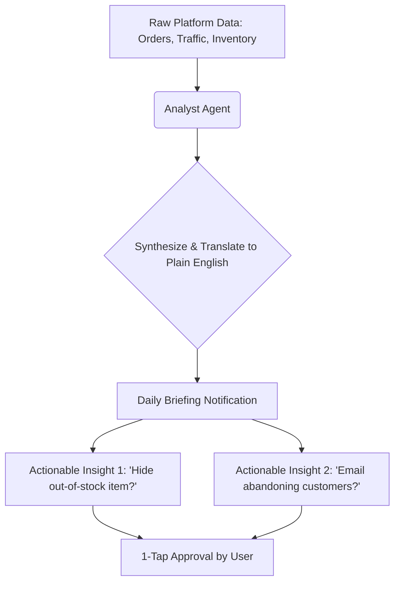

# Title: Plain Language Daily Business Briefing

## Problem Statement
Small business owners (like Maya the baker or Carlos the handyman) do not have the time, expertise, or desire to log into complex dashboards and read bar charts to understand their business health. Tools like Shopify Analytics present data (e.g., "Conversion Rate down 2.1%"), but don't explain *why* or *what to do about it*. This causes cognitive overload and inaction. Business owners want to know: "How did I do yesterday, and what do I need to do today?"

## Research Report
*   **Context:** Analysis of App Store reviews and Reddit discussions reveals a consistent trend: SMBs feel overwhelmed by data. They often ignore dashboards entirely unless they are actively looking for a specific order.
*   **Competitor Analysis:** Shopify and Wix provide traditional analytics dashboards. Shopify's Sidekick can answer data questions but must be prompted. None proactively synthesize business health into plain language.
*   **Persona Pain Point (Maya):** Maya doesn't care about "Session Duration." She wants to know if her Instagram post actually led to cake sales, and if she needs to buy more flour today.
*   **Recommendation:** OHC should replace the traditional default analytics dashboard with a "Daily Briefing"—a plain-language, AI-generated summary of yesterday's performance, coupled with 1-tap actionable insights for today.

## Design Doc
*   **High-Level Architecture:**
    *   **Data Aggregator:** Collects daily events (orders, page views, inventory changes).
    *   **Analyst Agent (LLM):** Ingests aggregated data and a prompt template instructing it to speak in the persona of a helpful, jargon-free assistant.
    *   **Delivery Mechanism:** Push notification to the mobile app leading to the Briefing Screen.
*   **UI/UX Flow (Mobile First - 375px):**
    *   **Screen 1:** A clean, card-based interface. Large, friendly typography (Outfit/Inter). No charts on the initial view.
    *   **Content:** "Good morning! You had a great Tuesday. You made $145 from 3 orders. Most of your visitors came from Instagram."
    *   **Action Cards:** Below the summary, interactive cards present agent suggestions:
        *   "I noticed your 'Vanilla Cupcakes' are out of stock. Should I hide them from the store for now?" [Yes, hide them] [Remind me later]
*   **Progressive Disclosure:** An "Advanced Mode" or "View Raw Data" toggle allows users to click through to traditional charts if they choose.

## Implementation Prompt
Implement the daily data aggregation logic and the prompt structure for the Analyst Agent. The system should collect the previous 24 hours of key metrics (revenue, order count, top traffic source, low inventory items). Pass this data to the LLM to generate a 2-3 sentence friendly summary. Define the API response structure to return both the text summary and an array of `ActionableInsight` objects (e.g., suggested inventory updates or draft marketing emails) that the UI can render as 1-tap approval buttons.

## Priority
P0

## Estimated Scope
Medium
