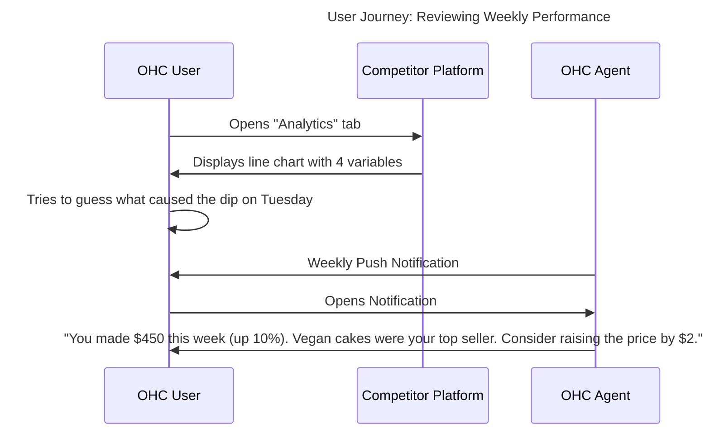

# Issue Brief: Plain-Language Financial Advisory (The Advisor & The Accountant)

## Problem Statement
"Financial Fog" prevents small business owners from making informed decisions. Traditional dashboards present overwhelming charts, graphs, and accounting jargon (EBITDA, MRR, COGS) that alienate non-technical users like Maya or Fatima. These users just want to know: "Did I make money this week, and what should I do next?" OHC needs to synthesize financial data into clear, human-language narratives using "The Advisor" and "The Accountant" agents.

## Research Report

### Competitive Landscape Analysis
- **Shopify Analytics:** Very comprehensive, but requires navigating multiple reports. Often too complex for micro-businesses.
- **Wix Analytics:** Similar to Shopify. Relies heavily on visual charts that require interpretation.
- **Square:** Good basic reporting, but still relies on standard charts rather than narrative insights.

### Persona-Specific Pain Point Summary
- **Maya (28, Home Baker):** Wants to know which cake flavor is actually making her the most profit (accounting for ingredient costs), but hates looking at spreadsheets.
- **Fatima (50, Food Cart):** Needs a simple daily summary of what sold out so she can adjust her purchasing for tomorrow.

### OHC vs Competitor Gap Analysis
| Feature | Shopify Analytics | Wix Analytics | OHC Target (The Advisor) |
| :--- | :--- | :--- | :--- |
| **Data Presentation** | Charts & Tables | Charts & Tables | **Narrative Text (Human Language)** |
| **Actionability** | User Interprets | User Interprets | **AI Provides Specific Next Steps** |
| **Complexity** | High | Medium | **Zero (Read like a text message)** |

### User Journey Comparison

### Specific Recommendations
- **OHC should** replace default analytics dashboards with narrative, text-based summaries generated by the LLM **because** text is the most universally understood interface.
- **OHC should** include actionable recommendations in every report (e.g., "Raise price," "Run promotion") **because** data without action leads to paralysis.

## Design Doc

### High-Level Architecture
- **Data Aggregation:** A cron job (e.g., weekly on Sunday evening) aggregates sales data, inventory levels, and customer engagement metrics from PostgreSQL.
- **Insight Generation:** "The Advisor" analyzes the aggregated data and generates a structured plain-language summary (The Narrative) and 1-3 specific recommendations.
- **Delivery Mechanism:** The narrative is saved to the database and pushed to the user via the mobile app's notification system.

### Mobile UX Flow (375px First)
1.  **Notification:** "Your Weekly Business Briefing is ready."
2.  **Briefing View:** A clean, typography-focused screen (Outfit font for headings, Inter for body). No complex charts by default—just three bold bullet points summarizing the week, followed by a "Suggested Actions" section.
3.  **Action Buttons:** Each suggested action has a 1-tap execute button (e.g., "[Increase Price by $2]").

## Implementation Prompt
Implement the Weekly Business Briefing generation pipeline. Create a scheduled job that queries the `orders` and `products` tables to aggregate weekly metrics. Pass these metrics to "The Advisor" agent (via the LLM integration layer) with a specific system prompt to generate a plain-language summary and actionable advice. Store the resulting report in the database and create an endpoint for the Flutter UI to display it as a narrative briefing rather than traditional charts.

## Priority
P2

## Estimated Scope
Medium
