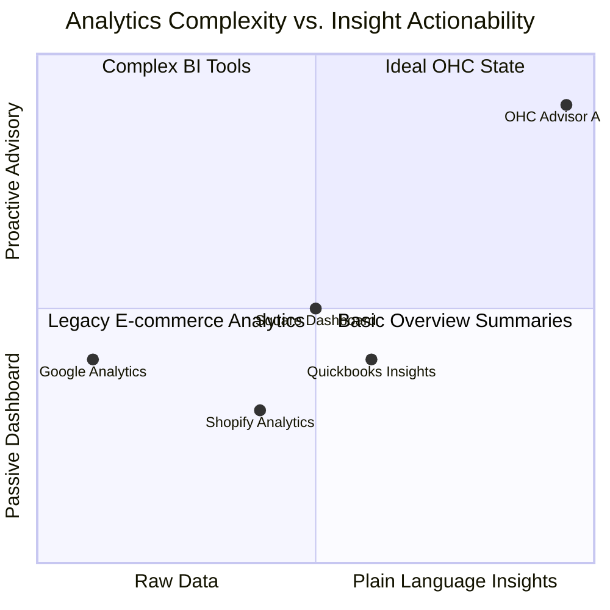

# Plain-Language Financial Advisory

## Title
Plain-Language Financial Advisory: Curing "Financial Fog" for SMBs

## Problem Statement
Most non-technical small business owners experience "Financial Fog." Complex dashboards and raw data dumps (like Shopify Analytics or Google Analytics) alienate them. They don't want to decipher line charts to understand their business health; they want a clear, concise text message explaining what happened and what to do next.

## Research Report
Current reporting tools assume the user is a data analyst. OHC flips this paradigm by having "The Advisor" agent act as a personal financial consultant. Instead of forcing the user to find insights, the system proactively generates plain-language summaries (e.g., "You made $450 this week. Tuesday was your busiest day. Consider raising prices on your top seller, Lemonade").

### Competitive Landscape: Analytics Tools

### Feature Comparison Matrix

| Feature | OHC Advisor | Shopify Analytics | Quickbooks | Standard Dashboard |
| :--- | :--- | :--- | :--- | :--- |
| **Delivery Method** | **Proactive Weekly Briefing** | Passive Dashboard | Dashboard / Email | Dashboard |
| **Format** | **Plain Language (Text)** | Charts & Tables | Charts & Tables | Charts & Tables |
| **Actionability** | **Specific Recommendations** | User Must Interpret | Basic Trends | None |
| **Context** | **Holistic (Sales + Bookings + Ops)** | E-commerce Only | Finance Only | Varies |

## Design Doc

### 1. Data Aggregation
- Implement a scheduled background job (cron) that aggregates weekly metrics for each tenant (revenue, top-selling items, busiest days, refund rates).
- The aggregation queries must be highly optimized and utilize read-replicas to prevent main database impact.

### 2. "The Advisor" Generation
- Pass the aggregated data payload to "The Advisor" agent.
- Use a strictly constrained system prompt to force the LLM to generate plain-language, non-jargon summaries.
- Incorporate simple conditional logic to suggest actions (e.g., if inventory is low and sales are high, suggest raising prices).

### 3. Delivery Mechanism
- Deliver the briefing to the unified Action Feed or as an in-app notification every Monday morning.

## Implementation Prompt
1.  **Metric Aggregation**: Create Go SQLx queries to aggregate weekly revenue, order counts, and top products per `tenant_id`.
2.  **Cron Scheduler**: Utilize the Hybrid Task Scheduler MCP or a simple Go ticker to run the aggregation job weekly for all active tenants.
3.  **Agent Logic**: Develop "The Advisor" agent workflow to consume the JSON metrics payload and interact with the LLM to generate the text summary.
4.  **UI Display**: Design a "Weekly Briefing" card component in Slint for the main dashboard, ensuring it uses large, readable typography (Outfit/Inter).
5.  **Observability**: Add Prometheus metrics to track the execution time of the aggregation job and the LLM generation success rate.

## Priority
**P2 (Medium)** - Essential for long-term user retention and demonstrating the value of "AI as a Teammate."

## Estimated Scope
- **Backend**: 1-2 weeks (Data aggregation queries, Cron scheduling).
- **Agent Integration**: 1 week (Prompt tuning for plain language).
- **Frontend**: 1 week (Dashboard UI component).
- **Total**: ~3-4 weeks.
