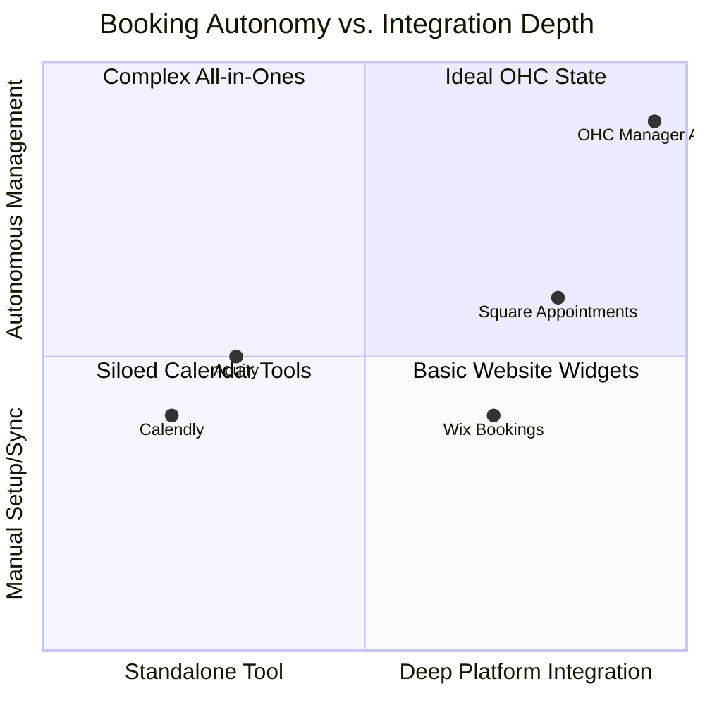

# Smart Booking & Deposit System

## Title
Smart Booking & Deposit System: Automated Commitments for Service Providers

## Problem Statement
Service-based small business owners like Carlos (Handyman) and Leo (Music Tutor) struggle with high friction in securing serious customer commitments. Setting up calendars, managing availability, and integrating payment gateways for deposits is often too technically complex. This results in lost leads, double bookings, and a lack of upfront capital to secure time slots.

## Research Report
Market analysis shows that while platforms like Calendly or Acuity offer booking, they require significant setup and are disconnected from the core business operations (e.g., website, CRM). Shopify's native tools are heavily focused on physical products. OHC can leapfrog these solutions by offering a native booking primitive that automatically handles deposits via Stripe and deeply integrates with "The Manager" agent to send contextual pre-appointment instructions and reminders.

### Competitive Landscape: Booking Systems

### Feature Comparison Matrix

| Feature | OHC Smart Booking | Calendly | Wix Bookings | Shopify |
| :--- | :--- | :--- | :--- | :--- |
| **Setup Complexity** | **Zero (AI Generated)** | Low | Medium | High (Apps needed) |
| **Deposit Handling** | **Automated via Stripe** | Yes (requires setup) | Yes | Yes (with Apps) |
| **Agent Reminders** | **Proactive & Contextual** | Static Templates | Static Templates | N/A |
| **Platform Sync** | **Native CRM/Finance** | External Integration | Native | App Dependent |

## Design Doc

### 1. Booking Primitive
- Establish a core `Booking` data model in PostgreSQL linked to the `Tenant`.
- Fields include scheduled time, service ID, customer ID, deposit amount, and payment intent ID.

### 2. Stripe Deposit Integration
- Integrate with Stripe Checkout to automatically generate Payment Intents for the required deposit amount upon booking selection.
- Implement webhook listeners to update the booking status from `Pending` to `Confirmed` once the deposit is secured.

### 3. Agent Coordination ("The Manager")
- Upon `BookingConfirmed` event via NATS, "The Manager" agent is triggered.
- The agent drafts and schedules contextual pre-appointment instructions (e.g., "Please clear the area under the sink before I arrive" for Carlos) and sends them to the customer.
- "The Manager" also handles rescheduling logic autonomously based on tenant rules.

## Implementation Prompt
1.  **Database Migration**: Create the `bookings` table with Row-Level Security (RLS) enabled on `tenant_id`.
2.  **API Endpoints**: Create REST endpoints for creating and fetching availability slots, and initiating a booking.
3.  **Stripe Integration**: Implement a Go service to handle Stripe Payment Intent creation for deposits and webhook processing for payment confirmation.
4.  **Agent Logic**: Update "The Manager" agent to listen for `BookingConfirmed` events and automatically generate contextual reminders using the LLM provider.
5.  **UI Components**: Build Slint UI components for the service provider to view their calendar and upcoming appointments on mobile.

## Priority
**P1 (High)** - Crucial for onboarding service-based personas (Carlos, Leo). Closes a major gap compared to product-only platforms.

## Estimated Scope
- **Backend**: 2-3 weeks (DB schema, API, Stripe integration, Webhooks).
- **Agent Integration**: 1 week ("The Manager" logic for reminders).
- **Frontend**: 1-2 weeks (Calendar UI, Booking Flow).
- **Total**: ~4-5 weeks.
