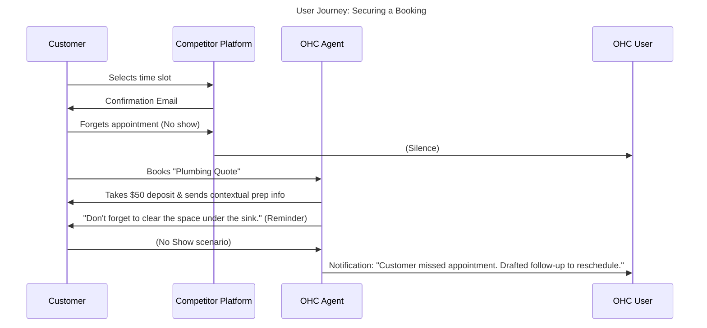

# Issue Brief: AI-Powered Smart Booking & Deposit System

## Problem Statement
Service-based non-technical small business owners, like Carlos (The Freelance Handyman) and Leo (The Music Tutor), suffer from high friction in securing commitments. They lack a unified system that handles scheduling, upfront deposit collection, and automated pre-appointment communication. Traditional booking systems are overly complex to configure and require users to learn technical jargon like "iCal sync" or "webhook integration." OHC needs a seamlessly integrated booking flow managed by "The Manager" (Operations) and "The Salesperson" (Sales), providing a mobile-first, jargon-free experience.

## Research Report

### Competitive Landscape Analysis
- **Squarespace (Acuity Scheduling):** Very powerful, but requires configuring a separate product suite. Setup is complex and the mobile app is disjointed from the main website editor.
- **Wix Bookings:** Well-integrated but lacks proactive AI. The user must manually configure reminder emails and deposit rules.
- **GoDaddy Appointments:** Basic functionality, but inflexible regarding custom deposit amounts or dynamic pricing based on service complexity.
- **Shopify:** Not natively built for bookings; requires expensive third-party apps with varying UI quality.

### Persona-Specific Pain Point Summary
- **Carlos (42, Handyman):** Loses 2-3 hours a week driving to quotes for customers who aren't serious. He needs to collect a $50 deposit upfront before confirming a site visit, but finds Stripe too complicated to set up on his own.
- **Leo (22, Music Tutor):** Forgets to send Zoom links for his online lessons. He needs the system to automatically generate links upon booking and send reminders without his intervention.

### OHC vs Competitor Gap Analysis
| Feature | Acuity (Squarespace) | Wix Bookings | GoDaddy | OHC Target (The Manager) |
| :--- | :--- | :--- | :--- | :--- |
| **Setup Complexity** | High | Medium | Low | **Zero (AI Configured)** |
| **Integrated Deposits** | Yes (Manual config) | Yes | Basic | **Yes (AI suggested pricing)** |
| **Automated Reminders** | Rule-based | Rule-based | None | **Contextual AI Generated** |
| **No-Show Recovery** | Manual | Manual | None | **Proactive Follow-up Agent** |

### User Journey Comparison

### Specific Recommendations
- **OHC should** implement a unified "Booking & Deposit" primitive **because** securing upfront payment eliminates the "tire-kicker" problem that plagues service businesses.
- **OHC should** use "The Manager" to automatically append relevant pre-appointment instructions to booking confirmations based on the service type **because** it reduces the operational fatigue of manual communication.

## Design Doc

### High-Level Architecture
- **Data Model:** A unified `Booking` entity in PostgreSQL that links to a `PaymentIntent` (Stripe) and a `CalendarEvent`.
- **Payment Flow:** Leverage Stripe PaymentIntents to authorize the deposit amount before confirming the calendar slot.
- **Agent Integration:** When a `BookingCreated` event fires on the mesh, "The Manager" generates calendar invites (and Zoom links if applicable), while "The Ambassador" drafts personalized pre-appointment instructions based on the service description.
- **Mobile-First UX:** A 375px native calendar view for the owner, allowing them to tap a day, see bookings, and view deposit status instantly.

### Mobile UX Flow (375px First)
1.  **Dashboard Alert:** "New Booking Request: Plumbing Fix from John. $50 Deposit secured."
2.  **Calendar View:** A simple, scrollable agenda view (no complex weekly grids) showing upcoming appointments with clear "Paid" or "Pending" badges.
3.  **One-Tap Action:** Tapping an appointment provides options to "Reschedule", "Refund Deposit", or "Message Customer" (pre-drafted by AI).

## Implementation Prompt
Implement the Smart Booking and Deposit module. Create the required `Booking` database schema with Row Level Security for tenants. Integrate with the existing Stripe service to authorize and capture deposits during the booking flow. Ensure that booking events are published to the NATS mesh so that "The Manager" can automatically handle calendar synchronization and "The Ambassador" can generate contextual pre-appointment emails.

## Priority
P2

## Estimated Scope
Large
