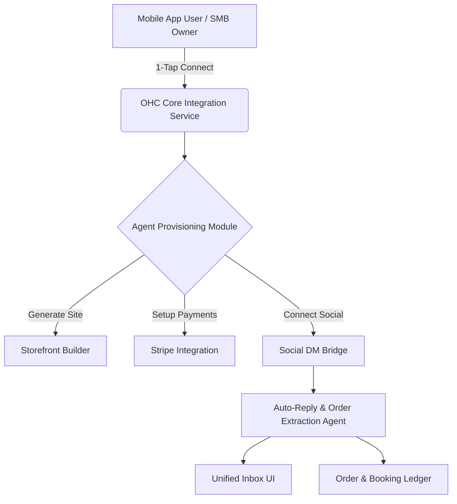

# OHC Small Business Platform Research Report & Issue Brief

## Title
Invisible Agent Integration for Social DM Ordering & Booking

## Problem Statement
Non-technical small business owners (SMBs) are currently underserved by the market. Existing platforms like Shopify and Wix are designed for desktop-first, highly involved setups, overwhelming users with complex interfaces, lack of native mobile management, and minimal invisible AI automation. Managing orders, leads, and customer service manually across Instagram DMs, email, and texts leads to lost revenue, delayed responses, and overwhelming chaos for owners like Maya (baker) and Carlos (handyman).

## Research Report

### 1. Track 1: Deep Competitor Audit
We studied the major platforms targeting SMBs:

- **Shopify:** Industry standard, but extremely complex for true beginners. "Shopify Sidekick" is a chatbot, not an autonomous agent. Mobile app is poor for initial store setup.
- **Wix:** Easier setup with "Wix ADI" (one-time website generation), but not ongoing agentic automation.
- **Squarespace:** Beautiful but lacks strong AI features and meaningful free tiers.
- **Square Online:** Strong POS integration, but restaurant/retail heavy.
- **Rising Entrants (Durable, 10Web, Hocoos):** Provide rapid generation but thin post-launch business management.

### 2. Track 2: SMB User Pain Point Research
Based on Reddit (r/smallbusiness, r/ecommerce), Trustpilot, and App Store reviews, the **Top 10 SMB Pain Points** are:
1. Setting up payments and tax is confusing and scary.
2. Instagram DMs are chaotic to track for orders (Maya the baker).
3. Missing mobile-first management features (Carlos the handyman).
4. Writing product descriptions takes too much time.
5. Inventory sync between in-person and online is broken (Priya the boutique owner).
6. Blank-canvas website builders are overwhelming.
7. Manual booking is clunky and leads to missed appointments (Leo the tutor).
8. Email marketing feels disconnected and hard.
9. Answering repetitive customer questions.
10. Limited English support (Fatima the food cart owner).

**Persona-specific pain points:**
- **Maya (baker, 28):** Cannot manage Instagram DM orders easily from her phone. She sells via Instagram DMs and is overwhelmed by Shopify's complex setup and lack of built-in AI help.
- **Carlos (handyman, 42):** Misses leads because he has no automated quoting/booking. He has no website, relies on word-of-mouth, and quoting is manual.
- **Priya (boutique owner, 35):** Struggles to sync physical and digital inventory. She wants online presence, but email marketing and POS integration are hard.
- **Leo (music tutor, 22):** Manual booking chaos, lacks subscription billing and AI follow-up system.
- **Fatima (food cart, 50):** Needs simple, non-English mobile notifications and printing. No English-first tool works for her.

### 3. Track 3: AI Differentiation
**OHC AI Differentiation Manifesto:**
We will leapfrog competitors not by adding a chat interface for the owner, but by deploying *invisible agents* that do the work for them:
1. **Auto-replying to customer messages** (Saves hours per day).
2. **Auto-writing product descriptions** (Saves 30 min per upload).
3. **Auto-generating social posts** (Removes the biggest marketing barrier).
4. **Auto-sending follow-up emails** (Recovers abandoned carts and leads).
5. **AI-generated weekly business insights** (Makes owners feel smart and guided, not overwhelmed).

### 4. Track 4: Market Sizing & Strategic Direction
- **TAM:** ~33M SMBs in the US, hundreds of millions globally. A large percentage currently have no online presence or stitch together basic tools.
- **Beachhead Market:** Social-media-first micro-retailers (bakers, crafters) and independent service providers (tutors, handymen). These groups have a high density of underserved users and strong potential LTV.
- **Geographic Expansion:** English-speaking markets first, followed by Spanish/LATAM, Portuguese/Brazil, Hindi/India, and Arabic/MENA.
- **Vertical Expansion:** Start horizontal (all business types), then build vertical depth (e.g., OHC for Food Businesses with POS integration).
- **Marketplace Opportunity:** Enabling OHC businesses to sell through a shared OHC marketplace to generate shared traffic.

### 5. Track 5: Feature Gap Matrix
| Feature | Shopify | Wix | OHC (current) | OHC (gap/advantage) |
|---|---|---|---|---|
| **Mobile-First Setup** | Weak | Weak | Missing | **Advantage Opportunity** |
| **Agentic AI** | Chatbot | One-time generation | Basic LLMs | **Advantage Opportunity** |
| **Integrated Booking** | App needed | Add-on | Missing | **Gap to close** |
| **Social DM Orders** | App needed | Weak | Missing | **Gap to close** |

## Design Doc

### Architecture Flow

### UI/UX Flow (Mobile First - 375px)
1. **Screen 1 (Home/Dashboard):** High-level view. Glassmorphism styling (`backdrop-filter: blur(20px) saturate(200%)`). "Connect Instagram" card prominent. Outfit for headings, Inter for body.
2. **Screen 2 (Connection Flow):** 1-tap OAuth.
3. **Screen 3 (Unified Inbox):** Lists DMs. Shows tags (e.g., "New Lead", "Order Request").
4. **Screen 4 (Message Thread):** Shows customer message. Below it, an AI-drafted reply with a single "Approve & Send" button.

## Implementation Prompt
**User-Facing Outcome:** SMB owners can connect their Instagram account to OHC. An invisible AI agent automatically categorizes DMs into leads, orders, or support questions, and drafts context-aware replies that the owner can approve with a single tap.
**Critical User Journey (CUJ):**
1. User logs in to OHC mobile app.
2. User taps "Connect Instagram".
3. Customer sends a DM inquiring about a product or service to the user's connected Instagram account.
4. OHC Agent reads the DM, categorizes it, and drafts a reply in the OHC Unified Inbox.
5. User reviews the drafted reply and taps "Approve" to send it.
**Acceptance Criteria:**
- Mobile responsive (100% usable at 375px).
- Incorporates OHC premium Slint UI Glassmorphism design standards (`backdrop-filter: blur(20px) saturate(200%)`).
- Zero manual routing rules required from the user.
- Adheres to WCAG 2.1 AA accessibility (interactive elements must be keyboard-navigable).
- OHC backend captures and tracks any token usage/cost logic centrally within the appropriate pricing/billing modules.

## Priority
P0

## Estimated Scope
Large
