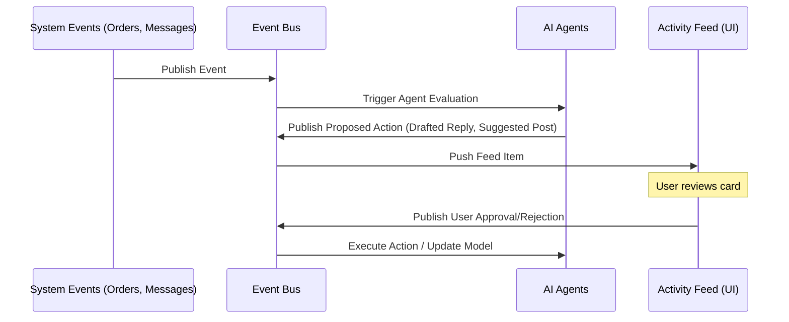

**Title**: Unified Activity Feed UI

**Problem Statement**: Current platforms offer complex navigation menus (Analytics, Settings, Products) that overwhelm non-technical users (like Fatima or Maya). Users suffer from "analysis paralysis" and technical debt fears when navigating these dashboards.

**Research Report**:
- Tools like Shopify and Wix utilize traditional CMS layouts.
- Users report pain point #10 (Analysis Paralysis) when logging in and seeing complex metrics.
- Our strategy requires an "Autopilot" rather than a "Copilot". The interface for an autopilot is a feed of completed or pending actions, not a configuration menu.

**Design Doc**:
- High-level architecture: A message queue system aggregating events from all subsystems (Orders, Inbox, SEO_Agent). The frontend subscribes to this queue and renders cards based on the event type.
- Mobile UX flow (375px first): The home screen is an Instagram-style vertical feed. Cards display plain language ("You got an order!", "I drafted a reply to Carlos"). Each card has 1-2 primary action buttons (e.g., "Approve", "Edit").
- The UI uses Glassmorphism design constraints per OHC standards.

**Implementation Prompt**: Build a React Native or responsive web component for the Activity Feed. It should accept an array of `ActivityItem` objects and render cards. Cards must support quick actions. The default mode should hide all raw JSON/configs, which are only accessible via a sticky "Advanced Mode" toggle.

**Priority**: P0

**Estimated Scope**: Large

## Detailed Design & Architecture

### Core Components
1.  **Event Bus (Backend)**: A centralized messaging system (e.g., Kafka or Redis) that ingests events from all OHC microservices (Orders, Appointments, CRM, AI Agents).
2.  **Feed Aggregator (Backend)**: Subscribes to the Event Bus, normalizes events into `ActivityItem` formats, and stores them in a highly available data store (e.g., DynamoDB or specialized feed database).
3.  **Client Application (Frontend)**: Native mobile app or PWA that fetches and renders the feed. Uses real-time updates (WebSockets or Server-Sent Events) to keep the feed current.

### The `ActivityItem` Schema
```json
{
  "id": "act_12345",
  "timestamp": "2023-10-27T10:00:00Z",
  "type": "AI_ACTION_REQUIRED",
  "source": "ReplyAgent",
  "priority": "HIGH",
  "title": "Drafted reply to new inquiry",
  "description": "Carlos asked about plumbing rates. I drafted a response based on your standard pricing.",
  "payload": {
    "draft_text": "Hi Carlos, my standard rate is $80/hr. Would you like to schedule a visit?",
    "customer_id": "cust_987"
  },
  "actions": [
    { "label": "Review & Send", "action_type": "NAVIGATE_TO_DRAFT" },
    { "label": "Send Now", "action_type": "API_CALL", "endpoint": "/api/send_message" }
  ],
  "status": "PENDING"
}
```

### UI/UX Principles
*   **Glanceability**: Cards must be readable in 2 seconds. Use clear iconography and concise text.
*   **Actionability**: Every card should have a clear "next step". If it's purely informational (e.g., "Daily Summary"), the action might just be "Dismiss" or "Archive".
*   **Triage Flow**: Support swipe gestures (e.g., swipe right to approve, swipe left to dismiss) to allow rapid triage of AI actions, similar to an email inbox.
*   **Progressive Disclosure**: The primary view is simple. Tapping a card expands it for more details. The "Advanced Mode" toggle reveals underlying raw data or configuration options.

## Strategic Recommendations for OHC
1.  **Iterative Rollout**: Start by migrating notifications (new orders, messages) into the feed. Then, introduce simple AI actions (e.g., suggested social posts). Finally, implement complex autonomous approvals (e.g., automated refunds).
2.  **Trust Building**: The feed is critical for building trust with the AI. By explicitly showing what the AI *proposes* to do before it acts autonomously (at least initially), users gain confidence in the system.
3.  **Gamification**: Use the feed to encourage positive business behaviors. E.g., "You haven't posted on Instagram this week. Here are 3 AI-generated options. Tap to publish one and maintain your streak!"

## Competitive Matrix: Dashboard UI

| UI Element | Traditional Platforms | OHC Activity Feed | Why OHC Wins |
| :--- | :--- | :--- | :--- |
| **Primary Interface** | Complex multi-tab dashboard | Unified chronological feed | Eliminates navigation hunting; surfaces immediate priorities. |
| **Data Presentation** | Raw metrics (charts, graphs) | Plain language summaries | Addresses "analysis paralysis"; tells the user *what the data means*. |
| **Action Execution** | Navigate to specific sub-menu | 1-tap inline actions | Drastically reduces time-on-task for common operations. |
| **AI Interaction** | Separate chat window | Integrated into the feed | AI actions are treated as peer events alongside customer actions. |

## Deep Dive: The Psychology of the Activity Feed
Traditional dashboards induce anxiety in non-technical users. Seeing a drop in a line chart without understanding *why* or *what to do about it* is demotivating.
*   **Cognitive Load Reduction**: The Activity Feed shifts the cognitive load from the user (interpreting data and deciding on an action) to the AI (interpreting data, deciding on an action, and presenting it for approval).
*   **The "Social Media" Paradigm**: By mimicking the familiar interaction model of social media feeds (scroll, consume discrete units of information, tap to interact), OHC leverages existing mental models, achieving the "Grandmother Test" requirement.

## UX Flow: Managing Daily Tasks (Status Quo vs. OHC)
### Status Quo
1.  Log in to dashboard.
2.  Check "Orders" tab -> see 2 new orders -> manually mark as fulfilled.
3.  Check "Messages" tab -> read inquiry -> type reply.
4.  Check "Analytics" tab -> see traffic is down -> feel stressed -> log out.

### OHC Target Flow
1.  Open OHC app.
2.  Feed Item 1: "You have 2 new orders to fulfill. [Mark Fulfilled]" -> User taps button.
3.  Feed Item 2: "Drafted reply to inquiry about hours. [Review/Send]" -> User taps button.
4.  Feed Item 3: "Traffic is down 5% this week. I drafted a promotional email to your past customers to boost sales. [Review Draft]" -> User taps button.
5.  All tasks completed in 30 seconds. User feels empowered.

## Technical Implementation Considerations

### Real-time Updates (WebSockets vs. SSE)
The Activity Feed must feel instantaneous.
*   **Server-Sent Events (SSE)**: Generally preferred for a unidirectional feed (server to client) due to simpler infrastructure and native HTTP support.
*   **WebSockets**: Necessary if the feed requires highly interactive, bi-directional communication (e.g., real-time typing indicators from the AI).

### State Management & Optimistic UI
*   When a user taps "Approve" on an AI-drafted reply, the UI must update instantly (optimistic update) while the API call is processed in the background. This ensures a fluid, responsive experience even on slow mobile networks.
*   Use robust state management (e.g., React Query or Zustand) to handle local caching and background synchronization of the feed items.

### Accessibility (a11y)
*   The feed must be fully navigable via screen readers.
*   Action buttons must have clear focus states and adequate touch targets (minimum 44x44pt) for mobile usability.
*   Ensure high contrast ratios, especially within the Glassmorphism design system, which can sometimes reduce legibility.

## Final Summary for Product Team
The Activity Feed is the nerve center of the OHC platform. Its performance, reliability, and UX must be flawless. It is the primary interface through which the user interacts with the AI, and therefore dictates the perceived quality of the entire platform.

## Competitive Analysis Matrix: Feature by Feature

| Feature Category | Traditional Dashboards | OHC Activity Feed | Key Difference |
| :--- | :--- | :--- | :--- |
| **Information Architecture** | Tabbed navigation, nested menus | Single chronological feed | OHC flattens the hierarchy, presenting all relevant information in one place. |
| **Data Interpretation** | User must analyze charts/graphs | AI provides plain-language summaries | OHC removes the cognitive burden of data analysis. |
| **Task Execution** | Requires navigating to specific modules | 1-tap inline actions on feed cards | OHC enables rapid triage and execution of common tasks. |
| **AI Visibility** | Hidden or siloed in specific tools | Front and center in the feed | OHC makes the AI's contributions explicitly visible, building trust. |

## The "Dashboard Fatigue" Dilemma
Small business owners are overwhelmed by the proliferation of dashboards they must monitor (Shopify, Google Analytics, Mailchimp, social media platforms).
1.  **Context Switching:** Jumping between different interfaces is inefficient and error-prone.
2.  **Missed Signals:** Critical information (e.g., a sudden drop in traffic) is often buried in sub-menus.

**OHC's Strategic Stance:**
The Activity Feed must be the ultimate aggregator. It should pull data from all OHC modules (and potentially external integrations) and present it as a cohesive narrative. By transforming raw data into actionable, plain-language tasks ("Your inventory is low. Reorder?"), OHC eliminates dashboard fatigue and empowers users to act decisively.

## Strategic Conclusion & Product Roadmap Implications

The Unified Activity Feed is the most critical UI component of the OHC platform. It is the tangible manifestation of the "Autopilot" paradigm. Its success will determine whether users perceive OHC as a helpful digital employee or a confusing black box.

The implementation of the Activity Feed must adhere to strict principles:
1.  **Extreme Glanceability**: Users must be able to understand their business status in seconds.
2.  **Frictionless Action**: 1-tap approvals are essential for maintaining the "Time-Poor Solopreneur" engagement.
3.  **Perfect Performance**: Real-time updates and optimistic UI changes are non-negotiable requirements for a modern, mobile-first experience.

By perfecting the Activity Feed, OHC solves the "Analysis Paralysis" and "Dashboard Fatigue" that plague incumbent platforms, creating a user experience that is fundamentally superior for our target demographic.

## Visual Excellence Mandate: Architecture & Flow



### UX Flow (Mobile-First 375px)
1. **The Interface:** A clean, vertical feed taking up the full screen. Each item is a card with heavy drop shadows (Glassmorphism style) separating it from the background.
2. **The Card Structure:**
    *   Top left: Icon indicating source (e.g., Mail icon, Cart icon).
    *   Top right: Timestamp (e.g., "2m ago").
    *   Body: Bold headline ("New Order from David") followed by plain text summary ("David ordered the Guitar Basics package. He requested a Tuesday slot.").
    *   Bottom: Primary Action ("View Order Details") and Secondary Action ("Message David").
3. **The Advanced Toggle:** A sticky floating action button (FAB) at the bottom right toggles "Advanced Mode". When active, cards expand to show raw JSON payloads or deeper configuration options for technical users.

## Final Implementation Prompt
**Objective:** Build the core UI component for the Unified Activity Feed. This feed will serve as the primary interface for users to review and approve autonomous actions proposed by the AI agents.

**Critical User Journey (CUJ):**
1. The user opens the OHC mobile app and lands on the Activity Feed.
2. The feed displays a chronological list of cards representing various events (e.g., new order, drafted message, SEO update recommendation).
3. The user interacts with a card representing an AI-drafted reply by tapping the primary "Send" button.
4. The UI immediately reflects the action (optimistic update), providing visual feedback (e.g., a checkmark animation) and moving the card to an "Archive" state.
5. The user taps the "Advanced Mode" toggle at the bottom of the screen, revealing additional configuration options and raw JSON payloads for all visible cards.

**Acceptance Criteria:**
* The feed component must be fully responsive, perfectly optimized for a 375px mobile viewport, and implement smooth scrolling.
* Each card must support distinct primary and secondary action buttons.
* Optimistic UI updates must be implemented for all primary actions to ensure a perceived zero-latency experience.
* The "Advanced Mode" toggle must successfully expose the hidden technical details (raw JSON, schema definitions) for debugging and advanced configuration without cluttering the simple view.
