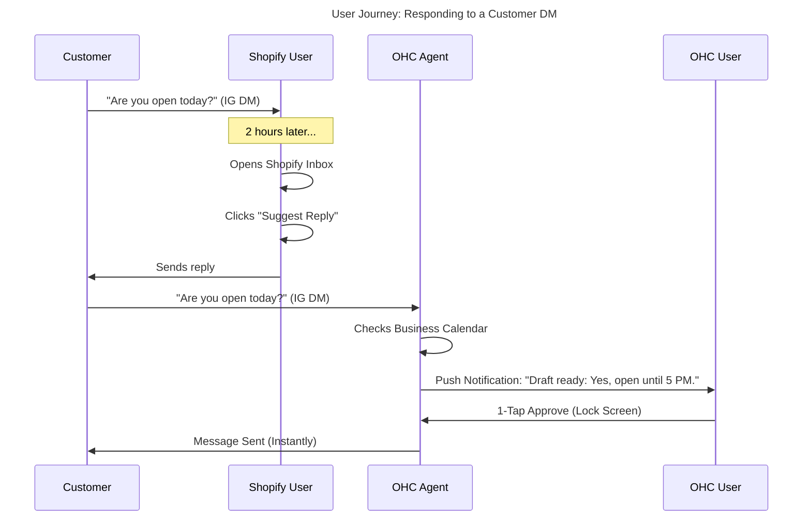

# Issue Brief: Unified AI Messaging Inbox (The Ambassador's Interface)

## Problem Statement
Non-technical small business owners like Maya (The Home Baker) and Fatima (The Food Cart Operator) are missing critical sales because their customer communications are fragmented across Instagram DMs, WhatsApp, SMS, and Email. They suffer from "Communication Lag" (a top 10 SMB pain point) and lose up to 30% of sales due to slow response times. Existing solutions like Shopify Inbox or Wix Inbox require manual monitoring and lack proactive AI drafting capabilities. OHC needs a single, unified inbox where "The Ambassador" (Customer Success Agent) proactively drafts responses for 1-tap approval, seamlessly integrating all communication channels into a simple, 375px mobile-first interface.

## Research Report

### Competitive Landscape Analysis
- **Shopify Inbox:** Consolidates Apple Business Chat, Instagram, and Messenger. Features "Shopify Magic" (AI) for suggested replies, but it is purely reactive. The user must open the app, read the message, and click to generate a reply.
- **Wix Inbox:** Centralizes communications but lacks deep, contextual AI. Focuses more on CRM tagging than autonomous drafting.
- **Squarespace:** Very limited native messaging. Relies heavily on third-party integrations (e.g., Mailchimp) or basic form emails.
- **GoDaddy:** Offers basic unified messaging in its app, but with zero AI assistance.

### Persona-Specific Pain Point Summary
- **Maya (28, Home Baker):** Receives 40+ Instagram DMs daily ("Do you have vegan options?"). She tries to answer them while baking, resulting in missed leads.
- **Fatima (50, Food Cart):** Uses WhatsApp for pre-orders. Struggles to manually confirm orders and track who paid, especially during lunch rushes.

### OHC vs Competitor Gap Analysis
| Feature | Shopify Inbox | Wix Inbox | Squarespace | GoDaddy | OHC Target (The Ambassador) |
| :--- | :--- | :--- | :--- | :--- | :--- |
| **Channel Consolidation** | High (IG, FB, Email) | High | Low | Medium | **High (IG, WA, SMS, Email)** |
| **AI Reply Generation** | Reactive (Prompted) | Low/None | None | None | **Proactive (Background Drafts)** |
| **Contextual Memory** | Low (Session only) | Low | None | None | **High (pgvector memory)** |
| **1-Tap Approval** | No | No | No | No | **Yes (Lock-screen actionable)** |

### User Journey Comparison

### Specific Recommendations
- **OHC should** implement a unified webhook aggregator for Meta (IG/FB/WA) and Twilio (SMS) **because** 68% of small business owners report operational fatigue from app-switching.
- **OHC should** trigger "The Ambassador" on every incoming message event to pre-draft replies **because** users need AI to act as a teammate (proactive) rather than a tool (reactive).

## Design Doc

### High-Level Architecture
- **Ingestion Layer:** A unified webhook receiver endpoint (`/webhooks/messaging`) that normalizes incoming payloads from Instagram, Facebook Messenger, WhatsApp, and SMS into a standard `IncomingMessage` struct.
- **Event Bus Integration:** The receiver publishes an `IncomingMessageReceived` event to the NATS event mesh.
- **The Ambassador (Agent):** Subscribes to the event mesh, retrieves the customer's previous interactions via pgvector (`autodream_memories`), checks business context (e.g., operating hours, inventory), and generates a response draft.
- **State Management:** The drafted response is saved to the OHC-SIP PostgreSQL database as a `PendingAgentAction`.
- **UI (Mobile-First):** The Flutter app subscribes to updates via WebSockets, displaying a "Drafts Awaiting Approval" card at the top of the 375px dashboard.

### Mobile UX Flow (375px First)
1.  **Notification:** User receives a push notification on their phone: "The Ambassador drafted a reply to Maya: 'Yes, we do vegan cakes!'"
2.  **Dashboard Feed:** Opening the app shows the unified inbox. Messages with AI drafts have a prominent blue "Approve & Send" button.
3.  **Editing:** Tapping the draft opens the native keyboard for quick edits before sending.

## Implementation Prompt
Implement the Unified Messaging Webhook Receiver and integrate it with "The Ambassador" agent. Create a new service that normalizes incoming Meta and Twilio webhooks, publishes them to the NATS mesh, and triggers The Ambassador to generate a draft reply. Store this draft in PostgreSQL under a `pending_actions` table, ensuring it is tied to the correct `tenant_id` via RLS. Finally, expose an endpoint for the Flutter UI to fetch and approve these drafts with a single tap.

## Priority
P1

## Estimated Scope
Medium
