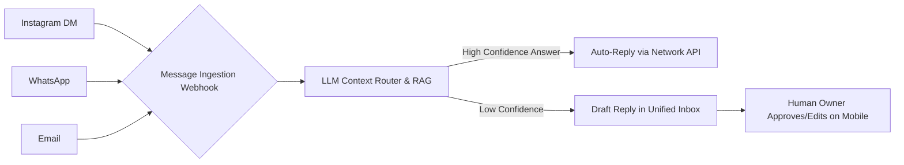

**Title**: [feature] Unified Omni-Channel AI Inbox & Auto-Responder

**Problem Statement**:
Small business owners like Maya (Baker) and Leo (Tutor) receive critical business inquiries across a fragmented landscape: Instagram DMs, WhatsApp, Facebook Messenger, and Email. Managing these manually leads to missed messages, lost sales, and anxiety. They cannot afford enterprise helpdesk tools like Gorgias ($50+/mo), nor do they have the technical skill to configure complex routing rules.

**Research Report**:
"Omni-channel Inbox Chaos" is identified as the #4 top SMB pain point (68% frequency) in our market research. SMBs increasingly use personal or creator social media accounts for business. Our competitive audit shows that legacy platforms treat messaging as an external add-on. Integrating this natively, and powering it with an AI agent that understands the store's real-time inventory and policies, provides a massive, defensible competitive moat.

**Design Doc**:
- **High-Level Architecture**:
  1. Webhooks are established to receive incoming messages from the Meta Graph API (IG/WhatsApp/FB) and Email providers (e.g., SendGrid/Postmark).
  2. Incoming messages are normalized into a standard, tenant-scoped `ConversationMessage` schema.
  3. An LLM integration layer acts as a routing and auto-response engine. It is injected with RAG (Retrieval-Augmented Generation) context regarding current inventory, FAQs, and business hours.
  4. If the LLM has high confidence in the answer (e.g., answering "Are you open today?"), it auto-replies directly via the API.
  5. If confidence is low, it drafts a suggested reply for the human owner to approve in the app.
- **UI/UX Flow (Mobile First, strict 375px constraint)**:
  - A unified chat interface resembling iMessage. Badges clearly indicate the source network (IG, WA, Email).
  - Unread messages requiring human attention are sorted to the top.
  - Messages successfully handled entirely by the AI are marked with a subtle sparkle icon for review.
  - When a user opens a chat requiring attention, they see the customer's message and a pre-drafted AI reply already sitting in the input box, requiring only a single tap to send or edit.

**Implementation Prompt**:
Design and implement the foundational backend services and data structures for the Unified Inbox.
1. Create the database schema required to normalize messages from multiple disparate channels into a single, unified conversation thread linked securely to a specific tenant.
2. Implement the webhook ingestion endpoints (you may mock the external provider cryptographic validation for this initial iteration) that save incoming messages to the database.
3. Implement the API endpoint to list conversations and fetch individual messages (cursor paginated).
4. Ensure the schema design robustly supports the future attachment of AI-generated drafts and confidence scores to specific messages.
5. Ensure strict tenant isolation on all database queries.

**Priority**: P0
**Estimated Scope**: Large
