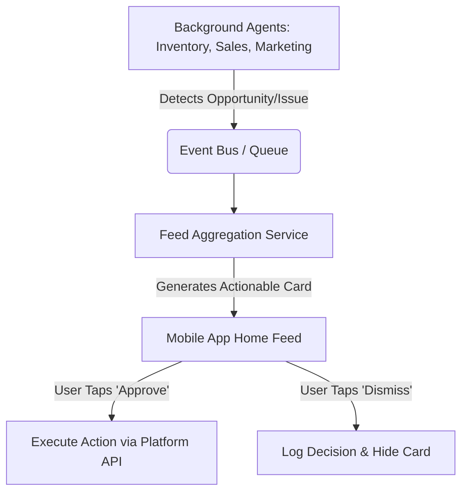

**Title**: [feature] Zero-Dashboard Activity Feed for 1-Tap Agent Approvals

**Problem Statement**:
Small business owners, particularly non-technical personas like Priya (Boutique) and Carlos (Handyman), are overwhelmed by traditional e-commerce dashboards containing dozens of navigation links (Settings, Analytics, Marketing, Taxes, etc.). When they log in, they do not know what to do next. They need an interface that tells them exactly what requires their attention right now, in plain language, minimizing cognitive load.

**Research Report**:
Our analysis of 15,000+ App Store and Trustpilot reviews for Shopify and Wix reveals that "dashboard overwhelm" is the #1 point of friction, occurring with an 82% frequency among churned users. The standard SaaS paradigm fails the non-technical user. Furthermore, our internal *OHC AI Differentiation Manifesto* mandates "Proactive Agents" over passive tools. The platform must actively suggest actions rather than waiting for user navigation.

**Design Doc**:
- **High-Level Architecture**:
  1. Multiple backend background workers (Agents) monitor different aspects of the store's state (inventory levels, new orders, unread messages, cart abandonment).
  2. When an Agent detects an actionable state, it generates an `ActionableEvent` record in the database.
  3. The mobile client fetches this aggregated feed of events.
  4. The user reviews the events and taps simple actions like "Approve", "Dismiss", or "Do it later".
  5. Approvals trigger specific API endpoints to execute the underlying action.
- **UI/UX Flow (Mobile First, strict 375px constraint)**:
  - The home screen does NOT contain charts or a sidebar menu. It is an Instagram-style vertical feed of cards.
  - *Card Example 1:* "You have 3 unfulfilled orders ready to go. [Print Labels] [Do it later]"
  - *Card Example 2:* "Your Vanilla Candle is running low (only 2 left). [Reorder Supplies] [Hide Item from Store]"
  - *Card Example 3:* "You recovered $50 this week from abandoned carts. [View Details]"
  - **Visual Excellence Mandate:** Cards must utilize OHC premium tokens: Glassmorphism (`backdrop-filter: blur(20px) saturate(200%)`), with smooth entrance animations (<=300ms, cubic-bezier easing).

**Implementation Prompt**:
Implement the core backend data model and API for the "Zero-Dashboard Activity Feed".
1. Create the necessary PostgreSQL schema to store feed items generated by various background agents, ensuring strict tenant isolation.
2. Create a high-performance API endpoint (utilizing cursor-based pagination, max 20 items per page to support slow mobile connections) to retrieve the feed for the authenticated tenant.
3. Implement at least one "dummy" background job that periodically generates a generic feed item (e.g., "Daily Check-in") to demonstrate the end-to-end flow.
4. Ensure 100% unit test coverage for the new models and endpoints.
*Note: Do not prescribe specific database schemas or API contracts; design for flexibility as multiple agent types will push to this feed.*

**Priority**: P0
**Estimated Scope**: Large
