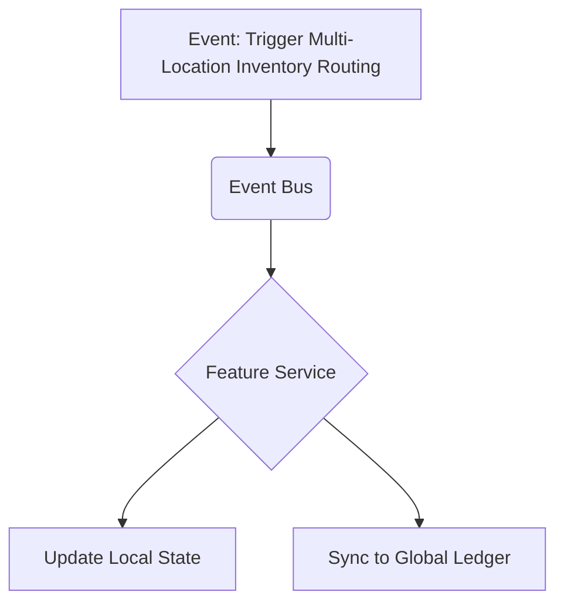

# Competitive Analysis Appendix 2: Multi-Location Inventory Routing

## Problem Statement
The implementation of Multi-Location Inventory Routing is a common pain point for Scaling e-commerce. While some platforms offer basic functionality, scaling operations often reveals significant limitations that require expensive workarounds.

## Research Report
### Definition
Rules based routing of orders to closest fulfillment center.

### Target Audience Needs
- Scaling e-commerce need this feature to operate efficiently.
- Current solutions often require manual data entry to sync with core accounting systems.

### Competitive Landscape
- Shopify advanced feature. Wix struggles here.
- User feedback indicates high dissatisfaction with the hidden costs associated with third-party apps for this functionality.

### Market Size Implications
A significant portion of the total addressable market relies on this capability to transition from a "side hustle" to a full-time enterprise.

## Design Doc
### Architecture Overview
This feature must be designed as a first-class citizen within the core entity graph, ensuring that it interacts seamlessly with the global Event Bus.

### Mobile UX Considerations (375px First)
The administration of Multi-Location Inventory Routing must be fully capable on a mobile device.

- **Primary View**: A unified dashboard showing the current status of the feature.
- **Action Flow**: 1-tap approvals for AI-suggested optimizations.

## Implementation Prompt
Ensure the database schema supports the necessary metadata for Multi-Location Inventory Routing without requiring schema migrations for every new configuration option. Use JSONB columns where appropriate for flexible configuration.

## Priority
P2

## Estimated Scope
Medium
