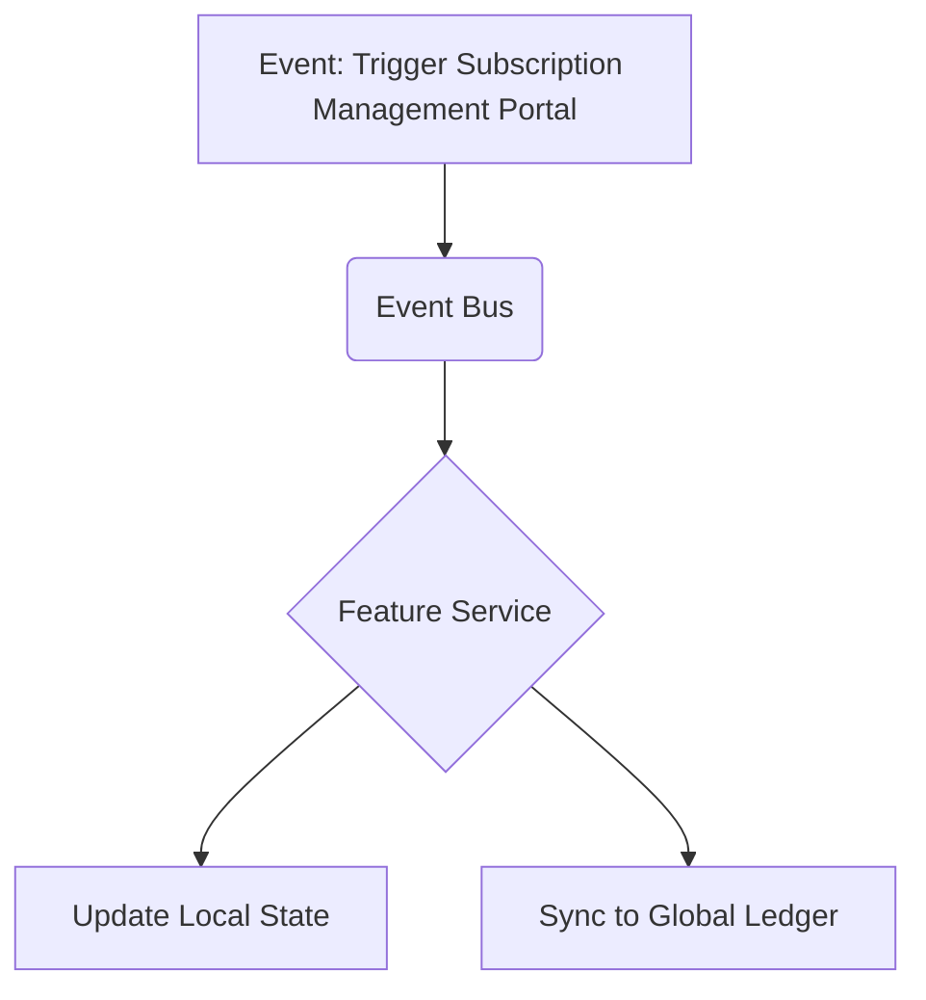

# Competitive Analysis Appendix 5: Subscription Management Portal

## Problem Statement
The implementation of Subscription Management Portal is a common pain point for Subscription boxes, tutors. While some platforms offer basic functionality, scaling operations often reveals significant limitations that require expensive workarounds.

## Research Report
### Definition
Customer self-service for pausing or modifying subscriptions.

### Target Audience Needs
- Subscription boxes, tutors need this feature to operate efficiently.
- Current solutions often require manual data entry to sync with core accounting systems.

### Competitive Landscape
- ReCharge (app) dominates Shopify. Squarespace is native.
- User feedback indicates high dissatisfaction with the hidden costs associated with third-party apps for this functionality.

### Market Size Implications
A significant portion of the total addressable market relies on this capability to transition from a "side hustle" to a full-time enterprise.

## Design Doc
### Architecture Overview
This feature must be designed as a first-class citizen within the core entity graph, ensuring that it interacts seamlessly with the global Event Bus.

### Mobile UX Considerations (375px First)
The administration of Subscription Management Portal must be fully capable on a mobile device.

- **Primary View**: A unified dashboard showing the current status of the feature.
- **Action Flow**: 1-tap approvals for AI-suggested optimizations.

## Implementation Prompt
Ensure the database schema supports the necessary metadata for Subscription Management Portal without requiring schema migrations for every new configuration option. Use JSONB columns where appropriate for flexible configuration.

## Priority
P2

## Estimated Scope
Medium
