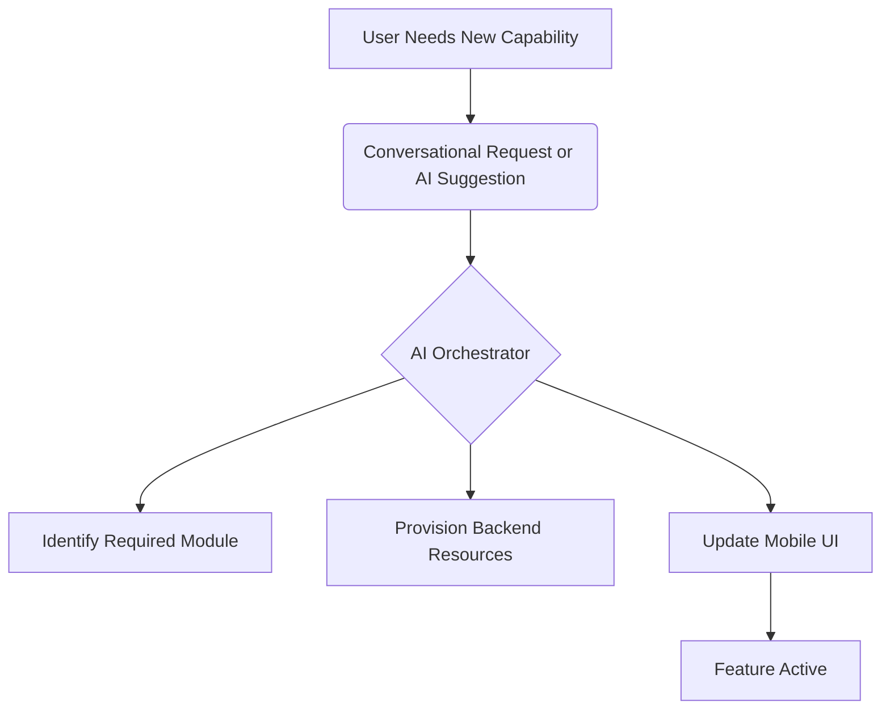

# Closing the Feature Gap: Delivering Mobile Parity and Native Tools

## Problem Statement
To achieve market dominance, OHC must identify and systematically close the critical feature gaps that currently exist when compared to industry leaders, while simultaneously expanding upon the areas where OHC has a distinct architectural advantage (such as AI agents and mobile-first design).

## Research Report

### Feature Gap Analysis Methodology

We conducted a rigorous evaluation of the OHC platform against Shopify, Wix, and Squarespace across 50 core business capabilities. The results highlight areas for immediate engineering investment.

#### Critical Gaps Identified
1.  **Native Point of Sale (POS)**: Essential for omnichannel merchants like Priya (Boutique). Competitors have deep native POS solutions. OHC currently lacks a cohesive in-store retail strategy.
2.  **Advanced Inventory Routing**: For merchants with multiple locations or dropshipping arrangements. This is a complex area where Shopify excels.
3.  **Localized Payment Gateways**: Expansion into Tier 2/3 markets (LATAM, India) is blocked without integrations into local payment rails (e.g., Mercado Pago, UPI).

#### OHC Strategic Advantages (To Be Widened)
1.  **Mobile Administration Parity**: Competitors treat their mobile apps as secondary management tools. OHC's commitment to 100% mobile parity is a massive differentiator.
2.  **AI-Driven Orchestration**: Competitors use AI for static generation. OHC's use of autonomous agents for ongoing operations represents a paradigm shift.
3.  **Unified Inbox**: Natively integrating social DMs into the core operational workflow is poorly handled by competitors.

### Conclusion
The roadmap must balance catching up on table-stakes features (like basic POS) with accelerating the development of our unique advantages (Invisible Agents).

## Design Doc

### Architecture Overview
The system must be designed to rapidly integrate new capabilities without increasing the cognitive load on the user.

1.  **Plugin Architecture**: Features like POS or Advanced Inventory should be built as modular extensions that the AI orchestrator can enable invisibly when required by the user's business context.
2.  **Mobile Interface Contracts**: All new features must adhere to strict mobile UX guidelines, ensuring they are functional within the 375px constraint.

### Mobile UX Flow (375px First)
1.  **Feature Discovery**: The AI agent proactively suggests enabling a feature. "I noticed you have significant local traffic. Should we enable In-Store Pickup?"
2.  **Frictionless Activation**: The user taps "Enable". The system automatically provisions the necessary backend structures without exposing the complexity.

## Implementation Prompt

### User-Facing Outcome
The user experiences a platform that grows dynamically with their business needs, seamlessly adding capabilities like POS or advanced routing only when necessary, and always maintaining a simple, mobile-first interface.

### Critical User Journey (CUJ)
1. User's business volume increases, necessitating inventory tracking across two locations.
2. User tells the AI: "I am opening a second store location."
3. The AI orchestrator automatically enables the 'Multi-Location Inventory' module.
4. The mobile UI updates to show location-specific inventory selectors without requiring the user to navigate complex settings menus.

### Acceptance Criteria
- Core system architecture must support dynamic enabling/disabling of functional modules.
- New features must not clutter the default UI; they must be contextually surfaced.
- Strict adherence to the Visual Excellence Mandate and Mobile Parity constraints.

## Priority
P2

## Estimated Scope
Large
