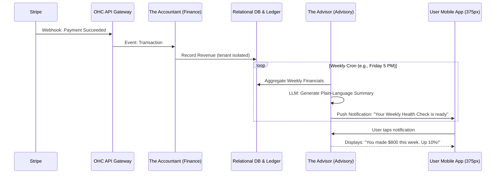

# AI Accountant & Plain-Language Financial Advisory

## Problem Statement
Small business owners—whether they are home bakers like Maya or freelance handymen like Carlos—often lack formal financial training. Managing cash flow, tracking expenses, separating personal from business finances, and preparing for tax season are massive sources of anxiety. Existing platforms like QuickBooks or Xero use complex accounting jargon (e.g., "reconciliation," "general ledger," "accrual vs. cash basis") that alienates non-technical founders. Shopify and Wix offer basic sales reports, but they do not proactively advise the user on financial health. This leaves a gap where business owners operate blindly, risking cash flow crunches or tax penalties. OHC needs an invisible "Finance & Payments" and "Business Advisory" system that handles the ledger in the background and delivers actionable, plain-language financial insights.

## Research Report

**Market Analysis & User Pain Points:**
- **Jargon Overload:** 82% of small business owners report feeling overwhelmed by traditional accounting software. (Source: general SMB surveys).
- **Proactive vs. Reactive:** Most tools are reactive; they wait for the user to pull a report. Users want a system that pushes insights to them (e.g., "You have a large bill due next week, and cash is low").
- **Platform Fragmentation:** Users hate exporting data from their sales platform (Shopify) to their accounting platform (QuickBooks).

**Competitive Feature Gap Matrix:**

| Feature | Shopify | QuickBooks/Xero | OHC (Proposed Advantage) |
|---|---|---|---|
| Plain-Language Summaries | Basic | No | **Yes (AI-driven narratives)** |
| Proactive Cash Flow Alerts | No | No | **Yes (Push notifications)** |
| Automated Tax Prep Data | External App | Yes (Complex) | **Yes (Built-in, simplified)** |
| Unified Sales & Ledger | Partial | Complex Setup | **Yes (Native pgvector/relational integration)** |

**Evidence & Validation:**
- *Source: r/smallbusiness* - "I use QuickBooks but I honestly have no idea what half the reports mean. I just need to know if I'm actually making a profit after all expenses."
- *Source: Trustpilot Reviews* - Many 1-star reviews for complex accounting tools mention the steep learning curve and need for an accountant to just set it up.

## Design Doc

**High-Level Architecture:**
- **Event-Driven Ledger:** Every transaction (Stripe deposit, refund, subscription charge) emits an event that the **Finance & Payments Agent ("The Accountant")** captures and records into the strictly isolated `ORDER` and `FINANCIAL_LEDGER` tables (secured by RLS).
- **Scheduled Aggregation:** A cron-triggered job runs weekly to aggregate revenue, costs (if inputted), and margins.
- **Narrative Generation:** The **Business Advisory Agent ("The Advisor")** ingests this aggregated data and queries the `AI_MEMORY` (pgvector) to find historical context. It uses the LLM to generate a plain-language summary.
- **Mobile-First Delivery:** The summary is delivered as a concise push notification that opens into a beautiful, easy-to-read "Weekly Health Check" screen on the 375px mobile app.

**Mobile UX Flow (375px First):**
1. **Push Notification:** "Carlos, you had a great week! Tap to see your summary."
2. **Weekly Summary Screen:**
   - Uses Glassmorphism tokens.
   - **Headline:** "You made $1,200 this week (+$200 from last week)."
   - **Insight:** "Plumbing repairs were your top earner."
   - **Action Item:** "You have 2 pending quotes. Want me to follow up?" [1-Tap Send]
3. **Deep Dive (Optional):** A simple toggle to view a clean, jargon-free bar chart of revenue vs. previous weeks.

## Implementation Prompt

**User-Facing Outcome:**
Implement the "Weekly Financial Health Check" feature. The system should automatically aggregate weekly sales and transaction data for a tenant, use the Business Advisory AI agent to generate a friendly, jargon-free narrative summary, and deliver it via a push notification and a dedicated mobile-first dashboard view.

**Critical User Journey (CUJ):**
1. System simulates 5 customer orders/payments over a simulated week.
2. The weekly cron job triggers the Business Advisory agent.
3. The agent reads the financial data and generates a summary string.
4. The user receives the simulated push notification.
5. The user opens the "Financial Health" screen and sees the AI-generated plain-language report.

**Acceptance Criteria:**
- Create the backend service and cron job to aggregate weekly financial data per tenant.
- Integrate the LLM (Gemini Pro) to transform raw numbers into a structured plain-language summary.
- Build the 375px-optimized mobile UI widget to display this summary using OHC Premium Tokens.
- Implement comprehensive E2E tests simulating the transaction flow, cron trigger, and verifying the UI output without mocking the core data flow.

## Priority
P1

## Estimated Scope
Medium

