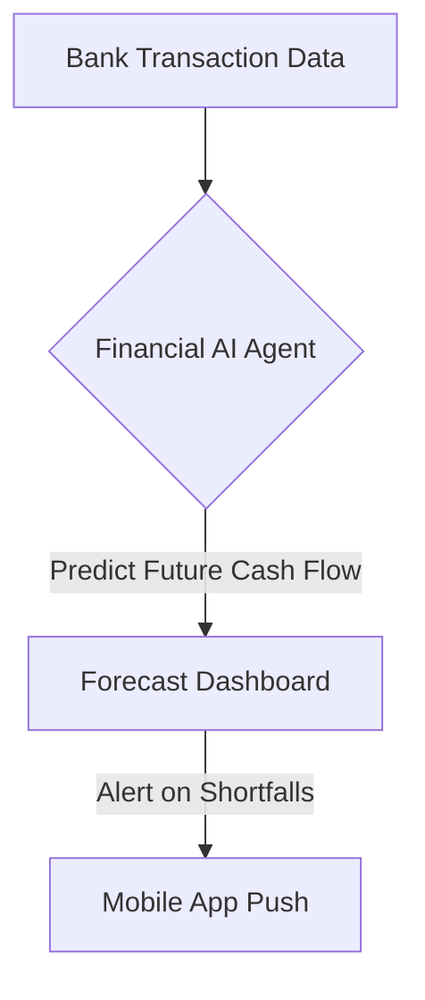

**Title**: Automated Cash Flow Forecasting
**Problem Statement**: Managing cash flow is the number one reason small businesses fail.
**Research Report**: Most SMB owners manage cash flow in their heads or on spreadsheets, leading to unexpected shortfalls.
**Design Doc**:
*   Architecture: Banking API Integration -> Financial AI Agent -> Forecast Dashboard.

**Implementation Prompt**: Integrate with banking APIs (e.g., Plaid) to analyze past transactions and predict future cash flows over a 30, 60, and 90-day horizon, alerting the business owner of any potential shortfalls.
**Priority**: P1
**Estimated Scope**: Large

### The Mechanics of Prediction
Cash flow forecasting requires more than just analyzing past revenue. The Financial AI Agent must integrate multiple data streams:
*   **Accounts Receivable**: Invoices sent but not yet paid (critical for B2B or service-based businesses like Carlos the handyman).
*   **Accounts Payable**: Upcoming bills, subscription renewals, and payroll obligations.
*   **Historical Seasonality**: Recognizing that a retail business typically sees a dip in sales during certain months and adjusting the forecast accordingly.

### Actionable Interventions
A forecast is only useful if it enables action. If the system predicts a cash shortfall in 14 days, it should suggest mitigations:
1.  **Accelerate Receivables**: Suggest sending automated, polite reminders for overdue invoices.
2.  **Delay Payables**: Identify bills that can be delayed without penalty.
3.  **Drive Immediate Revenue**: Suggest launching a flash sale via the Automated Ad Campaign Creator or Smart Promotional Campaigns to inject cash into the business quickly.
