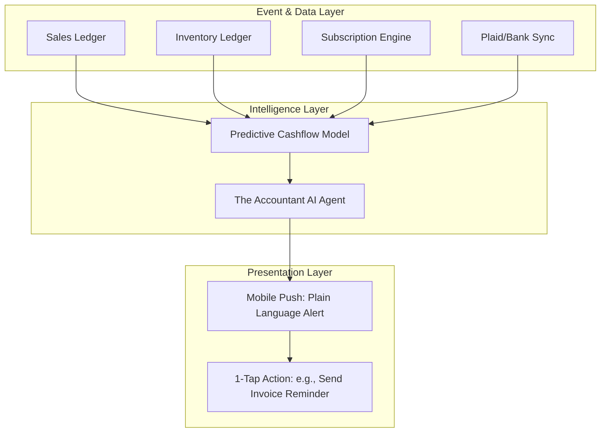

# [Finance] Autonomous AI Cashflow Forecasting Engine

## 1. Title
Autonomous AI Cashflow Forecasting and Proactive Health Engine

## 2. Problem Statement
Cashflow management is the #1 reason small businesses fail. For non-technical business owners like Priya (Boutique owner) or Carlos (Freelance Handyman), navigating financial software to predict cash gaps is virtually impossible. They rely on "gut feeling" or simply checking their bank balance. When big expenses hit (e.g., restocking inventory or paying a quarterly tax bill) and revenue is delayed (e.g., unpaid invoices), they face sudden crises.

Competitors like QuickBooks offer forecasting, but it requires manual categorization, data entry, and understanding complex accounting reports. OHC users need an invisible "Accountant" that monitors their entire business context (pending invoices, inventory needs, past seasonality) and simply tells them: *"Carlos, you have a $400 tax bill next week and 3 pending invoices. Do you want me to automatically follow up with those clients today?"*

## 3. Research Report
### Competitive Analysis
*   **QuickBooks/Xero:** Provide cashflow dashboards, but require active engagement and financial literacy. They are passive tools.
*   **Square/Stripe:** Provide excellent real-time snapshots but limited predictive capabilities based on external factors like inventory or payroll.
*   **OHC Differentiation:** As the unified platform handling Operations, Marketing, and Finance, OHC's AI agents have access to the complete business context. The AI knows what inventory is running low (Operations), how much marketing spend is converting (Marketing), and what payments are pending (Finance). It can synthesize this into simple, actionable push notifications instead of complex charts.

### Market Validation
*   SMBs cite "managing cash flow" as their primary operational stressor.
*   The "Grandmother Test" requires removing all accounting jargon (P&L, Accounts Receivable, Amortization) and replacing it with plain language: "Money Coming In" vs "Money Going Out".

## 4. Design Doc

### Architecture Diagram

### UX/UI Flow (Mobile First - 375px)
1.  **Passive Mode:** The user sees a simple "Financial Health" card on the main dashboard. It uses a traffic light system (Green, Yellow, Red) and simple text: "You have $2,400 coming in this week. You're in good shape."
2.  **Proactive Alert:** When a potential cashflow gap is detected (e.g., a large upcoming expense and delayed revenue), the user receives a push notification.
3.  **Actionable Solution:** The alert opens to a clean, UniFi-style card showing the problem in plain language. It offers an AI-generated solution button: `[ Send Auto-Reminders to Late Payers ]` or `[ Pause Next Week's Ad Spend ]`. One tap executes the action.

### Key Design Decisions
*   **No P&L Charts by Default:** We hide traditional financial statements behind an "Advanced Settings" view.
*   **Proactive vs. Reactive:** The engine must push actionable insights to the user rather than waiting for them to check a report.
*   **Cross-Department AI Sync:** The "Accountant" agent must communicate with the "Salesperson" agent to follow up on invoices if a cashflow gap is predicted.

## 5. Implementation Prompt
**To the Implementer Swarm:**
Your task is to build the "Autonomous AI Cashflow Forecasting Engine".

**Acceptance Criteria:**
1.  Create a predictive model service that ingests data from the unified ledger (invoices, sales, scheduled expenses).
2.  Implement "The Accountant" AI Agent logic to analyze the forecast and identify cash gaps within a 30-day window.
3.  Design and implement the mobile-first (375px) "Financial Health" dashboard card using the macOS glassmorphism / UniFi modular card design system.
4.  Implement the proactive notification system that pushes plain-language alerts with 1-tap actionable solutions (e.g., triggering invoice follow-ups).
5.  Ensure strict tenant data isolation; no forecast data can ever leak across tenants.

*(Note: Focus on the data pipeline, the AI Agent logic for generating the plain-language summary, and the API endpoints for the UI. Ensure 100% test coverage for the prediction logic.)*

## 6. Priority
`P1`

## 7. Estimated Scope
Medium
