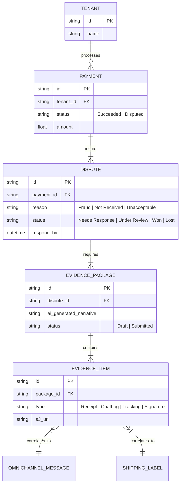
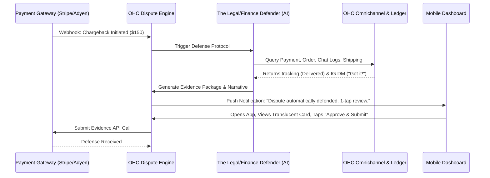

# Title: Autonomous Dispute & Chargeback Defense Engine

## Problem Statement

Small business owners (like Priya the boutique owner and Carlos the handyman) dread chargebacks and payment disputes. When a customer claims they never received a product or didn't authorize a transaction, the business owner suddenly has to play detective—gathering tracking numbers, emails, and receipts—while the funds are locked. Most small businesses lose these disputes simply because they lack the time or expertise to format the evidence exactly how banks require it. They need an automated system that immediately detects a dispute, gathers all relevant contextual evidence (chat logs, tracking info, digital signatures), and submits a bank-ready defense package on their behalf, with zero manual effort.

## Research Report

* **Current Capabilities:** OHC processes payments and stores order/booking history, but lacks an automated mechanism to respond to network-level chargebacks and disputes seamlessly.
* **Competitor Analysis:**
  * *Shopify:* Offers "Shopify Protect" and basic dispute management, but still requires the merchant to manually upload specific files and build their case.
  * *Stripe:* Provides "Radar" and evidence submission APIs, but the dashboard experience is heavily technical and not suited for a mobile-only non-technical user.
  * *Square:* Has a dispute resolution center, but again, puts the burden of proof gathering heavily on the merchant.
* **Gap Identified:** No major platform automatically intercepts a chargeback webhook, cross-references it with omnichannel chat logs (e.g., Instagram DMs saying "I love the cake!"), delivery receipts, and session data, and then *autonomously* compiles and submits the defense.
* **Strategic Advantage:** By turning a high-stress, high-loss event into an invisible, autonomous operation, OHC saves real dollars for its merchants, fostering massive trust and retention. It transforms the AI from a simple assistant into a literal financial shield.

## Design Doc

### Architecture Diagram

### Mobile UX Flow (375px First)

1. **The Interception:** A chargeback occurs. The merchant receives a standard iOS/Android notification: *"A $150 chargeback was filed. Your AI Defender has already built a case."*
2. **The Defense Card:** The merchant taps the notification and opens the OHC app. They see a clean, macOS-style Translucent Glass modal card. No complex banking jargon.
3. **The Breakdown:** The card displays:
    * **Customer:** John Doe ($150)
    * **Reason Claimed:** "Item not received."
    * **AI Findings:** "We have FedEx delivery confirmation from Tuesday, plus an Instagram DM from John saying 'It fits perfectly!'."
4. **1-Tap Action:** A large, primary action button: **"Submit Defense"**. (Or an auto-submit toggle if the merchant opted into fully autonomous mode).
5. **Grandmother Test:** If Fatima the food cart owner taps the screen, she doesn't need to know what a "Network Reason Code 10.4" is. She just sees that OHC found proof she delivered the food and she taps "Submit".

### AI Agent Integration Points

* **The Defender (Legal/Finance):** Subscribes to the `payment.disputed` event mesh topic. It acts as an investigator, querying the unified memory layer for any interactions related to the specific customer entity (emails, SMS, Instagram DMs, delivery webhooks). It uses an LLM to weave these disparate data points into a cohesive, highly persuasive defense narrative formatted exactly to the payment gateway's specifications.
* **The Business Advisor:** Updates the daily briefing to alert the merchant of the dispute status and suggests operational changes (e.g., "We noticed 3 disputes for 'Not as described' on the Red Dress. Consider updating the product photos.").

### Performance & Security Integrity

* **Zero-Trust Isolation:** Dispute data, customer PII, and evidence are strictly partitioned by `tenant_id`. Evidence retrieval must pass through tenant-scoped authorization checks.
* **Offline Tolerance:** If the merchant reviews the defense package while on the subway (offline), the "Approve" action is queued locally and dispatched instantly upon reconnection.
* **Data Integrity:** All extracted evidence items (like chat screenshots generated by the system) are cryptographically signed to ensure chain of custody for the payment processor.

## Implementation Prompt

Implement the Autonomous Dispute & Chargeback Defense Engine.
The system must listen for payment dispute webhooks from our payment gateway providers. Upon receiving a dispute, it should trigger an AI Agent routine that queries the local tenant's Order, Shipping, and Omnichannel Inbox repositories to gather relevant evidence (e.g., tracking numbers, customer communications). The system must automatically compile this into an Evidence Package. Provide a mobile-first UI component (using macOS-style Translucent Glass and UniFi card layouts) that presents the generated defense narrative to the merchant for 1-tap approval. Ensure all database operations and evidence retrieval strictly enforce tenant isolation. Do not prescribe specific database schemas or API signatures; design the core business logic and state transitions for a dispute lifecycle.

## Priority

P1

## Estimated Scope

Medium
