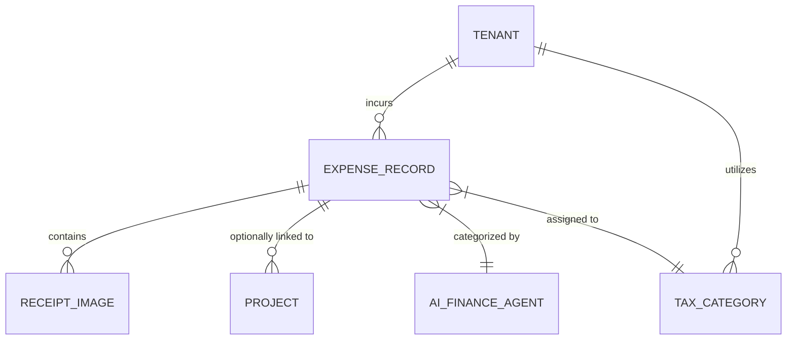
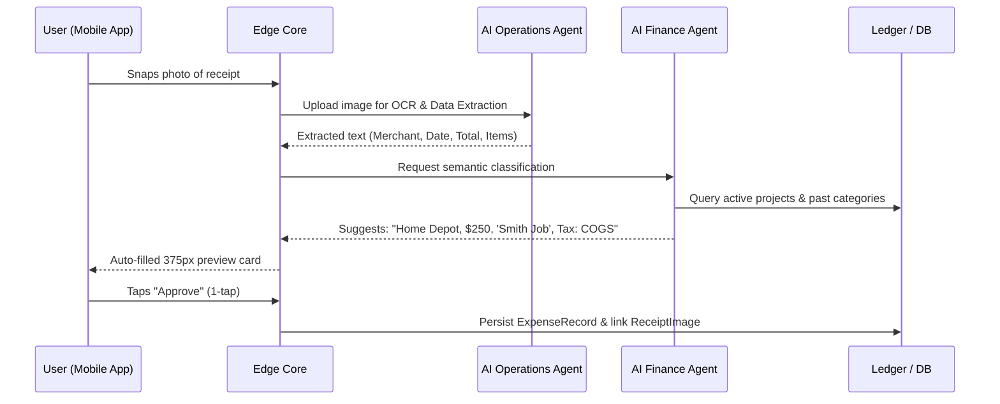

# [Architecture] Autonomous Expense & Receipt Intelligence Mesh

## Problem Statement

Small business owners operate on margins, yet tracking expenses is notoriously their biggest friction point. Carlos (handyman) buys lumber at Home Depot multiple times a week; Maya (baker) buys specialty flour and vanilla extract. They throw physical receipts into a shoebox or glovebox, leading to lost deductions, inaccurate job profitability, and massive end-of-year tax anxiety. Competitors like Shopify and Wix focus intensely on revenue (storefronts), leaving expense management to complex third-party tools like QuickBooks or Xero, which are overwhelming and desktop-first. A non-technical business owner needs to simply snap a photo of a receipt in the OHC app, and have the AI invisibly categorize the expense, match it to a specific client project, and file it for tax readiness.

## Research Report

We audited the expense management flows of leading platforms serving micro-businesses.

### Competitive Analysis

| Platform | Expense Capability | Strengths | Weaknesses (The OHC Opportunity) |
|---|---|---|---|
| **Shopify** | App ecosystem only | Good app choices | Native Shopify focuses purely on sales. Users must install and pay for 3rd-party accounting apps. |
| **Wix** | Basic manual entry | None | Extremely manual, no native AI OCR receipt scanning integrated deeply into the core mobile flow. |
| **QuickBooks** | Native OCR | Powerful rules engine | Overkill for micro-businesses. Desktop-first mindset, too technical, lacks project-based profit calculation for gig workers without manual tagging. |
| **Square** | Square Checking | Immediate spend tracking | Good for card purchases, but weak on cash/external card receipts. Requires deep lock-in to their banking product. |
| **OHC (Target)** | **Autonomous Receipt AI** | **Zero-touch OCR, invisible project-matching, tax-ready classification** | **Must provide a 1-tap "Scan & Forget" experience.** |

### Persona Pain Points

*   **Carlos:** "I bought $250 of supplies for the Smith job, but I forgot to add it to the final invoice. I lost money."
*   **Maya:** "I hate doing taxes. I have dozens of faded grocery receipts and I don't know what they were for."

### Key Architectural Findings
To achieve "Scan & Forget", the architecture must leverage vision models for OCR on edge devices where possible to reduce latency, backed by cloud AI for semantic categorization (e.g., mapping "HD-4829 LUMBER" to the "Cost of Goods Sold" category and probabilistically linking it to Carlos's active "Smith Bathroom" project).

## Design Doc

### Architecture Diagram

### Mobile UX Flow (375px First)

**Screen 1: The "Snap" FAB**
- On the main dashboard, a persistent Floating Action Button (FAB) or a clear action card specifically for "Log Expense".
- Tapping instantly opens a custom, high-speed camera view optimized for document scanning (auto-cropping).

**Screen 2: Magic Processing State**
- The UI uses premium macOS-style translucent glass. While uploading, a slick skeleton loader or pulsing gradient indicates the AI is reading the receipt.
- "Grandmother Test": No technical terms like "OCR" or "Parsing". Just "Reading your receipt..."

**Screen 3: The 1-Tap Approval Card**
- A clean summary card appears.
- **Top:** Merchant Name (Home Depot), Total Amount ($250.00), Date.
- **Middle:** AI Suggestions. It auto-selects a Category (e.g., "Materials") and auto-links a Project if there's an active one (e.g., "Smith Bathroom Repair").
- **Bottom:** A massive, full-width primary button: "Looks Good".
- **Interaction:** If the AI is wrong, tapping a field opens a simple bottom-sheet to correct it.

### AI Agent Integration Points
- **AI Operations Agent (Vision):** Handles the raw OCR and structured data extraction from messy, crumpled receipts.
- **AI Finance Agent (Logic):** Analyzes the extracted merchant and items, checks the tenant's transaction history, and assigns the correct accounting category. It proactively flags expenses that look duplicate or unusually high.

### Zero Trust & Security Guarantees
- Strict tenant isolation ensures `EXPENSE_RECORD` and `RECEIPT_IMAGE` are cryptographically bound to the business owner.
- Images uploaded must be immediately scrubbed of EXIF metadata before storage to preserve privacy.
- The OCR processing pipeline must execute in a stateless environment ensuring no PII leakage across merchant boundaries.

## Implementation Prompt

**Role:** Implementer Agent
**Task:** Build the core backend data entities, event lifecycle, and API contracts for the Autonomous Expense & Receipt Intelligence Mesh.

**Customer-User Journey (CUJ):**
1. A small business owner uploads an image of a receipt.
2. The system asynchronously processes the image, extracting structured data (merchant, amount, date) and semantically categorizing it (e.g., tax category, potential project link).
3. The owner reviews the AI's parsed suggestion on their mobile device and approves it with a single tap, committing it to the financial ledger.

**Acceptance Criteria:**
- Define the core multi-tenant data entities (`Expense`, `ReceiptImage`) reflecting the architectural diagram.
- Implement the API endpoints for secure image ingestion, processing status checking, and expense finalization.
- Ensure the state machine handles transitions smoothly (e.g., `UPLOADING`, `PROCESSING`, `NEEDS_REVIEW`, `APPROVED`).
- Emit domain events upon expense approval for downstream systems (like profit calculation or tax prep).
- Ensure strict tenant isolation throughout the API and persistence layers.
- Do not build the frontend UI or prescribe the specific OCR library/database schema. Focus on the robust backend foundation and API contracts. Ensure comprehensive unit testing.

## Priority
P1

## Estimated Scope
Medium
