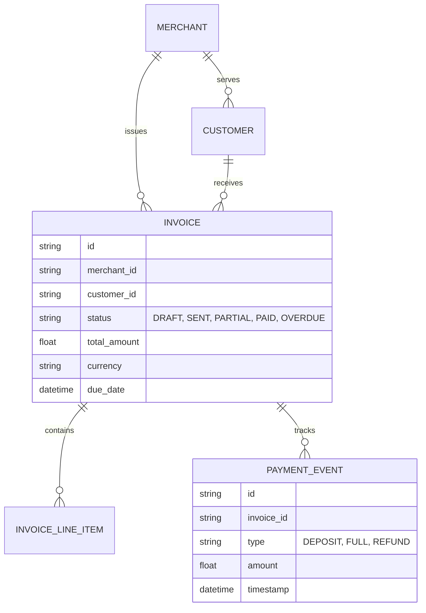
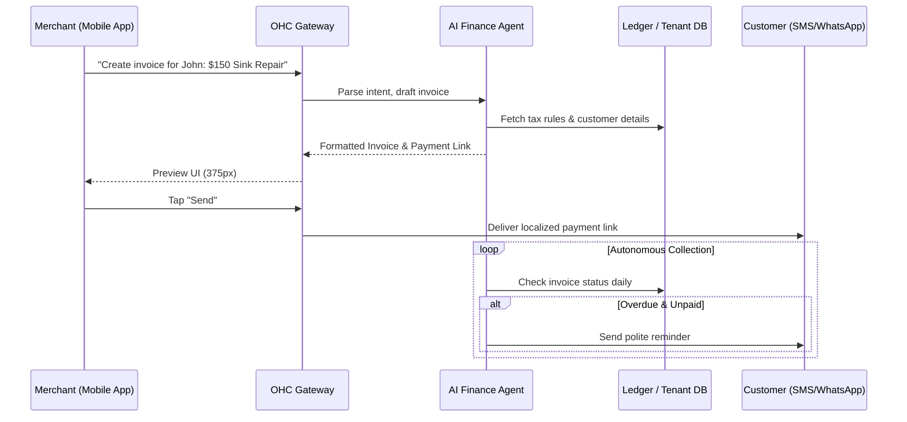

# Instant Localized Invoicing & Autonomous Collections

## Problem Statement

Service-based and non-standard small businesses (like Carlos, the handyman, or Maya, the baker, dealing with custom orders) face significant friction when collecting payments. Generating professional invoices is often a desktop-first, multi-step process in traditional tools (e.g., Quickbooks, Xero). Managing deposits, chasing unpaid invoices, and handling localized tax and currency requirements manually consumes hours and creates cash flow anxiety. A non-technical small business owner needs a way to generate a localized, professional invoice in seconds from their phone, with an AI agent taking over the entire follow-up and collection process invisibly.

## Research Report

**Competitor Analysis:**
- **Shopify:** Primarily designed for physical product checkout. Invoicing (draft orders) is clunky and not optimized for mobile-first service businesses.
- **Wix:** Has basic invoicing, but it feels disconnected from the core CRM and lacks robust autonomous follow-up capabilities.
- **Square / Quickbooks:** Powerful but overwhelming. UI is highly technical, and the mobile experience often hides core features behind complex menus. They lack native, integrated AI for proactive collections.
- **Stripe Invoicing:** Developer-first. The Dashboard is not designed for a "grandmother test" level user like Fatima or Carlos.

**Market Gap:** There is no platform that allows a user to say "Send a $200 invoice to John for the plumbing fix" into their phone and have a perfectly formatted, legally compliant, localized invoice generated, sent via SMS/WhatsApp, and automatically chased by an AI agent until paid.

## Design Doc

### Business Journey Mapping

1.  **Acquisition / Trigger:** Carlos completes a job or Maya agrees on a custom cake design via Instagram DM.
2.  **Creation:** Carlos opens the OHC app, taps "New Invoice", types "Fix sink $150", and selects the customer.
3.  **AI Augmentation:** The AI Finance Agent formats it, applies local taxes (e.g., VAT/Sales Tax based on location), and generates a web-based payment link.
4.  **Delivery:** The invoice is sent via the customer's preferred channel (SMS/WhatsApp/Email) with a 1-tap Apple Pay/Google Pay checkout link.
5.  **Autonomous Collection:** If unpaid after 48 hours, the AI Finance Agent sends a polite, conversational reminder (e.g., "Hi John, just a quick reminder about the invoice from Carlos. You can pay securely here: [Link]").

### Architecture Diagram

### Mobile UX Flow (375px First)

-   **Screen 1: The "1-Tap Action" Card.** On the main dashboard, a prominent, translucent glass card with a large "+" icon labeled "Get Paid".
-   **Screen 2: Natural Language Input.** A simple chat-like interface or a minimal form: "Who is this for?" (Contact picker), "What did you do?" (Text input), "How much?" (Number pad).
-   **Screen 3: The Magic Preview.** The AI instantly renders a beautiful, professional invoice preview. It includes the business logo, localized tax calculations already applied, and clear terms. A single, massive primary button at the bottom: "Send via WhatsApp" (or SMS/Email depending on contact info).
-   **Screen 4: Collection Dashboard.** A unified view of "Money Out" and "Money In" with status tags (Paid, Overdue). Tapping an overdue invoice shows a timeline of the AI Finance Agent's automatic follow-ups.

### AI Agent Integration Points

-   **AI Operations Agent:** Parses the initial messy input from the user (text or voice) into structured invoice line items.
-   **AI Legal/Finance Agent:** Ensures the invoice meets local compliance (e.g., mandatory business registration numbers in EU, correct sales tax in US).
-   **AI Customer Service Agent:** Handles the autonomous follow-up sequence, adapting tone based on the relationship and overdue duration, escalating to the owner only if the customer replies with a complex dispute.

### Zero Trust & Security Guarantees
- Strict tenant isolation ensures Invoice Data (PII/Financials) cannot cross merchant boundaries.
- The web-based payment checkout link utilizes short-lived, cryptographically signed tokens to prevent tampering or enumeration.

## Implementation Prompt

**Role:** Implementer Agent
**Task:** Build the core backend data models, the multi-tenant isolation logic, and the state machine for the Instant Localized Invoicing capability.
**Outcome:**
1. A secure, multi-tenant capable API for creating and managing Invoices and Line Items.
2. A state machine that transitions an invoice through its lifecycle (Draft -> Sent -> Partially Paid -> Paid -> Overdue).
3. The integration hooks (event publishing) so that when an invoice transitions to "Overdue", the AI Finance Agent is notified to begin autonomous collections.
**Acceptance Criteria:**
- The system must support split payments (deposits).
- Must emit events to the event bus for state changes.
- Ensure strict multi-tenant isolation (Merchant A cannot query Merchant B's invoices).
- Do not build the frontend UI, only the robust backend foundation and API endpoints. Ensure comprehensive unit testing.

## Priority
P0

## Estimated Scope
Medium
