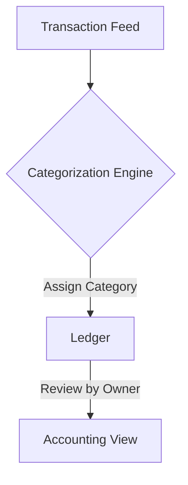

**Title**: Intelligent Expense Categorization
**Problem Statement**: Manual expense categorization is tedious and error-prone, complicating tax preparation.
**Research Report**: Automated bookkeeping is highly desired by SMB owners to reduce accounting costs.
**Design Doc**:
*   Architecture: Transaction Feed -> AI Categorization Engine -> Ledger.

**Implementation Prompt**: Implement an AI-powered expense categorization engine that automatically assigns tax categories to business transactions, learning from any manual corrections the user makes.
**Priority**: P2
**Estimated Scope**: Medium
