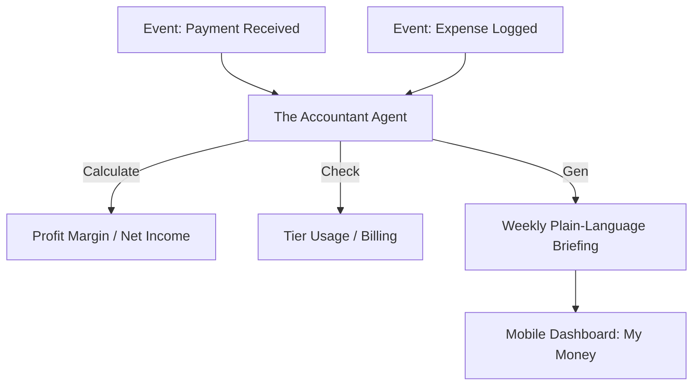

# [Finance] Architecture Brief: "The Accountant"

## Title
OHC "The Accountant": Financial Visibility, Profit Tracking, and Tax Readiness

## Problem Statement
Small business owners often suffer from "Financial Fog." Maya (Baker) sees money in her Stripe account but doesn't know if she's actually making a profit after ingredients and fees. Carlos (Handyman) forgets to track his expenses. They need a plain-language finance department that tracks every cent and explains it in simple terms.

## Research Report
- **Competitive Gap**: QuickBooks is too complex (it requires an accounting degree). Shopify Finance is limited to their own ecosystem.
- **Profit vs. Revenue**: Most OHC personas don't need a balance sheet; they need to know: "How much did I make this week after all costs?"
- **Multi-Channel Reconciliation**: OHC unifies payments from Stripe, Mercado Pago, and even manual cash entries into a single financial truth.

## Design Doc

### High-Level Architecture (Mermaid.js)

### UI Flow (375px First)
- **"My Money" Tab**: A clean, glassmorphic summary: "$500 Revenue, $120 Costs, $380 Profit."
- **1-Tap Expense**: A camera button to snap a photo of a receipt. "The Accountant" OCRs the text and categorizes it automatically.

### AI Agent Integration
- **Triggers**: `tenant.payment.success`, `tenant.expense.created`, `tenant.billing.period_end`.
- **Tools**: `finance_report`, `ocr_receipt`, `tax_summary`.

## Implementation Prompt
**To Implementer Agent:**
Implement "The Accountant" (Finance) department. This agent's core responsibility is to maintain the financial ledger for the tenant. It must automatically reconcile Stripe payments, subtract platform/transaction fees, and log them against the business's product/service costs. Implement the "Weekly Profit Briefing" trigger which generates a plain-language summary of the week's financial health. Ensure high confidence (0.95+) for all financial calculations.

## Priority
P0

## Estimated Scope
Large
