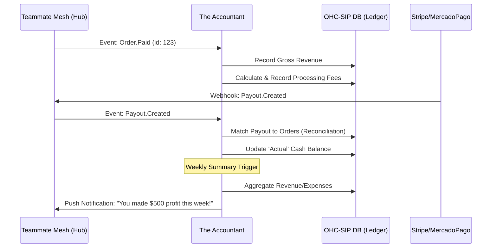

# Architecture Brief: "The Accountant" (Finance & Payments) Department

## Title
The Accountant: Invisible Bookkeeping and Financial Health for SMBs

## Problem Statement
Small business owners like Maya (baker) and Carlos (handyman) dread "Financial Fog." They struggle to track real profit versus revenue, reconcile payments from multiple sources (Instagram, Cash, Stripe), and prepare for tax season. Traditional accounting software like QuickBooks is too complex (technical jargon like "debits/credits" and "accounts payable"), while manual spreadsheets are prone to error and fatigue. They need an invisible staff member that handles the math and provides plain-language answers to questions like "How much did I actually make this week?"

## Research Report
- **Competitive Landscape**:
    - **Shopify/Wix**: Provide basic revenue dashboards but lack deep reconciliation and tax-readiness.
    - **QuickBooks/Xero**: Feature-rich but require accounting knowledge and manual data entry.
    - **OHC Opportunity**: By integrating "The Accountant" directly into the OHC event mesh, we can automate bookkeeping. Every order, refund, and payout is captured in real-time.
- **SMB Pain Points**:
    - **Reconciliation**: Matching bank payouts to specific orders.
    - **Tax Anxiety**: The last-minute scramble to find receipts and categorize expenses.
    - **Cash Flow**: Not knowing if they can afford new equipment (e.g., Maya's new oven).

## Design Doc

### Architecture Diagram (Mermaid.js)

### Key Design Decisions
- **Jargon-Free Ledger**: Internally, we use double-entry bookkeeping, but the user only sees "Profit," "Spending," and "Ready for Tax."
- **Automatic Reconciliation**: The agent matches payment processor webhooks to OHC orders autonomously.
- **Proactive Insights**: Instead of a static dashboard, the agent pushes "Weekly Health Reports" via the mobile app.
- **Draft-for-Review (High Risk)**: Actions like issuing refunds or paying tax installments require a 1-tap approval.

### Mobile UX Flow (375px)
- **Financial Briefing**: A simple card showing: Revenue - Expenses = Profit.
- **The "Can I Afford It?" Tool**: A text input where Carlos can ask "Can I buy a $200 drill?" and the agent responds based on current cash flow and upcoming bills.
- **1-Tap Tax Export**: A single button that generates a plain-language CSV or PDF for their tax preparer.

## Implementation Prompt
**To Implementer Agent:**
Implement the "The Accountant" AI department. Create the ledger schema in the OHC-SIP DB to track revenue, expenses, and fees per tenant. Implement the event handlers for `Order.Paid`, `Refund.Issued`, and `Payout.Created` to update the ledger in real-time. Build the "Weekly Health Report" generation logic that summarizes profit/loss in plain language (no accounting jargon). Ensure all financial data is strictly isolated via `tenant_id` and PostgreSQL RLS. Integrate with the `Teammate Mesh` to send push notifications for significant financial milestones (e.g., "Highest revenue day ever!").

## Priority
P1

## Estimated Scope
Medium
