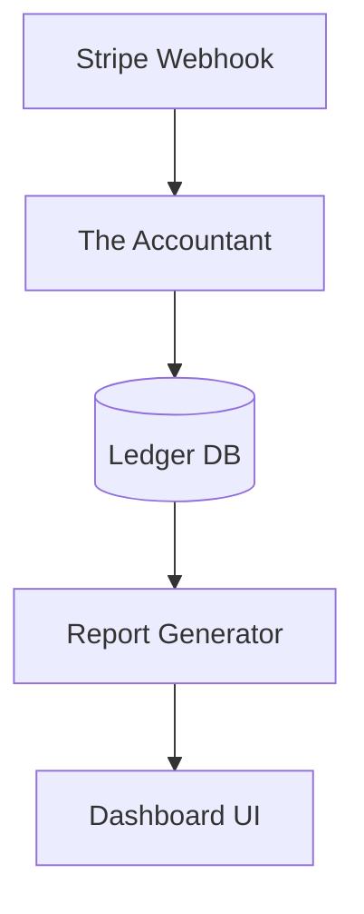

# Architecture Brief: The Accountant

## Title
OHC AI Department: Finance & Payments ("The Accountant")

## Problem Statement
Small business owners lack a bridge between raw transactions and actionable financial health. "The Accountant" department bridges this by providing plain-language bookkeeping and proactive cash-flow advice.

## Research Report
- **Financial Fog**: Small business owners often struggle with bookkeeping and reconciliation.
- **Actionable Advice**: "The Accountant" analyzes transactions to provide insights into cash flow and profitability.

## Design Doc

### Key Design Decisions
1.  **Invisible Bookkeeping**: Automatically categorizes transactions and reconciles payments.
2.  **Plain-Language Reports**: Generates weekly summaries of financial health without accounting jargon.
3.  **Proactive Advice**: Offers recommendations based on cash-flow trends.

### Architecture Diagram (Mermaid.js)

## Implementation Prompt
Implement "The Accountant" ledger schema and reconciliation logic. Focus on building the data models and backend logic to categorize and summarize financial data for plain-language reports. Ensure the system handles incoming transaction webhooks gracefully.
