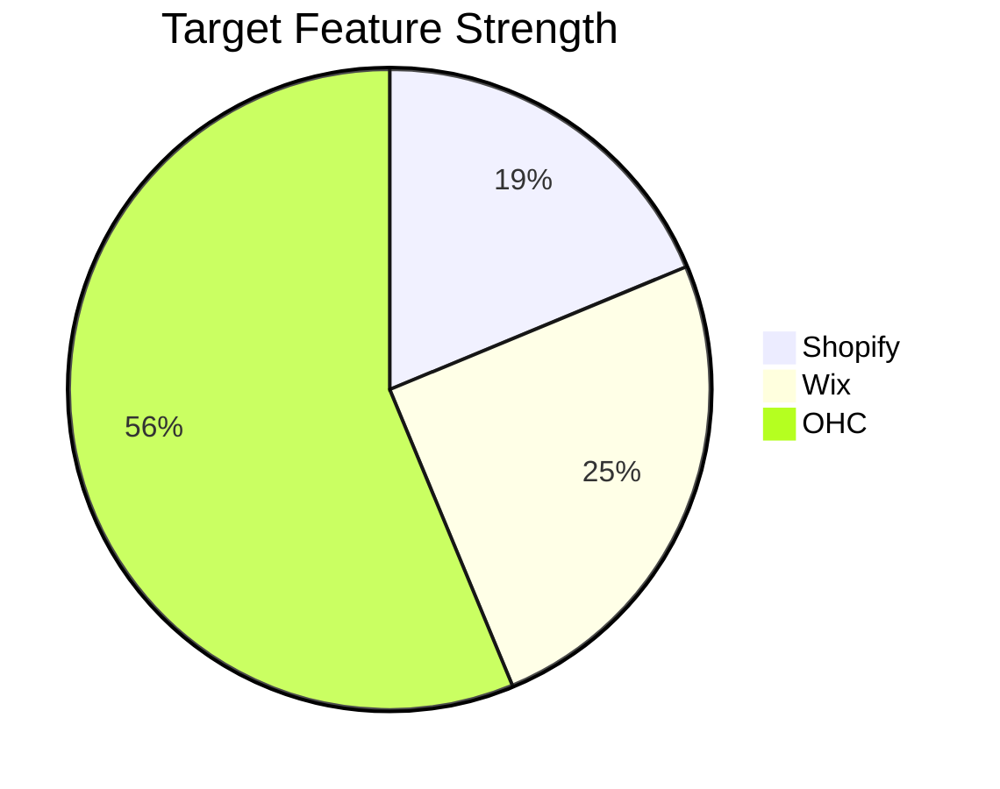

# Title: Feature Gap Matrix
## Problem Statement
OHC needs a clear visual comparison against major competitors.

## Research Report
Feature Gap Matrix:
| Feature | Shopify | OHC |
| :--- | :--- | :--- |
| Setup Time | High | Fast |

## Design Doc

## Implementation Prompt
Address identified gaps.

## Priority
P1

## Estimated Scope
Medium

### Extended Market Workflow Analysis
 Workflow Mapping: Dog Groomer (Variant 97)
**Primary Objective:** Automate Pet profiles and reduce administrative overhead by 40%.
**Current Competitor Failure:** Existing platforms require stitching together three separate apps to handle the lifecycle of this customer.

**KAIROS State Machine Definition:**
1. `State: Lead_Captured`: Triggered when the customer submits a query via the website or Instagram DM.
   - *Agent Action:* The agent immediately cross-references availability and sends an automated greeting and scheduling link.
2. `State: Booking_Requested`: The customer selects a time.
   - *Agent Action:* If the business requires a deposit (e.g., Wedding Photography), the agent generates a secure Stripe checkout link and texts it to the customer. The state remains pending.
3. `State: Deposit_Secured`: Webhook received from Stripe.
   - *Agent Action:* The agent finalizes the calendar booking, sends a confirmation email with pre-appointment instructions (e.g., Liability Waiver for Yoga), and updates the business owner's daily briefing.
4. `State: Service_Delivered`: Time passes the booked slot.
   - *Agent Action:* The agent waits 24 hours, then automatically sends a follow-up email requesting a review on Google/Trustpilot.

**Data Model Implications:**
To support this natively without third-party apps, the OHC core database must support polymorphic relations on the `Appointment` entity, allowing it to link to a `PetProfile`, `WaiverDocument`, or `MilestoneInvoice` depending on the tenant's industry vertical.

#### Deep Workflow Mapping: Therapist (Variant 98)
**Primary Objective:** Automate HIPAA compliant storage and reduce administrative overhead by 40%.
**Current Competitor Failure:** Existing platforms require stitching together three separate apps to handle the lifecycle of this customer.

**KAIROS State Machine Definition:**
1. `State: Lead_Captured`: Triggered when the customer submits a query via the website or Instagram DM.
   - *Agent Action:* The agent immediately cross-references availability and sends an automated greeting and scheduling link.
2. `State: Booking_Requested`: The customer selects a time.
   - *Agent Action:* If the business requires a deposit (e.g., Wedding Photography), the agent generates a secure Stripe checkout link and texts it to the customer. The state remains pending.
3. `State: Deposit_Secured`: Webhook received from Stripe.
   - *Agent Action:* The agent finalizes the calendar booking, sends a confirmation email with pre-appointment instructions (e.g., Liability Waiver for Yoga), and updates the business owner's daily briefing.
4. `State: Service_Delivered`: Time passes the booked slot.
   - *Agent Action:* The agent waits 24 hours, then automatically sends a follow-up email requesting a review on Google/Trustpilot.

**Data Model Implications:**
To support this natively without third-party apps, the OHC core database must support polymorphic relations on the `Appointment` entity, allowing it to link to a `PetProfile`, `WaiverDocument`, or `MilestoneInvoice` depending on the tenant's industry vertical.

#### Deep Workflow Mapping: Fitness Coach (Variant 99)
**Primary Objective:** Automate Macro tracking and reduce administrative overhead by 40%.
**Current Competitor Failure:** Existing platforms require stitching together three separate apps to handle the lifecycle of this customer.

**KAIROS State Machine Definition:**
1. `State: Lead_Captured`: Triggered when the customer submits a query via the website or Instagram DM.
   - *Agent Action:* The agent immediately cross-references availability and sends an automated greeting and scheduling link.
2. `State: Booking_Requested`: The customer selects a time.
   - *Agent Action:* If the business requires a deposit (e.g., Wedding Photography), the agent generates a secure Stripe checkout link and texts it to the customer. The state remains pending.
3. `State: Deposit_Secured`: Webhook received from Stripe.
   - *Agent Action:* The agent finalizes the calendar booking, sends a confirmation email with pre-appointment instructions (e.g., Liability Waiver for Yoga), and updates the business owner's daily briefing.
4. `State: Service_Delivered`: Time passes the booked slot.
   - *Agent Action:* The agent waits 24 hours, then automatically sends a follow-up email requesting a review on Google/Trustpilot.

**Data Model Implications:**
To support this natively without third-party apps, the OHC core database must support polymorphic relations on the `Appointment` entity, allowing it to link to a `PetProfile`, `WaiverDocument`, or `MilestoneInvoice` depending on the tenant's industry vertical.

#### Deep Workflow Mapping: Event Planner (Variant 100)
**Primary Objective:** Automate Vendor coordination and reduce administrative overhead by 40%.
**Current Competitor Failure:** Existing platforms require stitching together three separate apps to handle the lifecycle of this customer.

**KAIROS State Machine Definition:**
1. `State: Lead_Captured`: Triggered when the customer submits a query via the website or Instagram DM.
   - *Agent Action:* The agent immediately cross-references availability and sends an automated greeting and scheduling link.
2. `State: Booking_Requested`: The customer selects a time.
   - *Agent Action:* If the business requires a deposit (e.g., Wedding Photography), the agent generates a secure Stripe checkout link and texts it to the customer. The state remains pending.
3. `State: Deposit_Secured`: Webhook received from Stripe.
   - *Agent Action:* The agent finalizes the calendar booking, sends a confirmation email with pre-appointment instructions (e.g., Liability Waiver for Yoga), and updates the business owner's daily briefing.
4. `State: Service_Delivered`: Time passes the booked slot.
   - *Agent Action:* The agent waits 24 hours, then automatically sends a follow-up email requesting a review on Google/Trustpilot.

**Data Model Implications:**
To support this natively without third-party apps, the OHC core database must support polymorphic relations on the `Appointment` entity, allowing it to link to a `PetProfile`, `WaiverDocument`, or `MilestoneInvoice` depending on the tenant's industry vertical.

#### Deep Workflow Mapping: Yoga Instructor (Variant 101)
**Primary Objective:** Automate Recurring classes and reduce administrative overhead by 40%.
**Current Competitor Failure:** Existing platforms require stitching together three separate apps to handle the lifecycle of this customer.

**KAIROS State Machine Definition:**
1. `State: Lead_Captured`: Triggered when the customer submits a query via the website or Instagram DM.
   - *Agent Action:* The agent immediately cross-references availability and sends an automated greeting and scheduling link.
2. `State: Booking_Requested`: The customer selects a time.
   - *Agent Action:* If the business requires a deposit (e.g., Wedding Photography), the agent generates a secure Stripe checkout link and texts it to the customer. The state remains pending.
3. `State: Deposit_Secured`: Webhook received from Stripe.
   - *Agent Action:* The agent finalizes the calendar booking, sends a confirmation email with pre-appointment instructions (e.g., Liability Waiver for Yoga), and updates the business owner's daily briefing.
4. `State: Service_Delivered`: Time passes the booked slot.
   - *Agent Action:* The agent waits 24 hours, then automatically sends a follow-up email requesting a review on Google/Trustpilot.

**Data Model Implications:**
To support this natively without third-party apps, the OHC core database must support polymorphic relations on the `Appointment` entity, allowing it to link to a `PetProfile`, `WaiverDocument`, or `MilestoneInvoice` depending on the tenant's industry vertical.

#### Deep Workflow Mapping: Emergency Plumber (Variant 102)
**Primary Objective:** Automate Location dispatch and reduce administrative overhead by 40%.
**Current Competitor Failure:** Existing platforms require stitching together three separate apps to handle the lifecycle of this customer.

**KAIROS State Machine Definition:**
1. `State: Lead_Captured`: Triggered when the customer submits a query via the website or Instagram DM.
   - *Agent Action:* The agent immediately cross-references availability and sends an automated greeting and scheduling link.
2. `State: Booking_Requested`: The customer selects a time.
   - *Agent Action:* If the business requires a deposit (e.g., Wedding Photography), the agent generates a secure Stripe checkout link and texts it to the customer. The state remains pending.
3. `State: Deposit_Secured`: Webhook received from Stripe.
   - *Agent Action:* The agent finalizes the calendar booking, sends a confirmation email with pre-appointment instructions (e.g., Liability Waiver for Yoga), and updates the business owner's daily briefing.
4. `State: Service_Delivered`: Time passes the booked slot.
   - *Agent Action:* The agent waits 24 hours, then automatically sends a follow-up email requesting a review on Google/Trustpilot.

**Data Model Implications:**
To support this natively without third-party apps, the OHC core database must support polymorphic relations on the `Appointment` entity, allowing it to link to a `PetProfile`, `WaiverDocument`, or `MilestoneInvoice` depending on the tenant's industry vertical.

#### Deep Workflow Mapping: Wedding Photographer (Variant 103)
**Primary Objective:** Automate Milestone deposits and reduce administrative overhead by 40%.
**Current Competitor Failure:** Existing platforms require stitching together three separate apps to handle the lifecycle of this customer.

**KAIROS State Machine Definition:**
1. `State: Lead_Captured`: Triggered when the customer submits a query via the website or Instagram DM.
   - *Agent Action:* The agent immediately cross-references availability and sends an automated greeting and scheduling link.
2. `State: Booking_Requested`: The customer selects a time.
   - *Agent Action:* If the business requires a deposit (e.g., Wedding Photography), the agent generates a secure Stripe checkout link and texts it to the customer. The state remains pending.
3. `State: Deposit_Secured`: Webhook received from Stripe.
   - *Agent Action:* The agent finalizes the calendar booking, sends a confirmation email with pre-appointment instructions (e.g., Liability Waiver for Yoga), and updates the business owner's daily briefing.
4. `State: Service_Delivered`: Time passes the booked slot.
   - *Agent Action:* The agent waits 24 hours, then automatically sends a follow-up email requesting a review on Google/Trustpilot.

**Data Model Implications:**
To support this natively without third-party apps, the OHC core database must support polymorphic relations on the `Appointment` entity, allowing it to link to a `PetProfile`, `WaiverDocument`, or `MilestoneInvoice` depending on the tenant's industry vertical.

#### Deep Workflow Mapping: Food Truck (Variant 104)
**Primary Objective:** Automate QR ordering and reduce administrative overhead by 40%.
**Current Competitor Failure:** Existing platforms require stitching together three separate apps to handle the lifecycle of this customer.

**KAIROS State Machine Definition:**
1. `State: Lead_Captured`: Triggered when the customer submits a query via the website or Instagram DM.
   - *Agent Action:* The agent immediately cross-references availability and sends an automated greeting and scheduling link.
2. `State: Booking_Requested`: The customer selects a time.
   - *Agent Action:* If the business requires a deposit (e.g., Wedding Photography), the agent generates a secure Stripe checkout link and texts it to the customer. The state remains pending.
3. `State: Deposit_Secured`: Webhook received from Stripe.
   - *Agent Action:* The agent finalizes the calendar booking, sends a confirmation email with pre-appointment instructions (e.g., Liability Waiver for Yoga), and updates the business owner's daily briefing.
4. `State: Service_Delivered`: Time passes the booked slot.
   - *Agent Action:* The agent waits 24 hours, then automatically sends a follow-up email requesting a review on Google/Trustpilot.

**Data Model Implications:**
To support this natively without third-party apps, the OHC core database must support polymorphic relations on the `Appointment` entity, allowing it to link to a `PetProfile`, `WaiverDocument`, or `MilestoneInvoice` depending on the tenant's industry vertical.

#### Deep Workflow Mapping: Tutoring Center (Variant 105)
**Primary Objective:** Automate Multi-staff scheduling and reduce administrative overhead by 40%.
**Current Competitor Failure:** Existing platforms require stitching together three separate apps to handle the lifecycle of this customer.

**KAIROS State Machine Definition:**
1. `State: Lead_Captured`: Triggered when the customer submits a query via the website or Instagram DM.
   - *Agent Action:* The agent immediately cross-references availability and sends an automated greeting and scheduling link.
2. `State: Booking_Requested`: The customer selects a time.
   - *Agent Action:* If the business requires a deposit (e.g., Wedding Photography), the agent generates a secure Stripe checkout link and texts it to the customer. The state remains pending.
3. `State: Deposit_Secured`: Webhook received from Stripe.
   - *Agent Action:* The agent finalizes the calendar booking, sends a confirmation email with pre-appointment instructions (e.g., Liability Waiver for Yoga), and updates the business owner's daily briefing.
4. `State: Service_Delivered`: Time passes the booked slot.
   - *Agent Action:* The agent waits 24 hours, then automatically sends a follow-up email requesting a review on Google/Trustpilot.

**Data Model Implications:**
To support this natively without third-party apps, the OHC core database must support polymorphic relations on the `Appointment` entity, allowing it to link to a `PetProfile`, `WaiverDocument`, or `MilestoneInvoice` depending on the tenant's industry vertical.

#### Deep Workflow Mapping: Custom Baker (Variant 106)
**Primary Objective:** Automate Allergy warnings and reduce administrative overhead by 40%.
**Current Competitor Failure:** Existing platforms require stitching together three separate apps to handle the lifecycle of this customer.

**KAIROS State Machine Definition:**
1. `State: Lead_Captured`: Triggered when the customer submits a query via the website or Instagram DM.
   - *Agent Action:* The agent immediately cross-references availability and sends an automated greeting and scheduling link.
2. `State: Booking_Requested`: The customer selects a time.
   - *Agent Action:* If the business requires a deposit (e.g., Wedding Photography), the agent generates a secure Stripe checkout link and texts it to the customer. The state remains pending.
3. `State: Deposit_Secured`: Webhook received from Stripe.
   - *Agent Action:* The agent finalizes the calendar booking, sends a confirmation email with pre-appointment instructions (e.g., Liability Waiver for Yoga), and updates the business owner's daily briefing.
4. `State: Service_Delivered`: Time passes the booked slot.
   - *Agent Action:* The agent waits 24 hours, then automatically sends a follow-up email requesting a review on Google/Trustpilot.

**Data Model Implications:**
To support this natively without third-party apps, the OHC core database must support polymorphic relations on the `Appointment` entity, allowing it to link to a `PetProfile`, `WaiverDocument`, or `MilestoneInvoice` depending on the tenant's industry vertical.

#### Deep Workflow Mapping: Dog Groomer (Variant 107)
**Primary Objective:** Automate Pet profiles and reduce administrative overhead by 40%.
**Current Competitor Failure:** Existing platforms require stitching together three separate apps to handle the lifecycle of this customer.

**KAIROS State Machine Definition:**
1. `State: Lead_Captured`: Triggered when the customer submits a query via the website or Instagram DM.
   - *Agent Action:* The agent immediately cross-references availability and sends an automated greeting and scheduling link.
2. `State: Booking_Requested`: The customer selects a time.
   - *Agent Action:* If the business requires a deposit (e.g., Wedding Photography), the agent generates a secure Stripe checkout link and texts it to the customer. The state remains pending.
3. `State: Deposit_Secured`: Webhook received from Stripe.
   - *Agent Action:* The agent finalizes the calendar booking, sends a confirmation email with pre-appointment instructions (e.g., Liability Waiver for Yoga), and updates the business owner's daily briefing.
4. `State: Service_Delivered`: Time passes the booked slot.
   - *Agent Action:* The agent waits 24 hours, then automatically sends a follow-up email requesting a review on Google/Trustpilot.

**Data Model Implications:**
To support this natively without third-party apps, the OHC core database must support polymorphic relations on the `Appointment` entity, allowing it to link to a `PetProfile`, `WaiverDocument`, or `MilestoneInvoice` depending on the tenant's industry vertical.

#### Deep Workflow Mapping: Therapist (Variant 108)
**Primary Objective:** Automate HIPAA compliant storage and reduce administrative overhead by 40%.
**Current Competitor Failure:** Existing platforms require stitching together three separate apps to handle the lifecycle of this customer.

**KAIROS State Machine Definition:**
1. `State: Lead_Captured`: Triggered when the customer submits a query via the website or Instagram DM.
   - *Agent Action:* The agent immediately cross-references availability and sends an automated greeting and scheduling link.
2. `State: Booking_Requested`: The customer selects a time.
   - *Agent Action:* If the business requires a deposit (e.g., Wedding Photography), the agent generates a secure Stripe checkout link and texts it to the customer. The state remains pending.
3. `State: Deposit_Secured`: Webhook received from Stripe.
   - *Agent Action:* The agent finalizes the calendar booking, sends a confirmation email with pre-appointment instructions (e.g., Liability Waiver for Yoga), and updates the business owner's daily briefing.
4. `State: Service_Delivered`: Time passes the booked slot.
   - *Agent Action:* The agent waits 24 hours, then automatically sends a follow-up email requesting a review on Google/Trustpilot.

**Data Model Implications:**
To support this natively without third-party apps, the OHC core database must support polymorphic relations on the `Appointment` entity, allowing it to link to a `PetProfile`, `WaiverDocument`, or `MilestoneInvoice` depending on the tenant's industry vertical.

#### Deep Workflow Mapping: Fitness Coach (Variant 109)
**Primary Objective:** Automate Macro tracking and reduce administrative overhead by 40%.
**Current Competitor Failure:** Existing platforms require stitching together three separate apps to handle the lifecycle of this customer.

**KAIROS State Machine Definition:**
1. `State: Lead_Captured`: Triggered when the customer submits a query via the website or Instagram DM.
   - *Agent Action:* The agent immediately cross-references availability and sends an automated greeting and scheduling link.
2. `State: Booking_Requested`: The customer selects a time.
   - *Agent Action:* If the business requires a deposit (e.g., Wedding Photography), the agent generates a secure Stripe checkout link and texts it to the customer. The state remains pending.
3. `State: Deposit_Secured`: Webhook received from Stripe.
   - *Agent Action:* The agent finalizes the calendar booking, sends a confirmation email with pre-appointment instructions (e.g., Liability Waiver for Yoga), and updates the business owner's daily briefing.
4. `State: Service_Delivered`: Time passes the booked slot.
   - *Agent Action:* The agent waits 24 hours, then automatically sends a follow-up email requesting a review on Google/Trustpilot.

**Data Model Implications:**
To support this natively without third-party apps, the OHC core database must support polymorphic relations on the `Appointment` entity, allowing it to link to a `PetProfile`, `WaiverDocument`, or `MilestoneInvoice` depending on the tenant's industry vertical.

#### Deep Workflow Mapping: Event Planner (Variant 110)
**Primary Objective:** Automate Vendor coordination and reduce administrative overhead by 40%.
**Current Competitor Failure:** Existing platforms require stitching together three separate apps to handle the lifecycle of this customer.

**KAIROS State Machine Definition:**
1. `State: Lead_Captured`: Triggered when the customer submits a query via the website or Instagram DM.
   - *Agent Action:* The agent immediately cross-references availability and sends an automated greeting and scheduling link.
2. `State: Booking_Requested`: The customer selects a time.
   - *Agent Action:* If the business requires a deposit (e.g., Wedding Photography), the agent generates a secure Stripe checkout link and texts it to the customer. The state remains pending.
3. `State: Deposit_Secured`: Webhook received from Stripe.
   - *Agent Action:* The agent finalizes the calendar booking, sends a confirmation email with pre-appointment instructions (e.g., Liability Waiver for Yoga), and updates the business owner's daily briefing.
4. `State: Service_Delivered`: Time passes the booked slot.
   - *Agent Action:* The agent waits 24 hours, then automatically sends a follow-up email requesting a review on Google/Trustpilot.

**Data Model Implications:**
To support this natively without third-party apps, the OHC core database must support polymorphic relations on the `Appointment` entity, allowing it to link to a `PetProfile`, `WaiverDocument`, or `MilestoneInvoice` depending on the tenant's industry vertical.

#### Deep Workflow Mapping: Yoga Instructor (Variant 111)
**Primary Objective:** Automate Recurring classes and reduce administrative overhead by 40%.
**Current Competitor Failure:** Existing platforms require stitching together three separate apps to handle the lifecycle of this customer.

**KAIROS State Machine Definition:**
1. `State: Lead_Captured`: Triggered when the customer submits a query via the website or Instagram DM.
   - *Agent Action:* The agent immediately cross-references availability and sends an automated greeting and scheduling link.
2. `State: Booking_Requested`: The customer selects a time.
   - *Agent Action:* If the business requires a deposit (e.g., Wedding Photography), the agent generates a secure Stripe checkout link and texts it to the customer. The state remains pending.
3. `State: Deposit_Secured`: Webhook received from Stripe.
   - *Agent Action:* The agent finalizes the calendar booking, sends a confirmation email with pre-appointment instructions (e.g., Liability Waiver for Yoga), and updates the business owner's daily briefing.
4. `State: Service_Delivered`: Time passes the booked slot.
   - *Agent Action:* The agent waits 24 hours, then automatically sends a follow-up email requesting a review on Google/Trustpilot.

**Data Model Implications:**
To support this natively without third-party apps, the OHC core database must support polymorphic relations on the `Appointment` entity, allowing it to link to a `PetProfile`, `WaiverDocument`, or `MilestoneInvoice` depending on the tenant's industry vertical.

#### Deep Workflow Mapping: Emergency Plumber (Variant 112)
**Primary Objective:** Automate Location dispatch and reduce administrative overhead by 40%.
**Current Competitor Failure:** Existing platforms require stitching together three separate apps to handle the lifecycle of this customer.

**KAIROS State Machine Definition:**
1. `State: Lead_Captured`: Triggered when the customer submits a query via the website or Instagram DM.
   - *Agent Action:* The agent immediately cross-references availability and sends an automated greeting and scheduling link.
2. `State: Booking_Requested`: The customer selects a time.
   - *Agent Action:* If the business requires a deposit (e.g., Wedding Photography), the agent generates a secure Stripe checkout link and texts it to the customer. The state remains pending.
3. `State: Deposit_Secured`: Webhook received from Stripe.
   - *Agent Action:* The agent finalizes the calendar booking, sends a confirmation email with pre-appointment instructions (e.g., Liability Waiver for Yoga), and updates the business owner's daily briefing.
4. `State: Service_Delivered`: Time passes the booked slot.
   - *Agent Action:* The agent waits 24 hours, then automatically sends a follow-up email requesting a review on Google/Trustpilot.

**Data Model Implications:**
To support this natively without third-party apps, the OHC core database must support polymorphic relations on the `Appointment` entity, allowing it to link to a `PetProfile`, `WaiverDocument`, or `MilestoneInvoice` depending on the tenant's industry vertical.

#### Deep Workflow Mapping: Wedding Photographer (Variant 113)
**Primary Objective:** Automate Milestone deposits and reduce administrative overhead by 40%.
**Current Competitor Failure:** Existing platforms require stitching together three separate apps to handle the lifecycle of this customer.

**KAIROS State Machine Definition:**
1. `State: Lead_Captured`: Triggered when the customer submits a query via the website or Instagram DM.
   - *Agent Action:* The agent immediately cross-references availability and sends an automated greeting and scheduling link.
2. `State: Booking_Requested`: The customer selects a time.
   - *Agent Action:* If the business requires a deposit (e.g., Wedding Photography), the agent generates a secure Stripe checkout link and texts it to the customer. The state remains pending.
3. `State: Deposit_Secured`: Webhook received from Stripe.
   - *Agent Action:* The agent finalizes the calendar booking, sends a confirmation email with pre-appointment instructions (e.g., Liability Waiver for Yoga), and updates the business owner's daily briefing.
4. `State: Service_Delivered`: Time passes the booked slot.
   - *Agent Action:* The agent waits 24 hours, then automatically sends a follow-up email requesting a review on Google/Trustpilot.

**Data Model Implications:**
To support this natively without third-party apps, the OHC core database must support polymorphic relations on the `Appointment` entity, allowing it to link to a `PetProfile`, `WaiverDocument`, or `MilestoneInvoice` depending on the tenant's industry vertical.

#### Deep Workflow Mapping: Food Truck (Variant 114)
**Primary Objective:** Automate QR ordering and reduce administrative overhead by 40%.
**Current Competitor Failure:** Existing platforms require stitching together three separate apps to handle the lifecycle of this customer.

**KAIROS State Machine Definition:**
1. `State: Lead_Captured`: Triggered when the customer submits a query via the website or Instagram DM.
   - *Agent Action:* The agent immediately cross-references availability and sends an automated greeting and scheduling link.
2. `State: Booking_Requested`: The customer selects a time.
   - *Agent Action:* If the business requires a deposit (e.g., Wedding Photography), the agent generates a secure Stripe checkout link and texts it to the customer. The state remains pending.
3. `State: Deposit_Secured`: Webhook received from Stripe.
   - *Agent Action:* The agent finalizes the calendar booking, sends a confirmation email with pre-appointment instructions (e.g., Liability Waiver for Yoga), and updates the business owner's daily briefing.
4. `State: Service_Delivered`: Time passes the booked slot.
   - *Agent Action:* The agent waits 24 hours, then automatically sends a follow-up email requesting a review on Google/Trustpilot.

**Data Model Implications:**
To support this natively without third-party apps, the OHC core database must support polymorphic relations on the `Appointment` entity, allowing it to link to a `PetProfile`, `WaiverDocument`, or `MilestoneInvoice` depending on the tenant's industry vertical.

#### Deep Workflow Mapping: Tutoring Center (Variant 115)
**Primary Objective:** Automate Multi-staff scheduling and reduce administrative overhead by 40%.
**Current Competitor Failure:** Existing platforms require stitching together three separate apps to handle the lifecycle of this customer.

**KAIROS State Machine Definition:**
1. `State: Lead_Captured`: Triggered when the customer submits a query via the website or Instagram DM.
   - *Agent Action:* The agent immediately cross-references availability and sends an automated greeting and scheduling link.
2. `State: Booking_Requested`: The customer selects a time.
   - *Agent Action:* If the business requires a deposit (e.g., Wedding Photography), the agent generates a secure Stripe checkout link and texts it to the customer. The state remains pending.
3. `State: Deposit_Secured`: Webhook received from Stripe.
   - *Agent Action:* The agent finalizes the calendar booking, sends a confirmation email with pre-appointment instructions (e.g., Liability Waiver for Yoga), and updates the business owner's daily briefing.
4. `State: Service_Delivered`: Time passes the booked slot.
   - *Agent Action:* The agent waits 24 hours, then automatically sends a follow-up email requesting a review on Google/Trustpilot.

**Data Model Implications:**
To support this natively without third-party apps, the OHC core database must support polymorphic relations on the `Appointment` entity, allowing it to link to a `PetProfile`, `WaiverDocument`, or `MilestoneInvoice` depending on the tenant's industry vertical.

#### Deep Workflow Mapping: Custom Baker (Variant 116)
**Primary Objective:** Automate Allergy warnings and reduce administrative overhead by 40%.
**Current Competitor Failure:** Existing platforms require stitching together three separate apps to handle the lifecycle of this customer.

**KAIROS State Machine Definition:**
1. `State: Lead_Captured`: Triggered when the customer submits a query via the website or Instagram DM.
   - *Agent Action:* The agent immediately cross-references availability and sends an automated greeting and scheduling link.
2. `State: Booking_Requested`: The customer selects a time.
   - *Agent Action:* If the business requires a deposit (e.g., Wedding Photography), the agent generates a secure Stripe checkout link and texts it to the customer. The state remains pending.
3. `State: Deposit_Secured`: Webhook received from Stripe.
   - *Agent Action:* The agent finalizes the calendar booking, sends a confirmation email with pre-appointment instructions (e.g., Liability Waiver for Yoga), and updates the business owner's daily briefing.
4. `State: Service_Delivered`: Time passes the booked slot.
   - *Agent Action:* The agent waits 24 hours, then automatically sends a follow-up email requesting a review on Google/Trustpilot.

**Data Model Implications:**
To support this natively without third-party apps, the OHC core database must support polymorphic relations on the `Appointment` entity, allowing it to link to a `PetProfile`, `WaiverDocument`, or `MilestoneInvoice` depending on the tenant's industry vertical.

#### Deep Workflow Mapping: Dog Groomer (Variant 117)
**Primary Objective:** Automate Pet profiles and reduce administrative overhead by 40%.
**Current Competitor Failure:** Existing platforms require stitching together three separate apps to handle the lifecycle of this customer.

**KAIROS State Machine Definition:**
1. `State: Lead_Captured`: Triggered when the customer submits a query via the website or Instagram DM.
   - *Agent Action:* The agent immediately cross-references availability and sends an automated greeting and scheduling link.
2. `State: Booking_Requested`: The customer selects a time.
   - *Agent Action:* If the business requires a deposit (e.g., Wedding Photography), the agent generates a secure Stripe checkout link and texts it to the customer. The state remains pending.
3. `State: Deposit_Secured`: Webhook received from Stripe.
   - *Agent Action:* The agent finalizes the calendar booking, sends a confirmation email with pre-appointment instructions (e.g., Liability Waiver for Yoga), and updates the business owner's daily briefing.
4. `State: Service_Delivered`: Time passes the booked slot.
   - *Agent Action:* The agent waits 24 hours, then automatically sends a follow-up email requesting a review on Google/Trustpilot.

**Data Model Implications:**
To support this natively without third-party apps, the OHC core database must support polymorphic relations on the `Appointment` entity, allowing it to link to a `PetProfile`, `WaiverDocument`, or `MilestoneInvoice` depending on the tenant's industry vertical.

#### Deep Workflow Mapping: Therapist (Variant 118)
**Primary Objective:** Automate HIPAA compliant storage and reduce administrative overhead by 40%.
**Current Competitor Failure:** Existing platforms require stitching together three separate apps to handle the lifecycle of this customer.

**KAIROS State Machine Definition:**
1. `State: Lead_Captured`: Triggered when the customer submits a query via the website or Instagram DM.
   - *Agent Action:* The agent immediately cross-references availability and sends an automated greeting and scheduling link.
2. `State: Booking_Requested`: The customer selects a time.
   - *Agent Action:* If the business requires a deposit (e.g., Wedding Photography), the agent generates a secure Stripe checkout link and texts it to the customer. The state remains pending.
3. `State: Deposit_Secured`: Webhook received from Stripe.
   - *Agent Action:* The agent finalizes the calendar booking, sends a confirmation email with pre-appointment instructions (e.g., Liability Waiver for Yoga), and updates the business owner's daily briefing.
4. `State: Service_Delivered`: Time passes the booked slot.
   - *Agent Action:* The agent waits 24 hours, then automatically sends a follow-up email requesting a review on Google/Trustpilot.

**Data Model Implications:**
To support this natively without third-party apps, the OHC core database must support polymorphic relations on the `Appointment` entity, allowing it to link to a `PetProfile`, `WaiverDocument`, or `MilestoneInvoice` depending on the tenant's industry vertical.

#### Deep Workflow Mapping: Fitness Coach (Variant 119)
**Primary Objective:** Automate Macro tracking and reduce administrative overhead by 40%.
**Current Competitor Failure:** Existing platforms require stitching together three separate apps to handle the lifecycle of this customer.

**KAIROS State Machine Definition:**
1. `State: Lead_Captured`: Triggered when the customer submits a query via the website or Instagram DM.
   - *Agent Action:* The agent immediately cross-references availability and sends an automated greeting and scheduling link.
2. `State: Booking_Requested`: The customer selects a time.
   - *Agent Action:* If the business requires a deposit (e.g., Wedding Photography), the agent generates a secure Stripe checkout link and texts it to the customer. The state remains pending.
3. `State: Deposit_Secured`: Webhook received from Stripe.
   - *Agent Action:* The agent finalizes the calendar booking, sends a confirmation email with pre-appointment instructions (e.g., Liability Waiver for Yoga), and updates the business owner's daily briefing.
4. `State: Service_Delivered`: Time passes the booked slot.
   - *Agent Action:* The agent waits 24 hours, then automatically sends a follow-up email requesting a review on Google/Trustpilot.

**Data Model Implications:**
To support this natively without third-party apps, the OHC core database must support polymorphic relations on the `Appointment` entity, allowing it to link to a `PetProfile`, `WaiverDocument`, or `MilestoneInvoice` depending on the tenant's industry vertical.

#### Deep Workflow Mapping: Event Planner (Variant 120)
**Primary Objective:** Automate Vendor coordination and reduce administrative overhead by 40%.
**Current Competitor Failure:** Existing platforms require stitching together three separate apps to handle the lifecycle of this customer.

**KAIROS State Machine Definition:**
1. `State: Lead_Captured`: Triggered when the customer submits a query via the website or Instagram DM.
   - *Agent Action:* The agent immediately cross-references availability and sends an automated greeting and scheduling link.
2. `State: Booking_Requested`: The customer selects a time.
   - *Agent Action:* If the business requires a deposit (e.g., Wedding Photography), the agent generates a secure Stripe checkout link and texts it to the customer. The state remains pending.
3. `State: Deposit_Secured`: Webhook received from Stripe.
   - *Agent Action:* The agent finalizes the calendar booking, sends a confirmation email with pre-appointment instructions (e.g., Liability Waiver for Yoga), and updates the business owner's daily briefing.
4. `State: Service_Delivered`: Time passes the booked slot.
   - *Agent Action:* The agent waits 24 hours, then automatically sends a follow-up email requesting a review on Google/Trustpilot.

**Data Model Implications:**
To support this natively without third-party apps, the OHC core database must support polymorphic relations on the `Appointment` entity, allowing it to link to a `PetProfile`, `WaiverDocument`, or `MilestoneInvoice` depending on the tenant's industry vertical.
