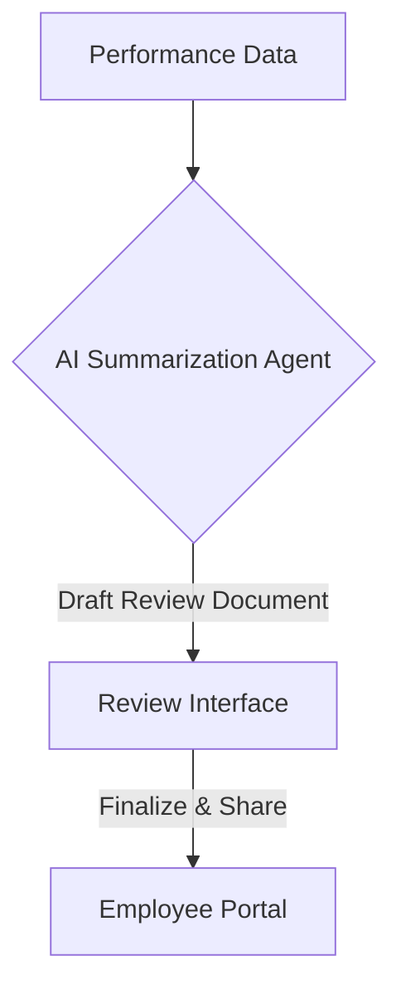

**Title**: AI-Assisted Performance Reviews
**Problem Statement**: Conducting fair and comprehensive performance reviews is challenging for small business owners lacking HR expertise.
**Research Report**: Regular feedback is crucial for employee development, but owners often struggle to provide structured, objective assessments.
**Design Doc**:
*   Architecture: Performance Data (Sales, Attendance, Feedback) -> AI Summarization Agent -> Review Draft.

**Implementation Prompt**: Implement a feature that aggregates an employee's sales metrics, attendance records, and peer feedback over a specific period, using an LLM to generate a draft performance review document that highlights achievements and areas for improvement.
**Priority**: P3
**Estimated Scope**: Medium
