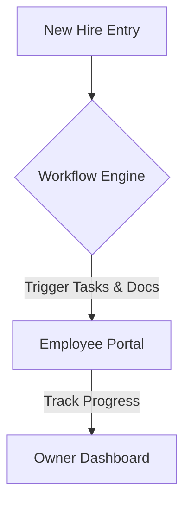

**Title**: Automated Employee Onboarding Workflows
**Problem Statement**: Onboarding new employees involves tedious paperwork, training, and policy reviews, taking time away from the business owner.
**Research Report**: A structured onboarding process significantly improves employee retention.
**Design Doc**:
*   Architecture: HR Database -> Workflow Engine -> Employee Portal.

**Implementation Prompt**: Build an automated onboarding workflow that generates required tax forms, policy acknowledgments, and training schedules when a new employee is added to the system, providing a checklist interface for both the employee and the business owner.
**Priority**: P2
**Estimated Scope**: Medium
