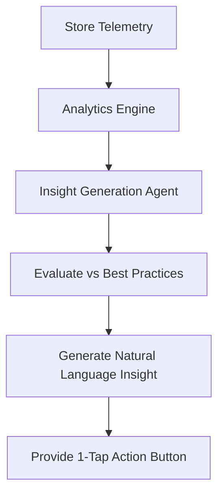

**Title**: Actionable Insights Agent
**Problem Statement**: Small business owners look at traditional analytics dashboards (charts, graphs, pageviews) and feel overwhelmed. They don't know how to translate data into action. They need to be told *what to do* with the data, not just *what the data is*.
**Research Report**: SMB market research shows a high abandonment rate for complex analytics tools. Shopify provides extensive reports, but they are geared towards data-literate marketers. OHC can differentiate by replacing passive dashboards with active, natural-language coaching.
**Design Doc**:
- **Architecture**: An `Analytics Aggregator` collects daily telemetry (page views, cart abandons, top products). An `Insight Generation Agent` runs a daily cron job to analyze the telemetry against best practices.
- **Key Relationships**: The Agent generates `Insight Notification` entities which are delivered to the user via Push/In-App alerts.
- **Mobile UX Flow (375px)**:
  1. The home screen features a prominent "Today's Advice" card instead of complex charts.
  2. The card uses natural language: "Your 'Summer Tote' is getting lots of views but few sales. Try dropping the price by 10% or adding better photos."
  3. The card includes a one-tap action button: "Apply 10% Discount Now".
- **Mermaid Flow**:

**Implementation Prompt**: Build the Actionable Insights engine. The user-facing outcome is a daily, personalized coaching tip delivered to the mobile dashboard. The Critical User Journey involves the system detecting a high cart abandonment rate, generating a plain-English alert advising the user to enable automated recovery emails, and providing a single button to activate that feature. Acceptance criteria require the insights to be actionable (linked to a specific platform feature or setting) and easily understood by a non-technical user.
**Priority**: P2
**Estimated Scope**: Medium
