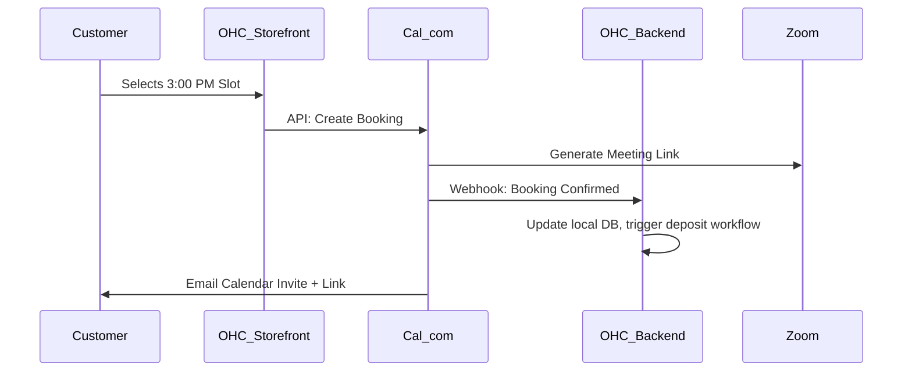

# Scout: Calendar & Scheduling (Cal.com)

## Title
Unified Calendar & Automated Booking 📅 (Cal.com Integration)

## Problem Statement
Service-based business owners, like Leo the Music Tutor and Carlos the Handyman, rely on back-and-forth emails or texts to schedule appointments. This manual process is time-consuming, prone to double-booking, and lacks automatic payment capture for deposits. A seamless, white-labeled scheduling tool is needed so customers can pick a time, pay a deposit, and automatically get calendar invites and video links without the owner lifting a finger.

## Research Report

- **Goal**: Evaluate Cal.com as the core scheduling infrastructure for OHC's Operations Department.
- **Features evaluated**:
  - Open-source, API-first approach.
  - Multi-calendar sync (Google, Outlook, Apple).
  - Webhook support for booking events.
  - Dynamic Zoom/Google Meet link generation.
- **Benefits for OHC users (Non-technical)**:
  - Users get a customized, branded booking page directly inside their OHC storefront.
  - Automatic time zone conversion and conflict prevention.
- **Integration Risks**:
  - Syncing local desktop calendars (Standalone mode) with cloud availability requires a robust event bridge.
- **Pricing**: Free for individuals. Platform/API pricing scales per booking or via a commercial license.
- **Cloud vs Standalone**: Native support for Cloud mode. For Standalone, OHC can use Cal.com's webhooks to push booking events down to the local SQLite database via the Hybrid MCP tunnel.

### Persona Pain Point Summary
| Persona | Pain Point | Solution via Cal.com Integration |
|---------|------------|----------------------------------|
| **Leo (Tutor)** | Managing availability across in-person and online lessons. | Unified booking page that syncs with his personal Google Calendar and generates Zoom links. |
| **Carlos (Handyman)**| Customers ghost him after booking because they forget. | Automated SMS/Email reminders 24h before the scheduled booking. |

### Competitive Analysis
| Feature | Cal.com | Calendly | Acuity |
|---------|---------|----------|--------|
| Open Source / API | Yes (API-first) | No | No |
| White-labeling | Excellent | Limited | Moderate |
| Multi-calendar sync | Yes | Yes | Yes |
| Custom integrations | Very high | Low | Moderate |

### Visual Architecture Flow

## Design Doc
- **Component**: `SchedulingService`
- **Responsibilities**:
  - Provision Cal.com API sub-accounts for each new OHC tenant (business).
  - Sync user availability settings from the OHC mobile app to Cal.com.
  - Render a white-labeled booking widget on OHC-hosted websites.
  - Listen for Cal.com webhooks to update the local OHC booking database and trigger the Finance department agent to invoice for deposits.
- **User Experience**:
  - A visual calendar drag-and-drop interface in the OHC mobile app to set working hours.
  - Customers see a native-feeling booking widget on the business website.

## Implementation Prompt
"Integrate Cal.com API into OHC. Create a Go service in `src/server/services/scheduling/` that utilizes the Cal.com Platform API to create booking links and sync availability. Implement a webhook handler that listens for `booking.created` events and publishes an internal Teammate Mesh event so the Operations and Finance AI agents can process the appointment and send deposit invoices. Ensure compatibility with both Cloud and Standalone modes."

## Priority
P0

## Estimated Scope
Medium
