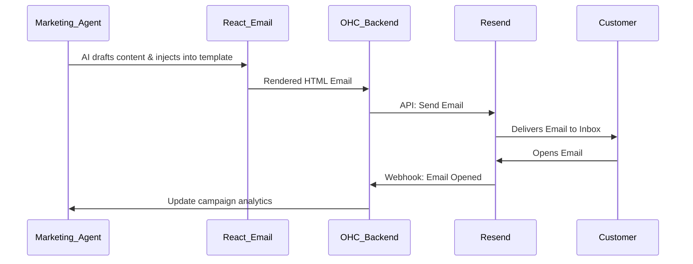

# Scout: Email Marketing (Resend)

## Title
Automated Email Marketing & Deliverability 📧 (Resend Integration)

## Problem Statement
Small businesses, like Priya the Boutique Owner, need a reliable way to notify customers about new stock or abandoned carts. Traditional tools like Mailchimp are bloated, complex, and overkill for a simple "New Arrivals" blast. Furthermore, ensuring emails actually land in the inbox (not spam) requires technical DNS configuration that non-technical users cannot perform.

## Research Report

- **Goal**: Evaluate Resend as the transactional and marketing email engine for the OHC Marketing & Advertising Department.
- **Features evaluated**:
  - Developer-first API with high deliverability.
  - Webhooks for bounce and open tracking.
  - React Email for template generation.
  - Domain authentication automation.
- **Benefits for OHC users (Non-technical)**:
  - Deliverability is handled automatically; OHC abstracts away SPF/DKIM complexity.
  - AI agents can draft beautiful, responsive HTML emails using React Email templates behind the scenes.
- **Integration Risks**:
  - Managing sender reputations across thousands of multi-tenant domains.
- **Pricing**: Generous free tier (3,000 emails/mo), simple scalable pricing afterwards.
- **Cloud vs Standalone**: Native to Cloud mode. In Standalone mode, OHC will proxy email requests through the central OHC cloud gateway to protect API keys and ensure deliverability.

### Persona Pain Point Summary
| Persona | Pain Point | Solution via Resend Integration |
|---------|------------|---------------------------------|
| **Priya (Boutique)**| Wants to email past customers when a popular dress restocks, but hates Mailchimp. | AI agent automatically drafts and sends a beautiful "Back in Stock" email using Resend. |
| **Leo (Tutor)** | Needs to send professional-looking receipts and lesson notes. | Resend transactional emails triggered instantly after a lesson finishes. |

### Competitive Analysis
| Feature | Resend | SendGrid | Mailgun |
|---------|--------|----------|---------|
| Developer UX | Excellent (React Email) | Moderate | Moderate |
| Deliverability | High | High | High |
| Setup Complexity | Very Low | High | High |
| Pricing (10k/mo) | ~$10 | ~$20 | ~$15 |

### Visual Architecture Flow

## Design Doc
- **Component**: `EmailMarketingService`
- **Responsibilities**:
  - Abstract the Resend API for internal OHC use.
  - Utilize React Email templates combined with Gemini Pro to generate personalized marketing emails.
  - Process Resend webhooks to track open rates, clicks, and bounces, updating local analytics dashboards.
- **User Experience**:
  - The business owner simply tells the AI, "Email my customers that we have a 20% sale this weekend." The AI generates the preview and sends it.

## Implementation Prompt
"Integrate Resend for transactional and marketing emails. Create a Go service in `src/server/services/email/` that wraps the Resend API. Implement a webhook receiver to track email analytics (opens, bounces) and log them into the OHC-SIP database. Ensure that the AI agents can pass raw text to the service, which then injects it into pre-defined React Email (or equivalent Go HTML) templates before sending."

## Priority
P1

## Estimated Scope
Small
