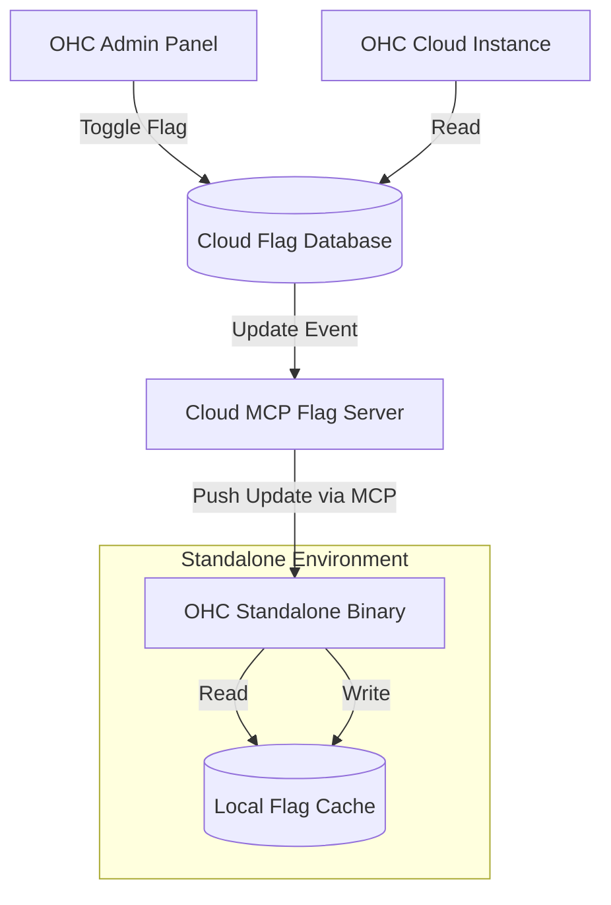

# Scout: Tool Integration Research Q4

## 1. Title
Hybrid Feature Flags via Model Context Protocol (MCP)

## 2. Problem Statement
Managing feature rollouts across both Cloud and Standalone (on-premise) OHC deployments is currently disjointed. We need a unified feature flagging system that allows product managers to toggle features seamlessly across all environments using MCP.

## 3. Research Report
### 3.1 The Small Business Owner Lens
"I read about the new AI Marketing tool in your newsletter, but I don't see it in my app." (User is on a Standalone version that hasn't synced the flag state).

### 3.2 Evidence & Metrics
*   **Release Friction**: Rolling out a feature currently requires coordinating a cloud deployment and a separate binary release for standalone users.
*   **Support Confusion**: Support agents struggle to diagnose issues because they cannot easily see which feature flags are active on a specific standalone instance.

### 3.3 Persona Specific Pain Points
*   **The Support Agent**: Spends 15 minutes asking the user to navigate through debug menus to find their current version and feature state before even beginning to troubleshoot the actual problem.

### 3.4 Actionable Recommendations
1.  **Centralized Control**: The OHC Cloud is the source of truth for all feature flags.
2.  **MCP Sync**: Standalone instances use an MCP client to periodically pull down the latest feature flag states from the Cloud MCP server.
3.  **Graceful Degradation**: If a standalone instance goes offline, it uses the last known good state of the feature flags until connectivity is restored.

## 4. Design Doc

### 4.1 UI/UX Flow
(Internal Tooling)
1.  **Product Manager View**: A dashboard in the OHC Admin panel to toggle a feature (e.g., "Enable AI Chat").
2.  **Targeting**: The ability to target the flag based on user plan, deployment type (Cloud vs. Standalone), or specific tenant IDs.

### 4.2 Architecture (Mermaid)

## 5. Implementation Prompt
**Context**: Implement the MCP syncing mechanism for feature flags.
**Requirements**:
*   Create an MCP server endpoint on the OHC Cloud that serves the current state of feature flags for a given tenant/environment.
*   Implement a background worker in the Standalone binary that polls this endpoint (or listens via PubSub) and updates a local SQLite cache.
*   Ensure the local cache is read efficiently on every request without blocking.

## 6. Priority
Medium. Improves internal velocity and support efficiency.

## 7. Estimated Scope
3 weeks for the MCP server, standalone polling client, and local caching logic.
