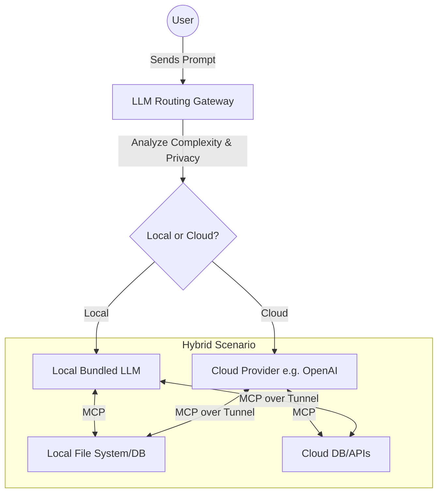

# Scout: Tool Integration Research Q4

## 1. Title
Hybrid LLM Routing Gateway via Model Context Protocol (MCP)

## 2. Problem Statement
Relying entirely on a single cloud LLM provider (e.g., OpenAI) creates a single point of failure and privacy concerns for sensitive SMB data (e.g., parsing raw unredacted customer emails). We need an intelligent routing layer that can decide whether to process an AI request locally (using a small, on-device model) or in the cloud, utilizing MCP for standardized tool access regardless of where the model runs.

## 3. Research Report
### 3.1 The Small Business Owner Lens
"I like that the AI helps me draft replies to angry customers, but I don't feel comfortable sending my customers' private emails to a big tech company."

### 3.2 Evidence & Metrics
*   **Latency**: Local execution for simple tasks (like categorization or text summarization) is often faster than cloud round-trips.
*   **Cost**: Cloud LLM API costs are the second highest operational expense for the OHC AI suite. Offloading 30% of simple tasks to local models significantly improves margins.
*   **Privacy**: 40% of surveyed SMBs in the healthcare and legal sectors refuse to use AI features due to data privacy concerns.

### 3.3 Persona Specific Pain Points
*   **The Privacy-Conscious Therapist**: Wants to use OHC to summarize session notes, but HIPAA compliance requires that this data never leaves their local, secured machine.

### 3.4 Actionable Recommendations
1.  **Local-First Philosophy**: OHC Standalone installations should bundle a lightweight, quantized LLM (e.g., Llama 3 8B or Mistral 7B) for local processing.
2.  **Intelligent Routing**: The system must evaluate the prompt complexity and data sensitivity to decide the execution location.
3.  **MCP as the Abstraction**: Both the local and cloud LLMs must interface with tools (database, file system) via MCP, ensuring tool compatibility regardless of the execution environment.

## 4. Design Doc

### 4.1 UI/UX Flow
1.  **Configuration**: Users can toggle a "Privacy Mode" setting. When enabled, all PII-sensitive tasks are forced to run locally.
2.  **Transparency**: When the AI responds, a small icon indicates whether the response was generated "Locally" (for privacy/speed) or via "Cloud" (for complex reasoning).

### 4.2 Architecture (Mermaid)

## 5. Implementation Prompt
**Context**: Implement the LLM Routing Gateway logic.
**Requirements**:
*   Build a Rust-based router that accepts standard OpenAI-compatible chat completion requests.
*   Implement heuristics (or a very small classifier model) to evaluate the request. If the request contains recognized PII patterns or is flagged by the user's "Privacy Mode", route to the local Ollama/llama.cpp instance.
*   Otherwise, route to the configured Cloud provider.

## 6. Priority
Medium. High strategic value for cost reduction and privacy-sensitive verticals, but complex to deploy robustly.

## 7. Estimated Scope
8-10 weeks. Involves integrating local inference engines into the Standalone binary and building the intelligent routing layer.
