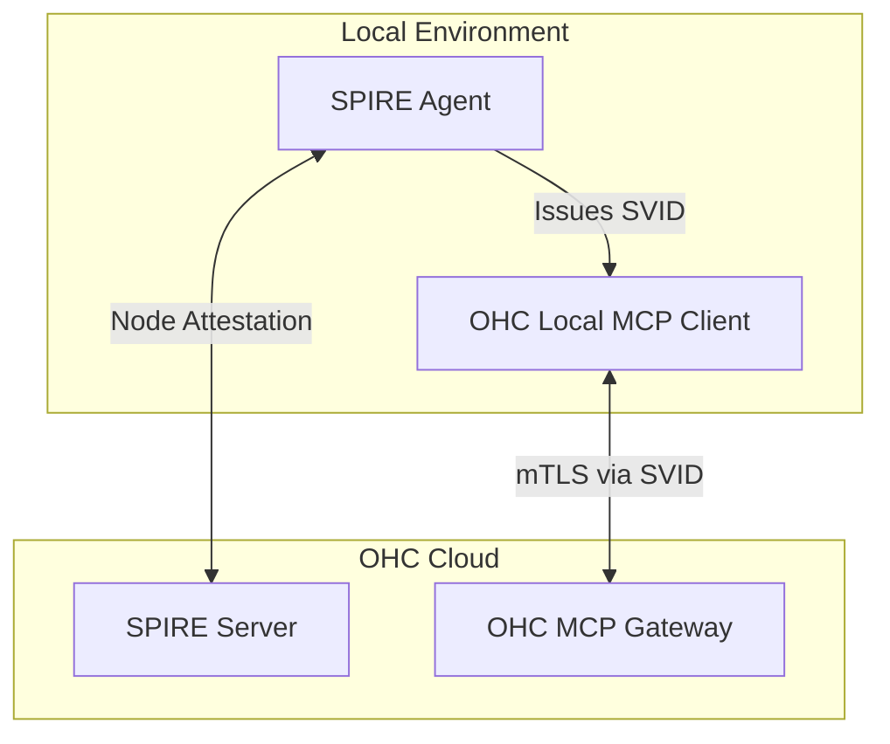

# Scout: Tool Integration Research Q4

## 1. Title
Hybrid SPIFFE Identity via Model Context Protocol (MCP)

## 2. Problem Statement
Securing communication between the OHC Cloud and various on-premise integrations (like local POS systems or legacy databases) relies on fragile, static API keys. We need a dynamic, short-lived identity system based on SPIFFE (Secure Production Identity Framework for Everyone) integrated via MCP.

## 3. Research Report
### 3.1 The Small Business Owner Lens
"I don't know what an API key is, and I don't want to copy-paste a long string of letters and numbers to make my cash register talk to my website."

### 3.2 Evidence & Metrics
*   **Key Compromise**: Static API keys are frequently leaked via accidental GitHub commits or compromised email accounts.
*   **Rotation Friction**: 95% of our SMB users have never rotated their API keys because the process is too complex.

### 3.3 Persona Specific Pain Points
*   **The IT Consultant**: Hired by a mid-sized retailer to set up OHC. They want to ensure zero-trust security between the local network and the cloud, but the current static key model makes this difficult to audit and enforce.

### 3.4 Actionable Recommendations
1.  **Zero-Touch Provisioning**: When a user downloads the OHC Local Agent, it should automatically establish trust with the Cloud using a one-time enrollment token, completely hiding the underlying cryptographic exchange.
2.  **Short-Lived Certificates**: The Local Agent uses SPIFFE to request short-lived (e.g., 1-hour) X.509 certificates (SVIDs) from the Cloud for authentication.
3.  **MCP Integration**: The MCP connection protocol must be upgraded to mutually authenticate using these SVIDs.

## 4. Design Doc

### 4.1 UI/UX Flow
1.  **Enrollment**: User clicks "Connect Local System" -> Receives a 6-digit pin.
2.  **Authentication**: User types the 6-digit pin into the local agent.
3.  **Magic**: The agent exchanges the pin for an initial identity and begins automatically rotating certificates in the background forever.

### 4.2 Architecture (Mermaid)

## 5. Implementation Prompt
**Context**: Implement the SPIFFE integration layer for the MCP Gateway.
**Requirements**:
*   Integrate the SPIRE Agent into the OHC Standalone binary distribution.
*   Modify the Rust MCP Client to request an SVID from the local SPIRE Agent before establishing a connection.
*   Configure the Cloud MCP Gateway to enforce mTLS and validate incoming SVIDs against the SPIRE Server trust domain.

## 6. Priority
High (for Enterprise/Mid-Market). Medium (for micro-SMBs). Crucial for establishing trust in the Hybrid ecosystem.

## 7. Estimated Scope
5-7 weeks. Involves complex PKI infrastructure setup and modification of core transport layers.
