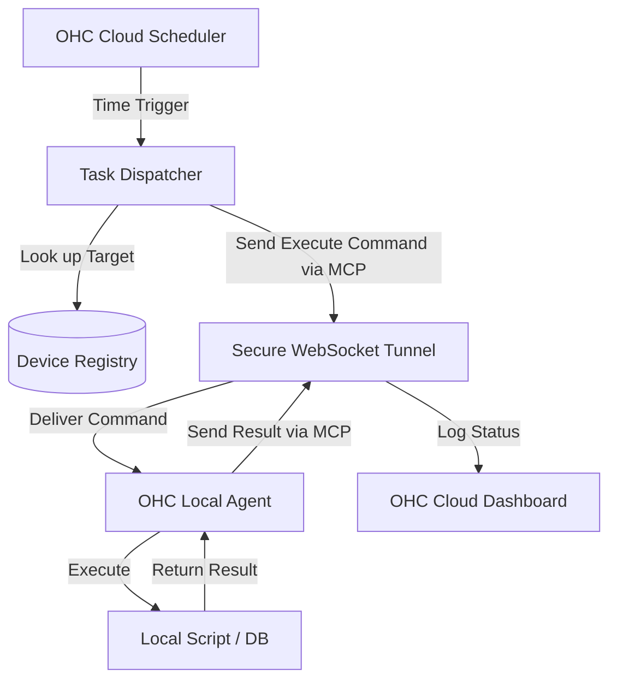

# Scout: Tool Integration Research Q4

## 1. Title
Hybrid Task Scheduler via Model Context Protocol (MCP)

## 2. Problem Statement
Many small business workflows require scheduled, recurring actions that span both cloud and local environments (e.g., "Every night at midnight, sync today's sales from the cloud to my local QuickBooks instance"). Currently, this requires complex, fragile cron jobs set up manually by the user on their local machine.

## 3. Research Report
### 3.1 The Small Business Owner Lens
"I don't know what a 'cron job' is. I just want my reports to be ready on my computer when I come in on Monday morning."

### 3.2 Evidence & Metrics
*   **Reliability Issues**: Manual local scheduling (like Windows Task Scheduler) fails frequently due to sleep states, permission issues, or missed paths.
*   **Visibility**: When a local background task fails, the user usually doesn't find out until a critical process breaks days later.

### 3.3 Persona Specific Pain Points
*   **The Multi-Location Retailer**: Has three store locations, each with a local inventory database. Needs a reliable way to ensure all three local databases sync with the central cloud database every night without having to log into three different computers.

### 3.4 Actionable Recommendations
1.  **Cloud-Driven Scheduling**: The OHC Cloud should act as the central brain for all scheduled tasks, even those executing locally.
2.  **MCP Task Execution**: When a scheduled time arrives, the Cloud uses MCP over the secure tunnel to trigger the specific action on the local agent.
3.  **Unified Audit Log**: The results of all scheduled tasks (success, failure, logs) must be reported back to the Cloud and visible in a single dashboard.

## 4. Design Doc

### 4.1 UI/UX Flow
1.  **Task Creation**: In the OHC Cloud Dashboard, the user creates an "Automation Rule": `WHEN: Every Day 11:00 PM` -> `DO: Export Sales Report` -> `WHERE: Local Store PC`.
2.  **Monitoring**: A simple "Automations Health" widget shows the status of recent runs. If a local PC was offline during the scheduled time, it flags the run as "Missed" and offers a "Run Now" button.

### 4.2 Architecture (Mermaid)

## 5. Implementation Prompt
**Context**: Implement the Cloud-to-Local Task Dispatcher via MCP.
**Requirements**:
*   Extend the OHC Cloud Scheduler to support targeting specific registered "Local Agents".
*   When a task fires, the Cloud sends an `execute_task` MCP request to the connected Local Agent.
*   The Local Agent must gracefully handle cases where the target local tool is unavailable or times out, reporting the specific error back to the Cloud.

## 6. Priority
High. Essential for operational automation in hybrid retail environments.

## 7. Estimated Scope
4-5 weeks to integrate the existing cloud scheduler with the MCP tunnel infrastructure and build the reporting dashboard.
