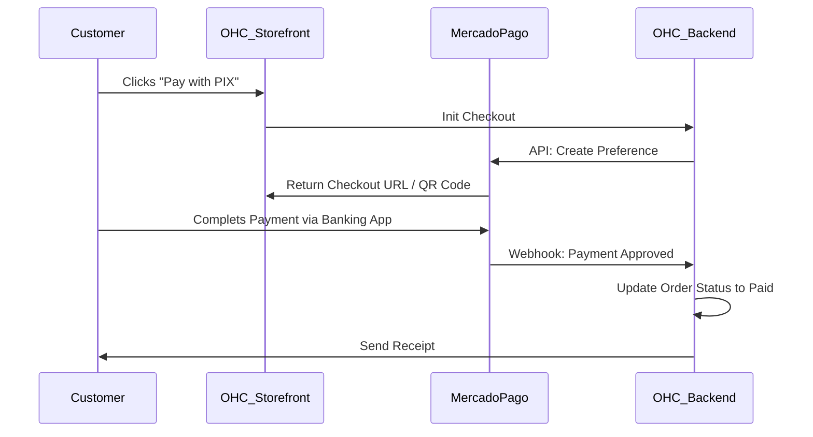

# Scout: Payment Processing (MercadoPago)

## Title
LATAM Payment Gateway 💳 (MercadoPago Integration)

## Problem Statement
While OHC relies heavily on Stripe, many small business owners in Latin America (LATAM) cannot use Stripe or find its regional penetration lacking compared to local alternatives. Business owners in Brazil, Argentina, and Mexico need a localized payment processor that supports regional payment methods (like PIX in Brazil or Rapipago in Argentina) to successfully capture online and in-person sales.

## Research Report

- **Goal**: Evaluate MercadoPago as a primary alternative to Stripe for LATAM-based OHC tenants.
- **Features evaluated**:
  - Checkout Pro (hosted checkout).
  - API for custom checkouts.
  - Webhook notifications for payment status.
  - Support for local payment methods (PIX, Boleto, OXXO).
- **Benefits for OHC users (Non-technical)**:
  - Higher conversion rates in LATAM due to familiar checkout experiences.
  - Seamlessly handles installments (cuotas) which are critical in LATAM e-commerce.
- **Integration Risks**:
  - MercadoPago's API can be regionally fragmented (different endpoints/rules per country).
  - Handling delayed asynchronous payments (e.g., a customer prints a Boleto and pays it two days later in cash).
- **Pricing**: Varies heavily by country and settlement speed.
- **Cloud vs Standalone**: The integration will require webhooks. For Standalone mode, delayed offline payments must securely sync down to the local SQLite database via the Hybrid WebSockets MCP.

### Persona Pain Point Summary
| Persona | Pain Point | Solution via MercadoPago Integration |
|---------|------------|--------------------------------------|
| **Carlos (Handyman - LATAM)**| Clients want to pay via bank transfer (PIX) rather than credit card. | MercadoPago checkout automatically generates a PIX QR code for instant payment. |
| **Priya (Boutique - LATAM)** | Customers abandon carts because her store only accepts international credit cards. | MercadoPago allows local debit cards and cash payment vouchers. |

### Competitive Analysis
| Feature | MercadoPago | Stripe (LATAM) | PayPal |
|---------|-------------|----------------|--------|
| LATAM Market Share | Very High | Low/Growing | Moderate |
| Local Methods (PIX/OXXO) | Native & Excellent | Limited | Limited |
| API Developer UX | Moderate | Excellent | Moderate |

### Visual Architecture Flow

## Design Doc
- **Component**: `PaymentGatewayService`
- **Responsibilities**:
  - Implement a provider interface matching the existing Stripe integration to allow seamless swapping.
  - Handle OAuth or token provisioning for tenant MercadoPago accounts.
  - Process asynchronous webhooks for delayed payments (e.g., cash vouchers).
- **User Experience**:
  - The business owner selects "MercadoPago" in their Finance department settings and connects their account.
  - The checkout UI dynamically displays local payment options based on the buyer's IP or selected country.

## Implementation Prompt
"Implement a MercadoPago payment provider in `srcs/server/services/payments/`. This must implement the existing `PaymentProcessor` interface used by Stripe. Ensure it supports creating payment preferences (Checkout Pro) and handling asynchronous webhook notifications for delayed payment methods like PIX and Boleto. Update the local SQLite schema to support MercadoPago specific transaction IDs."

## Priority
P2

## Estimated Scope
Large
