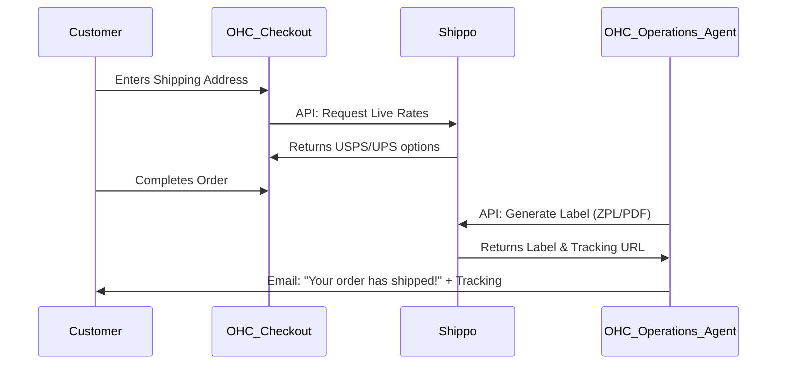

# Scout: Shipping & Logistics (Shippo)

## Title
Multi-Carrier Shipping & Label Generation 📦 (Shippo Integration)

## Problem Statement
E-commerce business owners, like Priya the Boutique Owner, spend hours manually calculating shipping rates, visiting carrier websites (USPS, FedEx, UPS), and printing labels. This disjointed process leads to miscalculated shipping costs, eating into profit margins, and frustrates customers who expect instant tracking numbers. A unified shipping API is required to automate rate calculation at checkout and generate labels instantly.

## Research Report

- **Goal**: Evaluate Shippo to power the logistics side of the OHC Operations Department.
- **Features evaluated**:
  - Real-time rating API for checkout.
  - Label generation (PDF/ZPL).
  - Multi-carrier support (USPS, UPS, FedEx, DHL, etc.) from a single API.
  - Tracking webhooks.
- **Benefits for OHC users (Non-technical)**:
  - Business owners get deeply discounted USPS/UPS rates by default without negotiating their own contracts.
  - One-click label printing from the OHC mobile app.
- **Integration Risks**:
  - Address validation is critical; bad addresses lead to failed API calls which must be handled gracefully in the UI.
- **Pricing**: Pay-as-you-go ($0.05 per label) or Pro subscriptions starting at $19/mo.
- **Cloud vs Standalone**: Rating and Label generation are synchronous API calls easily handled in both modes. Tracking webhooks will require the Hybrid WebSockets MCP for Standalone mode.

### Persona Pain Point Summary
| Persona | Pain Point | Solution via Shippo Integration |
|---------|------------|---------------------------------|
| **Priya (Boutique)**| Manually copying addresses to USPS.com to print labels. | "Print Label" button directly inside the OHC order dashboard. |
| **Maya (Baker)** | Undercharging for shipping because she guesses the weight/distance. | Live shipping rates calculated at checkout based on cart contents. |

### Competitive Analysis
| Feature | Shippo | EasyPost | ShipStation |
|---------|--------|----------|-------------|
| Multi-Carrier | Yes (85+) | Yes | Yes |
| Developer UX | Excellent | Good | Moderate |
| Pre-negotiated Rates| Yes (USPS/UPS) | Yes | Yes |
| Pricing | $0.05 / label | $0.05 / label | Subscriptions |

### Visual Architecture Flow

## Design Doc
- **Component**: `LogisticsService`
- **Responsibilities**:
  - Validate addresses before order completion.
  - Fetch real-time shipping rates during checkout.
  - Purchase and generate shipping labels.
  - Subscribe to tracking webhooks to update order statuses in real-time.
- **User Experience**:
  - OHC Dashboard shows a "Fulfill Order" screen. The owner taps a button, and the label is generated and sent to their mobile printer.

## Implementation Prompt
"Integrate the Shippo API to handle shipping logistics. Create a Go service in `src/server/services/logistics/` that supports address validation, rate fetching, and label creation. Connect this service to the Operations AI Agent so that when an order is marked 'Ready', the agent automatically purchases the label and emails the tracking number to the customer."

## Priority
P1

## Estimated Scope
Medium
