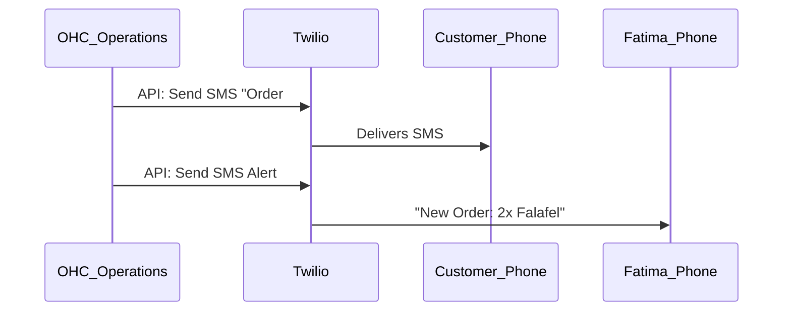

# Scout: SMS & Notifications (Twilio)

## Title
Global SMS Notifications & Marketing 📱 (Twilio Integration)

## Problem Statement
Many customers ignore emails, leading to missed appointments and abandoned carts. Furthermore, non-English speaking or less tech-savvy business owners (like Fatima the Food Cart Operator) rely heavily on SMS for immediate, high-priority communication. OHC needs a robust SMS provider to deliver order confirmations, appointment reminders, and targeted SMS marketing with high deliverability.

## Research Report

- **Goal**: Evaluate Twilio as the SMS engine for the OHC Operations and Marketing Departments.
- **Features evaluated**:
  - Programmable SMS API.
  - Alphanumeric Sender IDs (for branded texts).
  - 10DLC compliance automation.
  - WhatsApp Business API (via Twilio).
- **Benefits for OHC users (Non-technical)**:
  - Immediate, 98% open-rate communication channel.
  - OHC abstracts the complex 10DLC compliance registration process.
- **Integration Risks**:
  - Strict compliance rules (A2P 10DLC in the US) require business identity verification before sending.
  - High costs compared to email.
- **Pricing**: Pay-as-you-go (approx $0.0079 per SMS in the US).
- **Cloud vs Standalone**: Native to Cloud.

### Persona Pain Point Summary
| Persona | Pain Point | Solution via Twilio Integration |
|---------|------------|---------------------------------|
| **Fatima (Food Cart)**| Does not constantly check a computer; needs to know immediately when a pre-order is placed. | OHC sends Fatima an SMS alert: "New Order: 2x Falafel - Pickup 12:30PM". |
| **Carlos (Handyman)** | Customers forget appointment windows, causing Carlos to waste gas driving to empty houses. | Automated SMS reminder sent to the customer 2 hours before arrival. |

### Competitive Analysis
| Feature | Twilio | MessageBird | Plivo |
|---------|--------|-------------|-------|
| Global Reach | Excellent | Very Good | Good |
| Developer UX | Excellent | Good | Good |
| WhatsApp Native| Yes | Yes | Limited |
| Pricing | Premium | Moderate | Moderate |

### Visual Architecture Flow

## Design Doc
- **Component**: `SMSService`
- **Responsibilities**:
  - Interface with Twilio's Programmable SMS API.
  - Handle webhook callbacks for SMS delivery status.
  - Provide an interface for the Legal & Compliance agent to collect 10DLC business registration details from the tenant.
- **User Experience**:
  - The business owner simply toggles "Send SMS Reminders" in their dashboard. The AI handles drafting the 160-character limit message.

## Implementation Prompt
"Integrate Twilio for SMS notifications. Create a Go service in `srcs/server/services/sms/` that wraps the Twilio API. Ensure the service tracks delivery statuses via webhooks. Add logic to the 'Legal & Compliance' AI agent to guide US-based business owners through the required A2P 10DLC registration process to ensure compliance before enabling the feature."

## Priority
P0

## Estimated Scope
Medium
