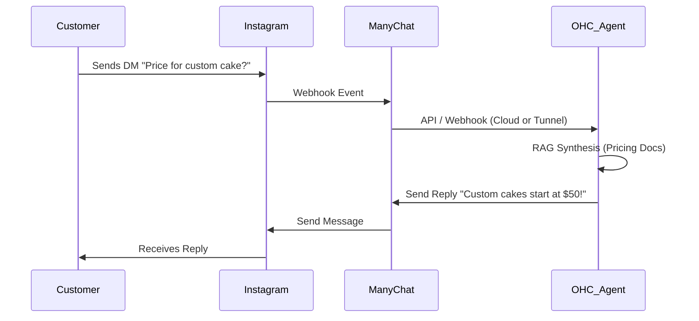

# Scout: Social Media Integration (ManyChat)

## Title
Social Media Unified Inbox & Automation 💬 (ManyChat Integration)

## Problem Statement
Small business owners, like Maya the Baker, currently juggle multiple apps to handle customer inquiries across Instagram, Facebook, and WhatsApp. They lose potential sales due to delayed responses and find it difficult to manually answer repetitive questions ("Do you do vegan cakes?"). A non-technical solution is required to centralize all DMs into a unified inbox and leverage AI to automatically reply to common questions or capture leads while the owner is asleep or busy.

## Research Report

- **Goal**: Evaluate ManyChat as the underlying engine to power the "Operations & Customer Success" AI agent capabilities for unified social media messaging.
- **Features evaluated**:
  - Instagram, Facebook Messenger, and WhatsApp integrations.
  - Automated flow building for DMs.
  - Lead capture directly in chat.
  - Keyword triggers.
- **Benefits for OHC users (Non-technical)**:
  - Users don't need to know what an "API" is; OHC would provision the ManyChat account behind the scenes via OAuth.
  - AI auto-responders run 24/7, directly answering questions based on the OHC business knowledge base.
- **Integration Risks**:
  - High dependency on Meta's API stability.
  - ManyChat pricing can scale quickly with contact volume, which might conflict with OHC's free-tier promise if not managed carefully.
- **Pricing**: Free tier exists (limited to 1,000 contacts), Pro starts at $15/mo.
- **Cloud vs Standalone**: Works perfectly in Cloud mode via webhooks. For Standalone desktop mode, a cloud relay or hybrid MCP tunnel is necessary to receive webhooks from ManyChat to the local SQLite event bus.

### Persona Pain Point Summary
| Persona | Pain Point | Solution via ManyChat Integration |
|---------|------------|-----------------------------------|
| **Maya (Baker)** | Misses Instagram DMs while baking; wants to automate FAQs. | AI auto-replies to DMs on IG with cake pricing and booking links. |
| **Carlos (Handyman)**| Cannot answer Facebook messages while working on a roof. | Lead capture flow in Messenger asks for zip code and problem description. |

### Competitive Analysis
| Feature | ManyChat | Chatfuel | MobileMonkey |
|---------|----------|----------|--------------|
| IG/FB Support | Excellent | Good | Good |
| WhatsApp | Native | via API | via API |
| Ease of API | Very Good| Moderate | Good |
| Pricing | $15/mo | $15/mo | Custom |

### Visual Architecture Flow

## Design Doc
- **Component**: `SocialMediaIntegrationService`
- **Responsibilities**:
  - Manage OAuth flows for users to connect their Instagram/FB pages.
  - Register webhooks with ManyChat to listen for incoming messages.
  - Route incoming messages to the "Customer Success" AI agent department for draft generation.
  - Support bi-directional syncing to local desktop environments via Hybrid WebSockets MCP.
- **User Experience**:
  - A simple "Connect Instagram" button in the OHC dashboard.
  - A unified inbox view in the OHC mobile app where all IG/FB messages appear.

## Implementation Prompt
"Implement the Social Media Inbox integration using ManyChat. Create a Go service in `srcs/server/services/social/` that handles the ManyChat OAuth connection, webhook registration, and incoming message parsing. Connect this service to the AI Job Queue so the Customer Success agent can automatically generate response drafts. Ensure webhook payloads can be forwarded to standalone clients via the local event bus."

## Priority
P0

## Estimated Scope
Medium
