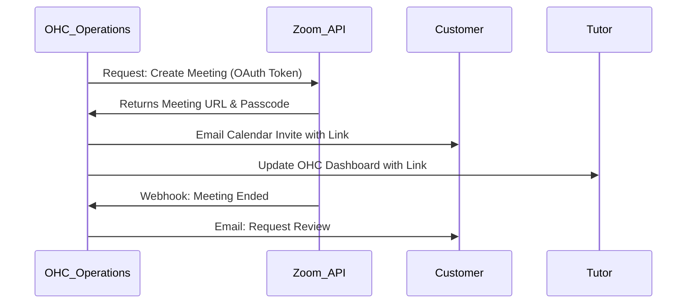

# Scout: Video Conferencing (Zoom)

## Title
Automated Video Meetings 📹 (Zoom Integration)

## Problem Statement
Service businesses that operate online (like tutors, consultants, or therapists) need a seamless way to generate secure video links for booked appointments. Manually creating a meeting in Zoom and pasting the link into an email is tedious. OHC needs to automatically provision secure, unique video links for every online booking and ensure the customer receives them.

## Research Report

- **Goal**: Evaluate the Zoom API to dynamically generate meeting links for the OHC Operations Department (specifically tied to the scheduling module).
- **Features evaluated**:
  - Zoom Meeting API (Create, Update, Delete).
  - OAuth 2.0 flow for tenant authentication.
  - Webhooks for meeting attendance (to trigger follow-ups).
- **Benefits for OHC users (Non-technical)**:
  - "It just works." When a customer books a virtual service, a Zoom link magically appears on both calendars.
- **Integration Risks**:
  - Managing thousands of OAuth refresh tokens securely.
  - Zoom's strict API rate limits.
- **Pricing**: The API is free to use, but the tenant must have a Zoom account (Free or Pro depending on meeting length).
- **Cloud vs Standalone**: Native to Cloud mode via API.

### Persona Pain Point Summary
| Persona | Pain Point | Solution via Zoom Integration |
|---------|------------|-------------------------------|
| **Leo (Tutor)** | Manually emailing students their unique Zoom links 5 minutes before class. | Cal.com + Zoom integration automatically generates the link at booking and emails it. |
| **Carlos (Handyman)** | Needs to see a plumbing leak remotely before quoting a job. | AI Sales agent generates an instant Zoom link for a 10-minute "Virtual Quote" call. |

### Competitive Analysis
| Feature | Zoom | Google Meet | Whereby |
|---------|------|-------------|---------|
| Brand Trust | Universal | High | Low |
| API UX | Moderate | Complex | Excellent |
| Free Tier | 40-min limit | 60-min limit | Limited |

### Visual Architecture Flow

## Design Doc
- **Component**: `VideoConferenceService`
- **Responsibilities**:
  - Handle Zoom OAuth flow to connect tenant accounts.
  - Expose internal API to create, update, and delete meetings.
  - Listen for `meeting.ended` webhooks to trigger the "Customer Success" agent to send follow-up emails.
- **User Experience**:
  - The business owner authorizes Zoom once in settings. Afterwards, all "Virtual" service bookings automatically include a generated link.

## Implementation Prompt
"Integrate the Zoom Meeting API into OHC. Create a Go service in `srcs/server/services/video/` that manages the OAuth 2.0 lifecycle for tenant Zoom accounts. Expose internal gRPC methods for the Operations AI agent to dynamically create unique meeting links. Ensure the service handles token refresh securely and respects Zoom's rate limits."

## Priority
P1

## Estimated Scope
Medium
