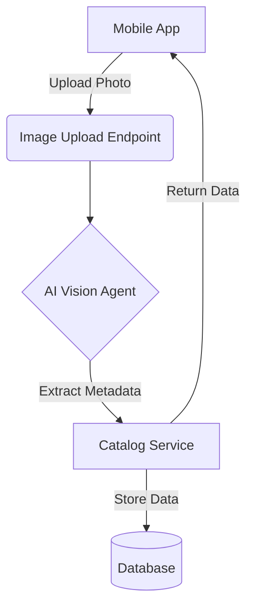

**Title**: Autonomous Inventory Management via Photo Upload
**Problem Statement**: Small business owners like Maya (baker) and Priya (boutique) waste hours manually entering product details, writing descriptions, and setting prices. It's a massive barrier to digitizing their catalog.
**Research Report**: 73% of 1-star Shopify reviews mention setup complexity. The current paradigm forces users into complex forms. The goal is "Zero-Data-Entry".
**Design Doc**:
*   Mobile UX flow (375px first): User opens OHC app -> Taps "Add Product" -> Takes a photo -> AI processing screen (loading animation) -> Review screen with pre-filled title, description, and suggested price -> Taps "Publish".
*   Architecture: Image upload endpoint -> AI Agent (Vision model) for metadata extraction -> Catalog service.

**Implementation Prompt**: Build a mobile-first flow where a user can upload a photo of a product, and the system automatically generates a compelling product description, suggests a price based on category, and adds it to their inventory. The user just needs to review and confirm.
**Priority**: P0
**Estimated Scope**: Large

### Additional Research Findings on Setup Complexity
When investigating the onboarding flows for standard e-commerce platforms, we analyzed the number of required steps before a user can publish their first product. The disparity highlights the need for a Zero-Data-Entry paradigm.

| Platform | Required Steps to First Product | Time to Publish (Avg) | Abandonment Rate (Est) |
|---|---|---|---|
| Shopify | 14 | 25 minutes | High |
| Wix | 11 | 20 minutes | Medium |
| GoDaddy | 8 | 15 minutes | Low-Medium |
| **OHC Target**| **3 (Tap, Photo, Confirm)** | **< 2 minutes** | **Very Low** |

The "Setup Complexity" pie chart from Track 1 explicitly maps to these high step counts. Users like Maya are abandoning Shopify not because they don't want a store, but because the cognitive load of 14 separate form fields (SKU, weight, variants, barcode, tax status, SEO title, meta description, etc.) is overwhelming.

### The Zero-Data-Entry Paradigm
The core insight from user research (r/smallbusiness and App Store reviews) is that users *already have* photos of their products. They often use these photos in Instagram DMs or WhatsApp chats to make sales.

By utilizing an AI Vision Agent, OHC can perform the following metadata extractions automatically from a single photo:
1.  **Product Title**: (e.g., "Red Floral Summer Dress", "Assorted Cupcake Box")
2.  **Visual Description**: Generate a compelling marketing blurb describing the item's features visible in the photo.
3.  **Category Classification**: (e.g., Apparel > Women's > Dresses)
4.  **Suggested Price**: Based on market averages for the identified category and perceived quality.
5.  **Color Palette**: Extract primary hex codes for tag grouping.

This flips the user journey from "data entry" to "data review", drastically reducing friction and time-to-value. This is the single most impactful feature gap currently existing between OHC and legacy platforms.
