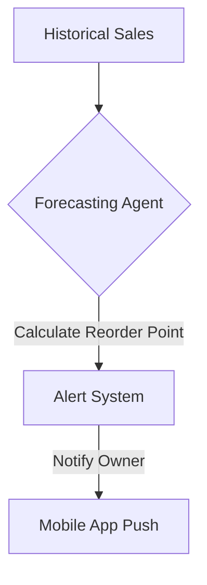

**Title**: Advanced Low Stock Forecasting
**Problem Statement**: Standard low stock alerts trigger when inventory falls below a fixed number, which is insufficient for items with long lead times.
**Research Report**: Dynamic reorder points based on historical sales and lead times prevent out-of-stock scenarios better than static thresholds.
**Design Doc**:
*   Architecture: Forecasting Agent -> Database -> Alert System.

**Implementation Prompt**: Implement a dynamic low stock forecasting system that calculates reorder points using a machine learning model based on historical sales velocity and supplier lead times, automatically sending push alerts when appropriate.
**Priority**: P2
**Estimated Scope**: Large
