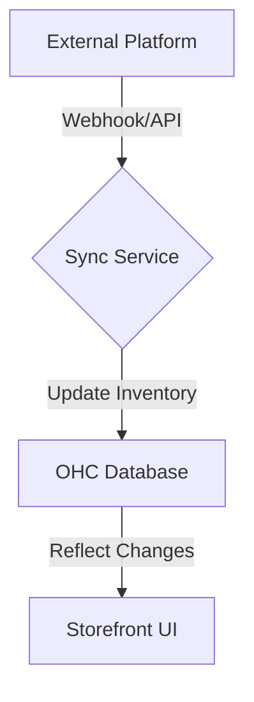

**Title**: Multi-Channel Product Catalog Sync
**Problem Statement**: Maintaining product catalogs across multiple platforms (e.g., Shopify, Instagram, OHC) is prone to errors, leading to out-of-stock purchases.
**Research Report**: Syncing inventory manually is an administrative burden, often leading to a poor customer experience when an item sold on one platform is still listed on another.
**Design Doc**:
*   Mobile UX Flow: "Settings" -> "Integrations" -> Select Platform -> "Sync Catalog".
*   Architecture: Sync Service -> Webhook/API Poller -> Inventory Database.

**Implementation Prompt**: Create an inventory synchronization service that listens to webhooks or polls external APIs to keep product catalogs up to date across platforms in real-time.
**Priority**: P1
**Estimated Scope**: Large

### The "Single Source of Truth" Challenge
For omnichannel merchants, inventory discrepancies are the primary cause of order cancellations and negative reviews. The OHC Sync Service must establish OHC as the absolute "Single Source of Truth" (SSOT) for inventory counts.

### Conflict Resolution Strategy
When syncing with external platforms (like Square POS or a legacy Shopify store during migration), the system needs a robust conflict resolution strategy.
*   **Timestamp-Based Resolution**: In the event of conflicting inventory counts, the system should generally favor the most recent update, but only if the update implies a *decrement* in stock (to prevent overselling).
*   **Manual Intervention Queue**: If the system detects a massive, anomalous change in inventory from an external source (e.g., stock jumps from 5 to 500), it should quarantine the sync update and place it in a "Manual Intervention Queue" for the owner to review.

### Performance Implications
Polling external APIs can quickly consume rate limits and degrade system performance.
*   **Webhook First**: The service should prioritize webhook-based integrations where the external platform pushes updates to OHC.
*   **Adaptive Polling**: For platforms that only support polling, implement an adaptive polling frequency algorithm. If a product hasn't sold in a week, poll its inventory status less frequently than a high-velocity item.

### Edge Cases in Multi-Platform Sync
While standard sync handles simple quantity decrements, several edge cases require complex logic:
*   **Variant Mapping**: A "Large Red Shirt" in Shopify might be represented differently in Square POS. The Sync Service requires a semantic mapping layer (potentially powered by an LLM during initial setup) to ensure variants are correctly linked across platforms, preventing mis-syncs.
*   **Kitting and Bundling**: If Maya sells a "Cupcake Variety Pack" (a kit), and a customer buys a single Vanilla Cupcake, the system must intelligently decrement the available inventory of the *components*, which in turn dynamically updates the available inventory of the *Variety Pack* across all integrated platforms.

### Real-Time Constraints vs. Eventual Consistency
True real-time sync is often impossible due to external API rate limits and network latency. The architecture must be built on the principle of *eventual consistency* while presenting an illusion of real-time to the end customer.
*   **Optimistic Locking**: When a user adds an item to their cart on OHC, the system should optimistically lock that inventory unit. If a webhook arrives moments later indicating that unit was sold on Square, the OHC cart must gracefully update, alerting the user that the item is no longer available before they reach payment.
