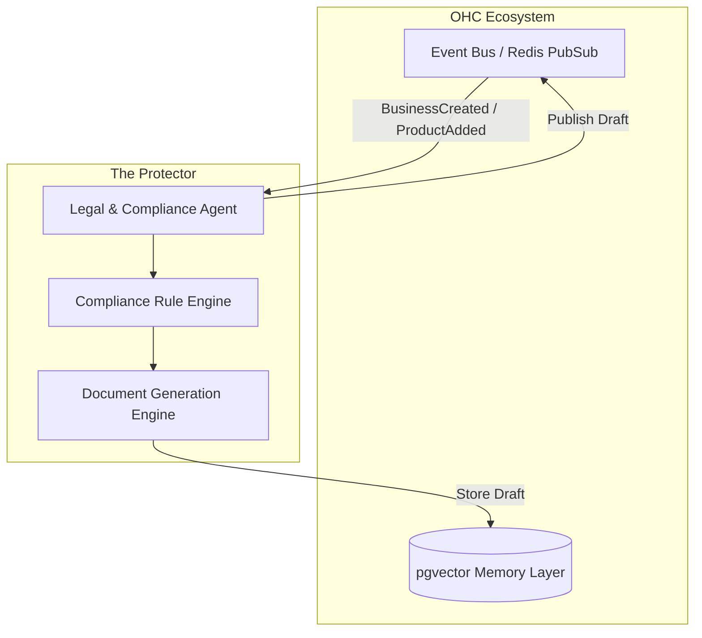

# Title
The Protector: AI Legal & Compliance Agent for SMBs

# Problem Statement
Small business owners (SMBs) consistently struggle with legal and compliance requirements, which they often ignore until a problem arises due to high lawyer fees and complex legal jargon. For example, a home baker like Maya needs specific allergy disclaimers, while a boutique owner like Priya requires comprehensive return policies and terms of service. Setting up cookie consent banners (GDPR/CCPA compliance) and drafting service contracts correctly are major hurdles that existing platforms like Shopify and Wix leave up to the user to figure out, exposing them to legal liabilities. Non-technical founders need an invisible layer of legal protection that autonomously generates policies, contracts, and compliance tools tailored to their specific business type and geography.

# Research Report
**Market & Competitor Findings:**
- **Shopify:** Provides basic, templated policies (Refund, Privacy, TOS), but the user must manually populate them and configure cookie banners via third-party apps. This process is fragmented and intimidating.
- **Wix:** Similar to Shopify, relies on generic templates that lack nuance for specific industries (e.g., food safety, custom service quotes).
- **Squarespace:** Very limited legal support. Users frequently resort to copying competitors' policies, which can be legally precarious.
- **Trustpilot/Reddit Validation:** A frequent complaint in r/smallbusiness is the stress of "doing things legally" (forming contracts, managing deposits, GDPR). Many non-technical founders feel paralyzed by compliance.
- **The Gap:** There is no platform that uses AI to *proactively* assess the business type (e.g., "Food Cart") and automatically inject the correct disclaimers, local compliance pop-ups, and service agreements without user intervention.

**OHC Differentiation:**
"The Protector" (Legal & Compliance Agent) will treat compliance as a core infrastructure service. Instead of offering templates, it will dynamically generate binding policies, consent forms, and service contracts based on the specific `tenant` profile, storing the context in pgvector to keep documents up-to-date as the business evolves.

# Design Doc
## Architecture & Data Flow
1.  **Entity Types:**
    -   `LegalDocument`: Terms of Service, Privacy Policy, Refund Policy, Custom Contract.
    -   `ComplianceStatus`: Boolean flags for GDPR, CCPA, local licensing.
2.  **Key Relationships:**
    -   The `LegalAgent` subscribes to events from the `BusinessSetup` and `Operations` departments to trigger compliance checks (e.g., when a new product type is added).
3.  **Mobile UX Flow (375px First):**
    -   **Onboarding:** During setup, the user selects their business type (e.g., "Food & Beverage").
    -   **Dashboard Notification:** "The Protector generated your Terms of Service and Cookie Policy. [Review & Publish]"
    -   **Contract Drafting:** When Carlos (Handyman) creates a $1,000 quote via the Sales Agent, The Protector intercepts to draft a liability and deposit contract, presenting it as a simple "Draft-for-Review" card.
    -   **Approval Screen:** A clear, jargon-free summary of the contract or policy. The user swipes right to approve.

## High-Level Diagram

# Implementation Prompt
Implement the Legal & Compliance AI Agent ("The Protector") framework. Define the agent's core capabilities to subscribe to business lifecycle events (`tenant.created`, `product.added`, `quote.generated`). When an event is detected, the agent should query the pgvector shared memory to understand the business context and use the LLM provider to generate appropriate legal documentation (e.g., Privacy Policy, custom service contract) in markdown format. The output must be saved to the database as a `DRAFT_FOR_REVIEW` action, triggering a notification to the user. Do not prescribe specific database schemas or API contracts; focus on the agent's autonomous generation and event-handling workflow.

# Priority
P1

# Estimated Scope
Medium

