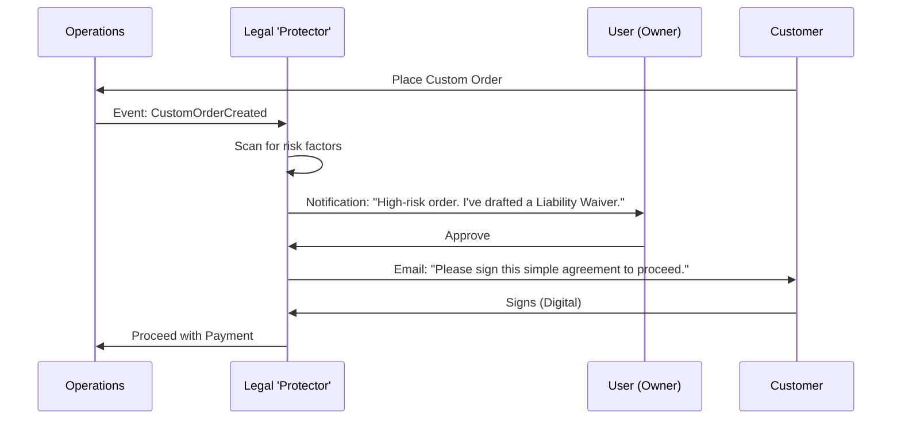

# Issue Brief: AI Legal 'Protector' Department

## Problem Statement
Legal compliance is a massive "Cognitive Overhead" for solopreneurs. Most ignore it until something goes wrong (e.g., a customer demands a refund for a non-refundable custom cake, or a GDPR complaint arrives). Static templates (provided by competitors) are "set-and-forget" and don't protect the business during actual operations. OHC needs a proactive "Protector" department that monitors business state, flags risks, and generates legally sound responses/contracts in plain language.

## Research Report
### Market Audit
- **Shopify/Wix**: Provide static template generators for "Privacy Policy" and "Refund Policy." They do not help if a customer sends a threatening email.
- **LegalZoom / RocketLawyer**: Expensive ($30-50/mo) and siloed. They are document repositories, not integrated business agents.
- **Top Solopreneur Fears**: 1. Not getting paid. 2. Customer lawsuits over minor issues. 3. Tax/Regulatory fines.

### Personas Alignment
- **Maya (Baker)**: Needs a "Custom Order Agreement" that clearly states deposits are non-refundable.
- **Carlos (Handyman)**: Needs a "Liability Waiver" for high-risk repair work (e.g., electrical/plumbing).
- **Leo (Tutor)**: Needs a "Cancellation Policy" that is automatically enforced when a student cancels 1 hour before a lesson.

## Design Doc
### High-Level Architecture
- **Passive Monitoring**: The Legal Agent listens to system events (e.g., `NewOrder`, `MessageReceived`).
- **Policy Enforcement**: Automatically injects specific terms into checkout based on the products in the cart (e.g., adding a food allergy disclaimer for Maya).
- **Proactive Risk Flagging**: If a customer message contains keywords like "sue," "lawyer," or "illegal," the agent flags it to the owner with a "Recommended Safe Response."

#### Legal Flow Diagram

### Mobile UX Flow (375px First)
1. **Compliance Health Check**: A simple "Shield" icon on the dashboard. Green = Covered, Yellow = Missing Policy, Red = Active Dispute.
2. **The "Safe Draft"**: When the owner is replying to a difficult customer, a "Legal Check" button appears. Tapping it rephrases the owner's response to be professionally firm and legally sound.
3. **1-Tap Policies**: "Carlos, you added a 'Plumbing' service. Should I add a Water Damage liability clause to your checkout?" -> Tap [Yes].

## Implementation Prompt
Implement the backend "Legal & Compliance" agent department. This agent must subscribe to `Order` and `Message` events to identify potential risks. It should be capable of generating dynamic, plain-language contracts and policies based on the business type and specific transaction context. Create a "Compliance Dashboard" in the Flutter mobile app (375px) that displays the business's current legal health and offers 1-tap "Protection Upgrades" (e.g., adding disclaimers or generating waivers). The agent should also provide an "AI Response Protector" feature to draft or review sensitive customer communications.

## Priority
P1

## Estimated Scope
Medium
