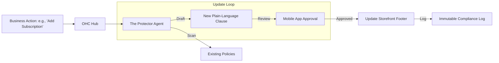

# Issue Brief: [Legal] Automated Compliance Shield

## Title
The Protector: Automated jargon-free Compliance, Policies, and Liability Shields

## Problem Statement
Small business owners like Fatima (Food Cart) and Leo (Tutor) often operate without Terms of Service or proper Privacy Policies because hiring a lawyer is too expensive and online templates are full of confusing jargon. This leaves them vulnerable to disputes or GDPR/CCPA fines. They need a "Protector" that automatically generates, updates, and translates legal essentials based on their specific business activities.

## Research Report
- **The "Legal Gap"**: 70% of small businesses have no written contracts or clear refund policies.
- **Competitive Analysis**:
  - **Shopify/Wix**: Provide generic templates but don't auto-update when the business changes (e.g., adding a digital product).
  - **Termly/Iubenda**: Powerful but charge separate high monthly fees ($15-$40/mo), adding to "subscription hell."
- **OHC Innovation**: "The Protector" is built-in. If Leo starts offering "Subscription Lesson Packages," the agent automatically drafts an updated "Cancellation Policy" and asks for his 1-tap approval.
- **Pain Points Addressed**:
  - Technical Jargon (Replacing "Indemnification" with "Your Protection").
  - Setup Complexity (Auto-generating policies during storefront launch).

## Design Doc

### High-Level Architecture (Mermaid.js)

### Mobile UX Flow (375px)
1.  **Onboarding Protection**: During the 10-minute setup, the agent says: "I've drafted a simple Refund Policy and Privacy Shield for your bakery. It says 'No refunds on custom cakes once baking starts.' Does that sound right?" [Yes] [Edit].
2.  **The "Safety Shield" Icon**: A small badge on the dashboard that turns amber if a policy is missing (e.g., "Missing Digital Delivery policy for your E-book").
3.  **1-Tap Dispute Helper**: If a customer disputes a payment: "Maya is asking for a refund. Based on your 'No Refunds' policy she agreed to, here is a polite draft reply." [Send Reply].

### AI Agent Integration
- **Triggers**: Storefront launch, product type change, or regional regulatory updates (e.g., new EU data laws).
- **Context**: Accesses `product` categories and `tenant` location.
- **Approval Logic**: Strictly `Draft-for-Review`. Legal documents are never published without the owner's explicit 1-tap consent.

## Implementation Prompt
**To Implementer Agent:**
Implement "The Protector" agent department. Create a compliance monitoring engine that tracks changes to the business's product catalog and service offerings. The agent must auto-generate plain-language legal documents (Terms, Privacy, Refunds) tailored to the business type. Build the mobile-first (375px) "Compliance Shield" dashboard component using OHC design tokens. Ensure that all legal documents are presented in a "Plain Language" toggle by default (e.g., "What this means in simple terms") with the full legal text accessible behind a "See Detailed Version" link. Implement the 1-tap approval flow for policy updates and maintain an immutable `audit_trail` of all approved versions.

## Priority
P2 (Security & Professionalism)

## Estimated Scope
Small
