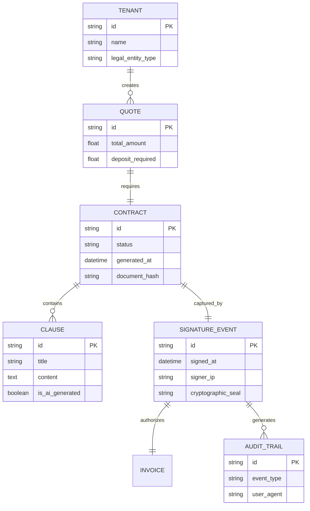

# Title: Autonomous Contract & Liability Waiver Engine

## Problem Statement

Service providers, event professionals, and high-ticket sellers (like Carlos the handyman, Leo the music tutor, or Maya the baker handling large custom weddings) face a critical drop-off point between agreeing on a quote and securing the job. They need legally binding agreements to protect against scope creep, no-shows, and credit card chargebacks. Currently, this means paying for and stitching together disjointed third-party tools like DocuSign, sending a PDF link, and hoping the client signs it before sending a *separate* payment link. If a client is on a phone, pinching and zooming a desktop-formatted PDF is frustrating. This multi-step friction loses leads and delays cash flow. They need a system where a custom contract is generated instantly and the signature and payment happen simultaneously on mobile.

## Research Report

* **Current Capabilities:** OHC has unified quoting and deposit capabilities (`[architecture]_unified_booking_quoting_deposit_engine.md`), but lacks an integrated, legally binding agreement or digital signature layer that cryptographically ties the signature to the transaction.
* **Competitor Analysis:**
  * *DocuSign / HelloSign:* The gold standard for legally binding signatures, but they are standalone tools. They are expensive for solopreneurs and interrupt the checkout flow because they are disconnected from the payment gateway.
  * *Jobber / HoneyBook:* Include contract features tied to quotes, but often present documents as static PDFs which fail the "grandmother test" on a 375px mobile screen.
  * *Square Contracts:* Good integration with payments, but rigid templating. Not deeply integrated with AI context to automatically adjust clauses based on client chat history.
* **Gap Identified:** A mobile-native, responsive "Sign & Pay" engine where AI dynamically drafts protective clauses based on the service context, and the signature event acts as the authorization for the payment deposit, producing a single, cryptographically sealed audit trail to defend against chargebacks.
* **Strategic Advantage:** By turning contracts from a static PDF hurdle into a responsive, AI-generated step seamlessly integrated into the checkout flow, OHC protects solopreneurs while maintaining a sub-2-minute conversion experience for the buyer.

## Design Doc

### Architecture Diagram

### UI Wireframes (375px Mobile First)

* **The Review Interface (Buyer View):**
  * Instead of a pinched PDF, the contract is rendered as native UI text within a macOS-style Translucent Glass card.
  * Typography is responsive, large, and highly readable.
  * Sticky footer at the bottom of the screen with a primary "Sign & Pay Deposit" button.
* **The Signature Canvas:**
  * When tapping the sticky footer, a bottom sheet slides up.
  * A smooth, responsive touch canvas appears for the finger signature, utilizing the entire width of the mobile device.
  * Clear text below: "By signing, I agree to the terms and authorize the $50.00 deposit."
* **Merchant "Protections" Dashboard:**
  * A clean card for the business owner showing signed contracts.
  * One-tap "Download Evidence" button (generates a Zip file of the signed contract + audit trail) designed specifically to be uploaded to Stripe during a chargeback dispute.

### Mobile UX Flow

1. **AI Drafting:** Maya confirms a $500 wedding cake order via the AI unified inbox. The AI Legal Agent automatically appends her standard "Non-refundable custom order" and "Allergen liability waiver" clauses to the quote.
2. **Buyer Review:** The customer clicks the SMS link. They view the beautiful quote, and scroll down to read the responsive, native-text contract terms right on their iPhone.
3. **Unified Action:** The customer taps "Sign & Pay". They draw their signature on the screen, and Apple Pay slides up immediately after.
4. **Completion:** The payment is captured, the contract is cryptographically sealed with the IP/User-Agent data, and a copy is emailed to both parties automatically.

### AI Agent Integration Points

* **Legal / Operations Agent:** Listens to the context of the service being booked. If a booking includes "roof repair", it dynamically injects a "weather delay" clause. If it's a food order, it injects "allergy waivers".
* **Finance Agent:** Uses the signed `SIGNATURE_EVENT` and its `AUDIT_TRAIL` to automatically assemble a defense package if a customer initiates a chargeback 3 months later, winning disputes without the merchant lifting a finger.

### Key Design Decisions and Why

* **Native Text over PDF Rendering:** We render contract text natively in the DOM rather than generating a PDF for review. Why: Pinch-to-zoom PDFs destroy conversion rates on mobile devices. (Grandmother test). A PDF is only generated *after* signing for record-keeping.
* **Unified Sign & Pay Action:** The signature and payment must occur in the exact same flow. Why: To prevent the "signed but didn't pay" or "paid but didn't sign" desync that plagues disjointed systems.
* **Cryptographic Audit Trail:** Every signature captures IP, timestamp, user agent, and an immediate hash of the document state. Why: To provide ironclad evidence for Stripe/payment gateway chargeback disputes, a massive pain point for solopreneurs.

## Implementation Prompt

Build the Autonomous Contract & Liability Waiver Engine. Focus on creating the data model (`CONTRACT`, `CLAUSE`, `SIGNATURE_EVENT`) and the mobile-native frontend signature experience. The UI must render contract text responsively (no PDFs for review) and provide a smooth HTML5 Canvas for touch signatures. Integrate this flow tightly with the existing Quote/Invoice system so that the signature event directly authorizes the payment gateway session. Implement the background `AUDIT_TRAIL` generation that cryptographically seals the document state upon signature. Ensure the component is Zero-Trust isolated, meaning tenant data and signatures are strictly separated. The end user should experience a seamless "Sign & Pay" action on a 375px screen in under 30 seconds.

## Priority

P1

## Estimated Scope

Medium
