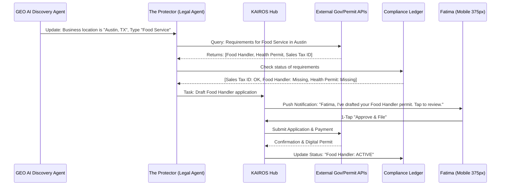
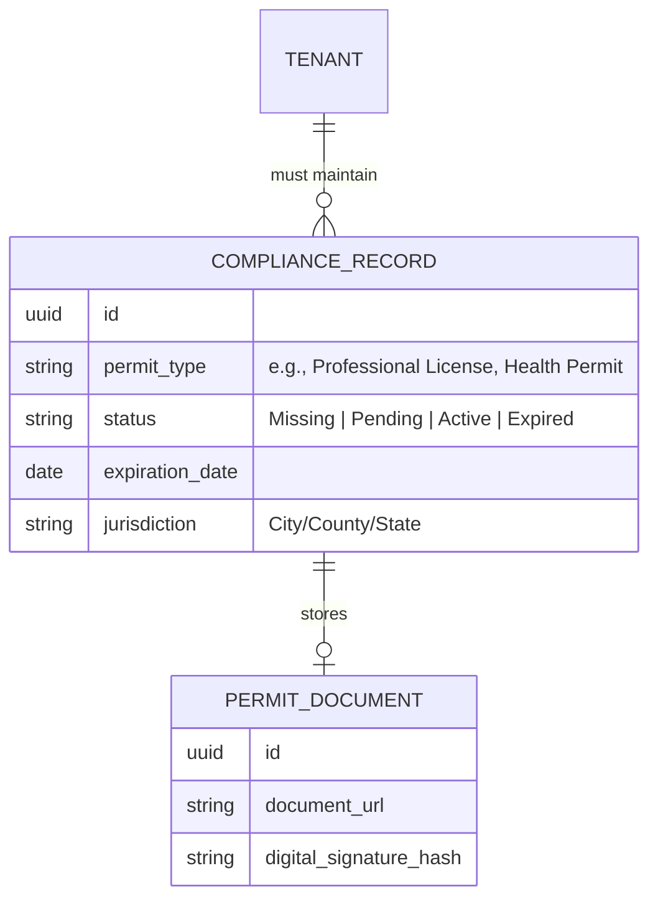

# [Legal] The Protector: Autonomous Local Compliance & Permit Engine

## Title
The Protector: Autonomous Local Compliance & Permit Engine

## Problem Statement
Small business owners like Fatima (food cart) and Carlos (handyman) operate in highly regulated environments. Fatima needs food handler permits, health department inspections, and sidewalk vending licenses. Carlos needs trade-specific contractor licenses and local building permits. Currently, these requirements are fragmented across different government websites, written in dense legal jargon, and require manual tracking of renewal dates. Solopreneurs often operate under significant legal risk or face heavy fines simply because they didn't know a specific local permit was required or let one expire. They need an invisible "Protector" that proactively identifies, drafts, and tracks every local permit and license required to stay legal, all via 1-tap mobile approvals.

## Research Report
*   **User Pain Points**:
    *   **Regulatory Blind Spots**: Owners don't know what they don't know regarding local municipal codes.
    *   **Fragmentation**: Navigating 5+ different city/state portals to stay compliant.
    *   **Renewal Amnesia**: Forgetting to renew a professional license until it's too late.
*   **Competitive Analysis**:
    *   *LegalZoom / ZenBusiness*: Primarily focus on entity formation (LLC/Corp). While they offer compliance packages, they are often expensive annual subscriptions that still require significant manual input and don't integrate with daily business operations.
    *   *Stripe Atlas*: Excellent for incorporation and tax IDs (EIN), but stops at the federal/state level. It does not handle local municipal permits (e.g., a "Halal Food Cart" permit in Queens, NY).
    *   *Gov2Go*: A citizen-to-government app that tracks some renewals but is not business-centric and isn't integrated into a commerce platform.
*   **OHC Advantage**: OHC leverages the **GEO AI Discovery Optimizer** to know the exact local jurisdiction requirements. "The Protector" (Legal AI Agent) doesn't just "notify"; it pre-fills the applications using the owner's existing OHC profile and business history, presenting a "1-Tap to File" experience.

## Design Doc

### Architecture Diagram (Mermaid.js)

### Data Model & Invariants (Mermaid.js)

### UI Wireframes & Mobile UX Flow (375px First)
1.  **The "Compliance Card" (Home Dashboard):** A translucent glass card showing a "Protective Shield" icon.
    *   *Status:* "🛡️ Your business is 80% protected."
    *   *Action:* "1 missing permit: Food Handler's License (Austin)."
2.  **The "Draft Review" Screen:** Tapping the card opens a macOS-style summary.
    *   *Content:* "I've filled out your Food Handler's application using your OHC profile. Fee: $25."
    *   *Interaction:* A single, prominent `[ Approve & Pay ]` button.
3.  **The Digital Vault:** A clean list view of all active permits with their expiration dates and digital copies accessible with one tap.

### AI Agent Integration Points
*   **The Protector (Legal & Compliance):** The primary agent responsible for monitoring the `Compliance Ledger` and drafting applications.
*   **The GEO AI Agent:** Provides the localized context (jurisdiction) based on the business's physical presence.
*   **The Accountant (Finance):** Handles the payment of permit fees from the `OHC Wallet`.

### Key Design Decisions
*   **Proactive Discovery:** The system doesn't wait for the user to ask "What permits do I need?". It uses the business type and location to tell the user.
*   **Zero-Jargon Interface:** We hide all statutory citations and government form IDs. We show "Food Handler's License", not "DSHS Form F-12".
*   **Multi-Tenant Isolation:** Compliance documents and legal history are strictly siloed per tenant.

## Implementation Prompt
**Objective:** Build the backend infrastructure for the "Autonomous Local Compliance & Permit Engine."

**Core User Journey (CUJ):**
1. The system identifies that a tenant (e.g., a food cart in Austin) is missing a mandatory local permit.
2. The "Protector" agent drafts a `ComplianceRecord` in a `PENDING_APPROVAL` state.
3. A `SharedTask` is created for the user to review and approve the filing.
4. Upon 1-tap approval, the system simulates the filing process and updates the record to `ACTIVE`.

**Acceptance Criteria:**
*   **Compliance Schema:** Implement a multi-tenant `ComplianceRecord` entity.
*   **Jurisdiction Mapping:** Create a service that can map a `Business Type + Geo Location` to a list of required `Permit Types`. (Mock data for 2 jurisdictions is acceptable).
*   **Agent Logic:** Implement the handoff between the GEO AI Agent (location context) and The Protector (drafting filing).
*   **Renewal Tracking:** Implement a background worker that checks `expiration_date` and triggers a "Renewal Draft" task 30 days before expiration.
*   **Security:** Ensure all permit documents and PII are encrypted and isolated via `tenant_id`.

## Priority
P1 (High - Critical for the "Launch in 10 minutes" promise).

## Estimated Scope
Large
