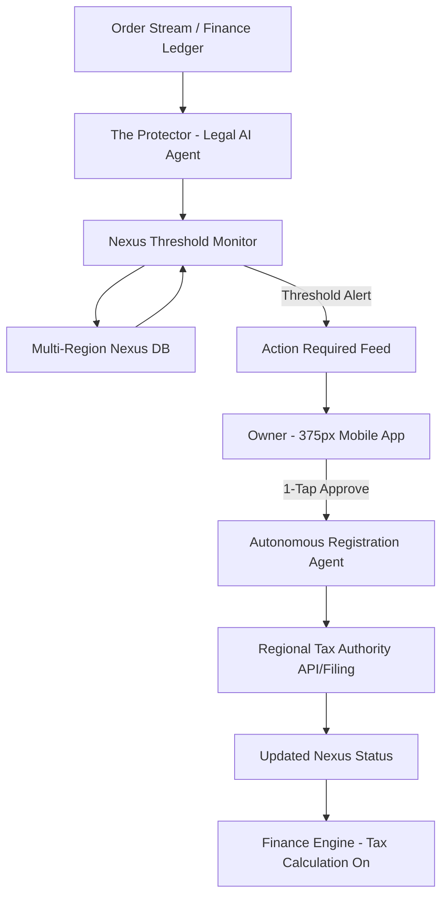
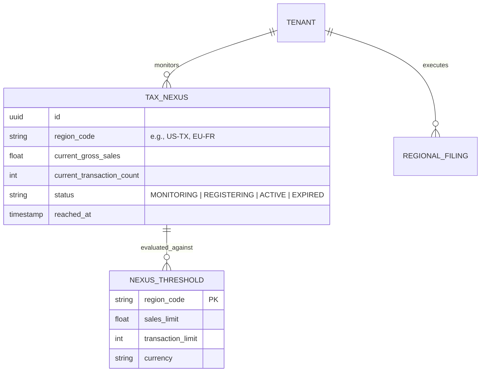

# [Legal] Autonomous Multi-Region Tax & Nexus Engine

## 1. Title
**Autonomous Multi-Region Tax & Nexus Engine: The "Safe-Growth" Compliance Shield**

## 2. Problem Statement
For growing small business owners like **Priya (boutique owner)** and **Maya (baker)**, scaling beyond their local city or state introduces a terrifying new layer of complexity: **Sales Tax Nexus**.

Economic Nexus laws mean that even without a physical office, selling into a new state (e.g., reaching $100k in sales or 200 transactions in California) makes the business legally responsible for collecting and remitting sales tax in that state. Missing these thresholds leads to massive back-tax liabilities and legal penalties. Currently, owners must manually track their sales volume per state or pay for expensive, technical tools like Avalara. OHC needs an invisible engine that proactively monitors these thresholds, alerts the owner *before* they are crossed, and autonomously prepares the registration paperwork for 1-tap approval on mobile.

## 3. Research Report
### The "Nexus Gap"
*   **Competitor Landscape**:
    *   **Shopify Tax / Stripe Tax**: Excellent at *calculating* tax once configured. However, *monitoring* nexus across 50+ US states and dozens of international VAT regions is often a passive dashboard that the owner must remember to check.
    *   **Avalara / TaxJar**: High-end tools that solve this but add significant "Cost Creep" and technical jargon (e.g., "Jurisdictional Nexus", "Remittance Frequency").
*   **The "OHC Unfair Advantage"**: We move from "Dashboard Reporting" to "Autonomous Protection." The **Protector (Legal Agent)** doesn't just show a chart; it watches the transaction stream and says, *"Priya, you're at 190 sales in Texas. We need to register for a tax permit there next week. Tap here to let me handle the paperwork."*

### Key Standards (Economic Nexus)
*   Most US states use a threshold of **$100,000 in gross sales** OR **200 individual transactions** in a calendar year.
*   International regions (EU/UK) have varying VAT thresholds (e.g., £90k in the UK).

## 4. Design Doc

### Architecture Diagram (Mermaid.js)

### Data Model & Invariants

**Key Invariants:**
*   **Isolation**: Every `TAX_NEXUS` record is strictly isolated via `tenant_id`.
*   **Proactivity**: Alerts must trigger at **90% of the threshold** to allow lead time for registration.
*   **Zero-Jargon**: Terms like "Jurisdiction" and "Economic Nexus" are replaced by "Region" and "Regional Tax Rule."

### Mobile-First UX Flow (375px First)
1. **The "Safe-Growth" Nudge**: A glassmorphic card on the main dashboard: *"You're growing! 🚀 You are 10 sales away from needing a Texas tax permit. Tap to prepare your registration."*
2. **The Nexus Detail Bottom-Sheet**: Displays a simple progress bar (190/200 sales).
3. **The 1-Tap Registration**: A single primary button: `[ Handle Texas Registration for Me ]`.
4. **The Auto-Fill Confirmation**: *"I've drafted your Texas registration using your existing business ID. No forms needed. Just confirm your signature below."*
5. **The Shield Status**: Once active, the region card turns green with a shield icon: *"Texas Protected."*

### AI Agent Integration Points
- **The Protector (Legal AI Agent)**: Oversees the entire compliance lifecycle.
- **The Accountant (Finance AI Agent)**: Provides the raw transaction data stream to the monitor.
- **The Scribe (Administrative Agent)**: Handles the autonomous filing and communication with regional tax portals.

## 5. Implementation Prompt
**Task for Implementer Agent:**
Implement the backend "Nexus Threshold Monitor" and the mobile UI for the "Safe-Growth Compliance Shield."

**Core User Journey (CUJ):**
1. Priya sells her 190th dress to a customer in California.
2. The system (The Protector) detects she is at 95% of the California economic nexus threshold.
3. A "Nexus Risk" notification appears in Priya's mobile dashboard Activity Feed.
4. Priya taps the notification, reviews the simple summary, and taps "Register Me."
5. The system auto-fills the registration request and moves the region into a "Registering" state.

**Acceptance Criteria:**
*   **Threshold Monitor**: Build a service that aggregates sales data by `region_code` and compares it against a global `NexusThreshold` lookup table.
*   **Entity Design**: Implement the `TaxNexus` model with strict multi-tenant isolation.
*   **Nudge UI**: Create the 375px-optimized glassmorphic dashboard card for nexus alerts.
*   **Automated State Transition**: Ensure that approving the registration automatically updates the `TaxNexus` status and triggers the secondary registration flow.
*   **Safety Buffer**: Alerts must be configurable to trigger at 80%, 90%, and 100% of the threshold.

## 6. Priority
**P1** (High - Critical for preventing legal liability for growing businesses).

## 7. Estimated Scope
Large (Requires aggregation of transaction history, region-based lookup logic, and a robust notification engine).
