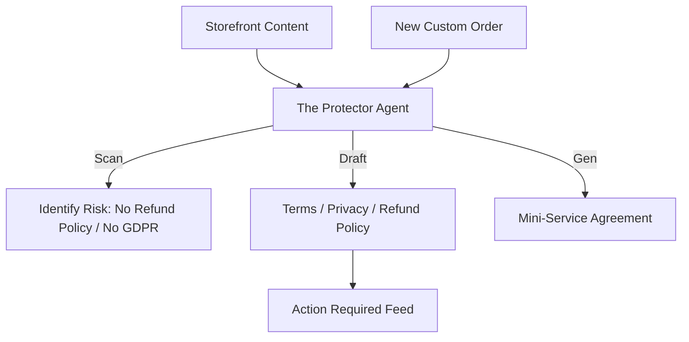

# [Legal] Architecture Brief: "The Protector"

## Title
OHC "The Protector": Autonomous Compliance, Safeguards, and Legal Policies

## Problem Statement
Small business owners fear legal trouble but can't afford a lawyer. Fatima (Food Cart) needs a liability disclaimer for allergens. Leo (Music Tutor) needs a cancellation policy. Currently, they copy-paste policies from the internet, which might not be legally binding or up-to-date with GDPR/CCPA.

## Research Report
- **Compliance Gap**: Most platforms provide "templates" but don't handle regional variations or proactive hazard warnings.
- **The "Protector" Persona**: This agent is a "shield" for the business. It scans the website for high-risk content (e.g., medical claims) and suggests safeguards.
- **Regional Awareness**: Automatically detects if a customer is from the EU and ensures the "The Promoter" (Marketing) has cookie consent active.

## Design Doc

### High-Level Architecture (Mermaid.js)

### UI Flow (375px First)
- **Safe Mode Toggle**: "The Protector" highlights sections of the website that need disclaimers. The user taps "Apply Auto-Fix" to generate and publish the policy.
- **GDPR 1-Tap**: A single toggle to enable compliance for international sales.

### AI Agent Integration
- **Triggers**: `tenant.site.content_updated`, `tenant.legal.scan_requested`.
- **Tools**: `policy_generator`, `risk_audit`, `compliance_lookup`.

## Implementation Prompt
**To Implementer Agent:**
Implement "The Protector" (Legal & Compliance) department. This agent must autonomously scan the tenant's storefront content for missing mandatory legal documents (Privacy Policy, ToS). It should generate regional-specific drafts based on the business's location and industry (e.g., Food vs. Services). Implement a "Contract Generator" tool that "The Salesperson" can call to attach mini-service agreements to quotes for high-value jobs.

## Priority
P1

## Estimated Scope
Medium
