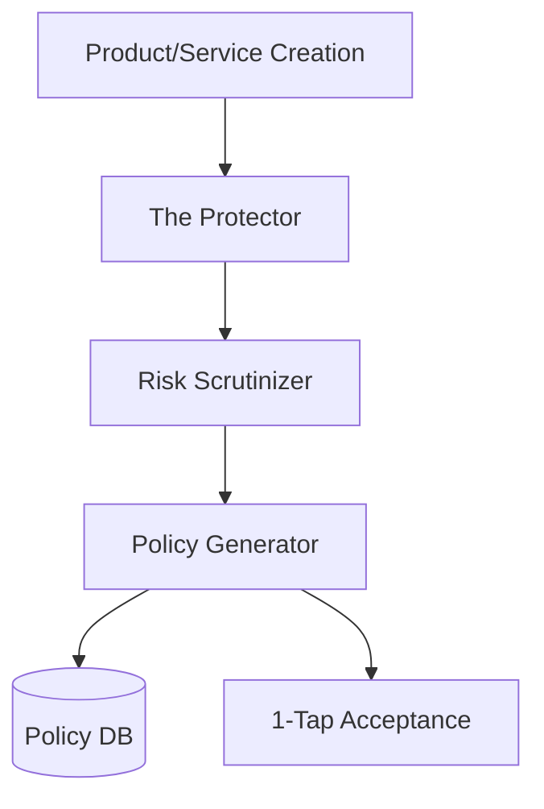

# Architecture Brief: The Protector

## Title
OHC AI Department: Legal & Compliance ("The Protector")

## Problem Statement
Compliance is often seen as a "black art." "The Protector" makes legal safety a 1-tap experience by generating contextual policies (e.g., allergen disclaimers for food, liability waivers for services).

## Research Report
- **Legal Anxiety**: Small businesses fear legal repercussions but cannot afford lawyers.
- **Contextual Safety**: Policies should dynamically adapt to the products or services offered.

## Design Doc

### Key Design Decisions
1.  **Risk Scrutinizer**: Analyzes product/service descriptions to identify potential legal or compliance risks.
2.  **Contextual Policies**: Generates tailored disclaimers and policies.
3.  **1-Tap Compliance**: Integrates seamlessly into the setup workflow without confusing jargon.

### Architecture Diagram (Mermaid.js)

## Implementation Prompt
Integrate "The Protector" risk scrutinizer into the product/service creation workflow. Build the logic to scan product descriptions and automatically flag necessary disclaimers or generate required policies. Focus on the integration points with the catalog service.
