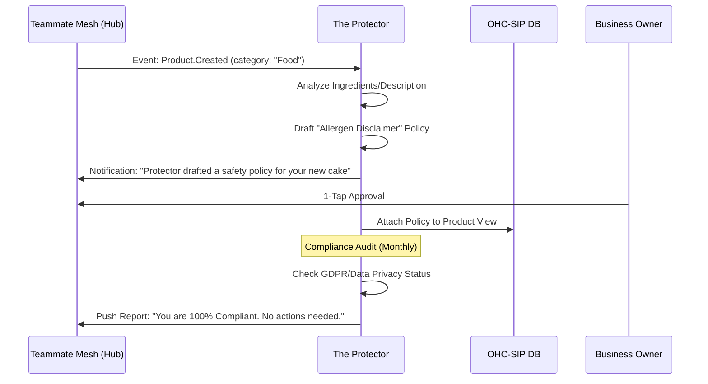

# Architecture Brief: "The Protector" (Legal & Compliance) Department

## Title
The Protector: Automated Compliance, Liability Safeguards, and Policy Management

## Problem Statement
Small business owners often operate in a "Legal Blind Spot." Maya (baker) doesn't know she needs an allergen disclaimer; Carlos (handyman) doesn't have a liability waiver for his repair jobs; Fatima (food cart) isn't sure about local health permit tracking. Legal fees are prohibitive, and standard "Terms of Service" generators are full of jargon that neither the owner nor the customer understands. OHC needs an agent that identifies these risks autonomously and drafts simple, legally-sound protections.

## Research Report
- **Compliance Gaps**:
    - **GDPR/CCPA**: Most SMBs are technically out of compliance the moment they capture a customer email.
    - **Liability**: Physical services (Carlos) and Food (Maya/Fatima) carry high liability risk without proper disclaimers.
    - **Refund Policies**: Unclear policies lead to Stripe disputes (chargebacks), which are costly.
- **Competitor Scan**:
    - **Termly/GetTerms**: Good for generic policies but disconnected from the actual business workflow.
    - **OHC Opportunity**: "The Protector" is context-aware. If Maya adds "Peanuts" as an ingredient, the agent proactively drafts an allergen warning. If Carlos books a "Roof Repair," it attaches a liability waiver to the quote.

## Design Doc

### Architecture Diagram (Mermaid.js)

### Key Design Decisions
- **Contextual Generation**: Policies are not static; they are generated or suggested based on the *actions* the owner takes (adding products, changing location, etc.).
- **Plain-Language Law**: All drafted policies must pass the "Grandmother Test"—no "heretofore" or "notwithstanding."
- **Liability Gates**: High-risk services (identified via AI classification) cannot be published without a basic liability disclaimer approved by the owner.
- **Draft-for-Review (All Actions)**: Given the legal nature, *all* Protector actions require 1-tap approval.

### Mobile UX Flow (375px)
- **Safety Score**: A circular progress bar on the dashboard showing "Business Safety 85%."
- **1-Tap Compliance**: A card saying "Missing Refund Policy. [Draft One Now]" which uses AI to create a policy based on the business type.
- **The "Vault"**: A mobile-friendly list of all active policies and signed customer waivers.

## Implementation Prompt
**To Implementer Agent:**
Implement "The Protector" AI department. Create a `Policy` entity in the OHC-SIP DB that can be linked to `Tenants`, `Products`, or `Services`. Implement the "Risk Scrutinizer" logic that listens to `Product.Created` and `Service.Updated` events to identify liability risks (e.g., food, heavy machinery). Build the "Policy Generator" which uses business metadata to draft "Grandmother-Tested" Terms of Service and Privacy Policies. Ensure the `Teammate Mesh` is used to gate high-risk product publication until a safety policy is approved. All data must be isolated by `tenant_id`.

## Priority
P2

## Estimated Scope
Small
